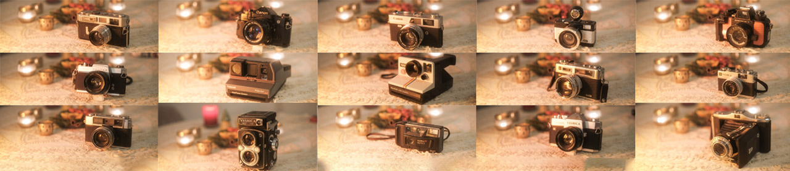
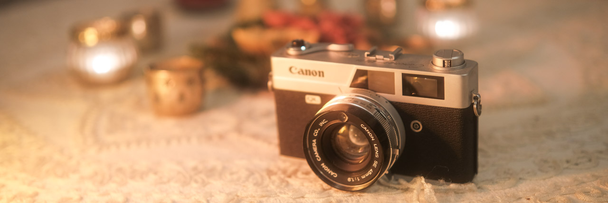
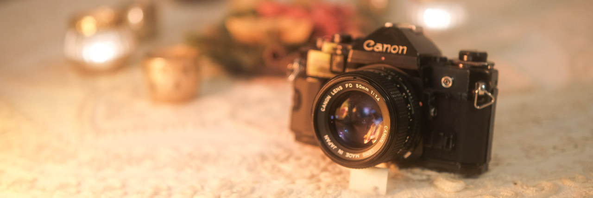
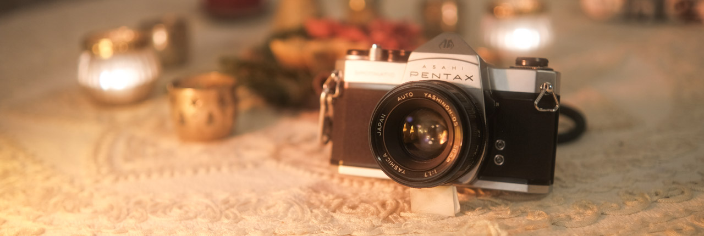
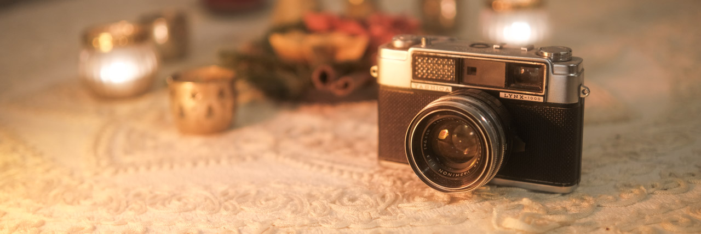
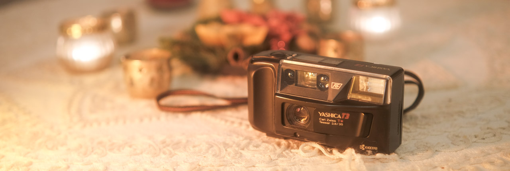

One of my main hobbies nowadays is film photography. And a big part of it is shooting with different old cameras, most of them fully mechanical. I've been collecting a few of them since I started and this page is a catalogue of my collection with basic information about each camera and my comments on them. This page will be updated every time I get a new one or have a new piece of information worth sharing.

# Cameras in Collection

## Yashica Mat 124

A beautiful TLR medium format camera from late 60's. Bought from a small shop in Bremen. 

It's my first and only medium format camera. I have shot a few rolls with it and I really love the experience (and challenge) of composing using it's huge mirror. It's not the type of camera to walk around with, I'm very cautious taking it out because it's a bit uncomfortable to carry and shoot handheld. 

Interesting thing about it is that a lot of people come talk to me about it when I'm shooting it on the street. One day, in Düsseldorf, this old folk came speaking German and I couldn't understand much, but I got that he said he had one of that long time ago but had to sell it because he needed money and it was a very expensive camera. 

---
## Canon Canonet QL19

A 35mm rangefinder camera from the mid 60's. I bought it from a German camera store on eBay. There are several versions of the Canonet, this one is one of the first models released. 

I have an interesting relationship with this camera. Whilst I think it's a really good rangefinder with an excellent (fixed) lens, I sometimes find it a little unsatisfying to shoot with, probably because of loose aperture ring and the quiet shutter. The lightmeter on my copy is a bit unreliable, sometimes I get readings very different from what I would expect with [Sunny 16](https://en.wikipedia.org/wiki/Sunny_16_rule). 

It's still probably the camera I shot more rolls with and that's because it's portable, lightweight and very reliable. 

---
## Canon 7

One of the most praised Canon rangefinders, from early 60's, often referred as a good replacement for the legendary (and very expensive) Leica M cameras. I bought this body on eBay and it came from Japan. 

For the lens I picked the soviet Jupiter-8, an inexpensive 50mm f2.0, from a German shop on eBay. 

I have shot many rolls with this camera, but I found it's not very reliable. The lightmeter seems to work pretty well (even though it's known that selenium meters tend to fail at some point, and seems like it's pretty hard to find Canon 7 with a functional meter), but the shutter is not very precise on my copy. The lens is not in a very good shape, the aperture and focus ring are pretty loose, and I think this contributes a lot to a poor experience shooting with it. 

I want to, eventually, get a Canon 50mm f1.4 lens for this camera, because I like the feel, and especially the looks, of the Canon 7. 

---
## Canon A-1

Classic Canon SLR camera from the late 70's. It sold so much during its time that it's actually pretty easy to find copies in great condition from a good price. I bought it from Safelight Berlin, and it was my first film camera. 

It's a very professional 35mm camera with many features as TTL lightmeter (with a nice LCD view inside the viewfinder), a fully automatic mode and easy double exposure selector. It's still my go to camera for whenever I need more professional photos on 35mm film. 

The lens in this camera is absolutely great. The wide f1.4 aperture makes it easy for me to take photos on darker conditions and renders a beautiful depth of field. The experience of shooting an SLR with the loud mirror slapping in this camera is really satisfying. 

---
## Yashica TL Electro X

Big and chunky SLR from the late 60's. I bought two copies of this camera. Both from German sellers only eBay. The first one was in a good condition and came with the amazing Yashinon 50mm f1.4 lens, but didn't have the little battery port, hence why I got the second one, which was in a worse shape (with a few dents in the body), yet functional. 

The first roll I shot with it was a Fomapan 400, so I could properly test it and it surprised me how sharp that lens is. I'd say it's one of the sharpest lenses in my collections. One interesting thing about it is that the back element is a bit yellow and is radioactive. It's made with Thorium. I'm not sure exactly why, but if someone says "sharpness", I'd readily believe. The shutter and mirror slapping sound is absolutely fantastic, it's pretty loud but helps the brain release dopamine.

---
## Pentax Spotmatic

Considered one of the best filly-mechanic SLRs from the early 60's, with sexy curves and no hotshoe mount for flash. Bought it from a German seller on ebay.

I got it without a lens so I could use the Yashinon lens from the TL Electro X. Then I shot a friend's birthday to try out this camera for the first time, but weeks later I completely forgot about that film in it and opened the back, ruining all the moments in it.

---
## Yashica Lynx 1000

A simple good looking rangefinder from 60's. It's like the Canonet from Yashica. I bought it from a UK shop on ebay. 

When I opened the shipping box I noticed that no rings on the camera would move properly and the shutter looked like had a few blades jammed, probably due to thickened lubricant. The seller stated on their eBay page that it was working the _last time they used, about 10 prior_. I didn't talk to them after because it was fairly cheap and I actually plan to CLA it myself at some point. It's on a great cosmetic condition. 

---
## Yashica T3

The predecessor of one of the most famous point-and-shoot, from late 80's. Chunky and with a quirky design, but with a good grip. Bought from a German seller on ebay.

I actually quite enjoy shooting with this camera. The shutter button is a bit too sloppy for my taste, but the viewfinder is big enough to see the frame without any problems. I wish it was a bit smaller to be honest, but in general is a really good camera. Been using this primarily since I lost my L35AD2.

---
## Polaroid Impulse 600 AF

A plasticky behemoth from the late 80's. Bought from a German seller on ebay.

It has a very interesting auto-focus system based on a sonar technology, and it workes pretty well, except if you have a window in between you and the subject. It uses 600 film and takes really pretty pictures.

---
## Polaroid Land Camera 1000

A classic Polaroid camera, also known as _OneStep_, from the 70s. It was the first plastic camera they made, supposed to be cheaper than the absolute classic SX-70. I got as a present from a colleague after buying some other photography gear from him.

I tried using it during a New Year's party in my place, with the flash that came with it, and I remember a lot of people complained the flash was _way too_ strong. And after the second photo, it drained the battery completely. And since the battery comes in the photo packages for these old models, I was left with 6 unused photos in the cartridge that I just can't use anymore. I assume old packages had a much better battery, or the package I got had a faulty or almost empty one.

Anyway, I still think of modifying it to use external batteries and also the newer film they produce.

---
## Yashica Electro 35 MC

A beautiful portable from early 70s. Bought it on eBay.

It's tiny and very easy to carry around, don't even need to hang on my neck, it goes on my pocket! It's a zone focus camera, but that doesn't bother me anymore. The lens is absolutely great. One of my favorite cameras in my collection. 

---
## Yashica Electro 35 GSN

A true classical of the 60s consumer cameras. From eBay.

There's just nothing bad that can be said about this camera. Yes, I agree it's a bit too big and heavy, but shooting it is just pure pleasure. It's a great rangefinder with automatic exposure. Mine is in a really good state. Definitely need to take it out more often.

---
## Nikon Nikonos V

Known for being a professional camera for underwater photographers and divers. Got it on eBay.

I took it to Brazil, most importantly to the beaches in Guarujá (São Paulo coast) and to the amazonian rivers in Manaus. Took it to take mostly underwater photos, but in the same trip I ended up losing my **Nikon L35AD 2**, so I had to use that for everything. It's a range focus camera, so it can be a bit complicated to snap a photo on low light, but nonetheless a fantastic camera. Plus, it looks absolute banger.

---
## Lomography Fisheye

A cute little fisheye camera, or just a toy?

It's a very simple camera with a plastic lens. I only ever shot one roll through it and honestly didn't like the results very much, but I want to try more. A little photo book, made with this camera, was included in the package and I was pleasently surprised with it. Definitely giving it another try.

---
## Zeiss Ikon Nettar 517/2

The oldest camera I have ever used. Bought from eBay.

A very simple foldable medium format camera that can yield really good images. I wrote a whole text on it here: [Old Camera: Zeiss Ikon Nettar 517/2](/post/camera-zeiss-ikon-nettar-517-2/).

# Cameras not in Collection anymore

## Nikon L35AD 2

A fantastic point-and-shoot from the mid 80's. I bought it from a seller in UK on eBay.

It's an incredible little point-and-shoot. Not as small as the Olympus Mju, but the experience is so much better, in my opinion. The weight of this camera makes you feel like it's a premium build, even though the exterior is all plastic. The shutter button feels really mechanical, there's an enjoyable resistence to it. I can't comment on the lens because I didn't develop the films I took with it, but the experience of shooting it is excellent.

An interesting story about this camera is that it took more than two weeks to fly from UK to Germany, and in the exact same day it arrived I took it with me to a short trip to London.

Another interesting-but-not-in-a-good way story is that I lost this camera in an Uber in São Paulo. It's really sad that the Uber driver never returned the messages. Kills me in curiosity about its destiny. I had a few family shots in a black and white film in it, but I imagine whoever got that camera might have opened the back right on the spot.

---
## Olympus Mju

A very portable point-and-shoot from the 90's. Bought it from a German seller on ebay. 

Even though it's a plasticky lightweight product of the 90's, I find the experience of shooting with camera really good. The lens is good enough if you consider it can all fit in your pocket and has a pretty strong flash always available when the light conditions are poor. It's a good camera to use on in-house parties or to have with you all the time. 

I gave it to my girlfriend, so not in _my_ collection anymore.
