I recently bought the oldest camera in [my collection](/cameras) so far, the 6x9 medium-format german **Zeiss Ikon Nettar 517/2**. Don't mind the huge name, this is how it looks:

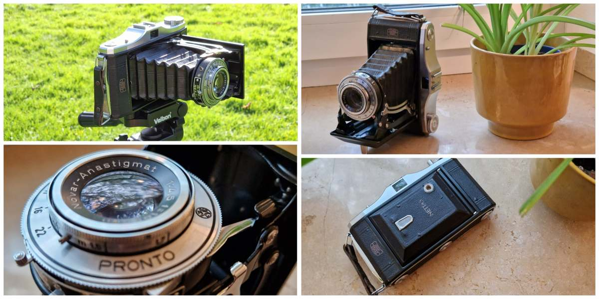

And some technical information, according to [**Camera-wiki.org**](http://camera-wiki.org/wiki/Nettar#Nettar_517.2F2):

```yaml
Manufacturer: Zeiss Ikon
Country of Origin: Germany
Production period: 1951 to 1953
Alternate name: Nettar IIc
Film Format: 120 roll film (8 exposures format 6×9cm)
Viewfinder: optical, built into top cover
Lens/shutter combinations: Novar Anastigmat 1:4.5/105mm - Pronto leaf shutter
```

It's a medium-format camera that uses 120-type film. For those who don't know much about film photography, the more common type of film is _35mm_, the ones with the iconic canister that, if you're older than 30 years old, you'll know that for sure. But among many other types, there was medium-format, both 120 and 220 types. Quick glossary about it:

| Term               | Explanation                                                                                                                                                                                                             |
|--------------------|-------------------------------------------------------------------------------------------------------------------------------------------------------------------------------------------------------------------------|
| Medium format      | Refers to the width of the film: 6cm. As a reference, 35mm is 3.5cm.                                                                                                                     |
| 120/220            | Refers to the length of the film, 220 having double the length of a 120 film roll.                                                                                                                                      |
| 6x6, 6x7, 6x9, etc | These are the size of negatives that some cameras are able to shoot using medium-format film. Unlike 35mm that all cameras pretty much had the same negative size, medium-format cameras have a wider range of formats. |


For more information about film formats, [this page](https://thedarkroom.com/film-formats/#:~:text=220%20film%20is%20the%20same,number%20of%20exposures%20per%20roll.) is really awesome.

The good thing about shooting medium-format is that the negatives are comparable to the ones of [IMAX](https://en.wikipedia.org/wiki/IMAX), depending on the ratio you use;  6x9 in this camera is even bigger. It's bigger than any full-frame digital camera! The bad thing, however, is that you can only get 8 photos out of a 120 roll.

It's a folding camera, it means that the (fixed) lens is mounted at the end of a folding leather cloth that works as a _camera obscura_. It's more portable when it's folded and weights a lot less than a complex lens with lots of elements, but it's prone to holes in the cloth, as well as wear-off. It has no _rangefinder_, which means you have to focus by range or just by guessing the distance to the subject.

## Camera Introduction

I had another medium-format camera, the **Yashica 124**, a 6x6 TLR camera, but I've been trying to get a camera that shoots other negative sizes, more specifically 6x7 or 6x9. Unfortunately, 6x7 cameras are very popular, so they're expensive. I mean, REALLY expensive. A Mamiya 7, for example, costs around _$3k_. For my surprise, those old foldable cameras are cheaper, definitely because of its mechanism being simpler. I bought that on eBay, from a German seller, and it came with a beautiful leather case and with the **original manual**, in German!

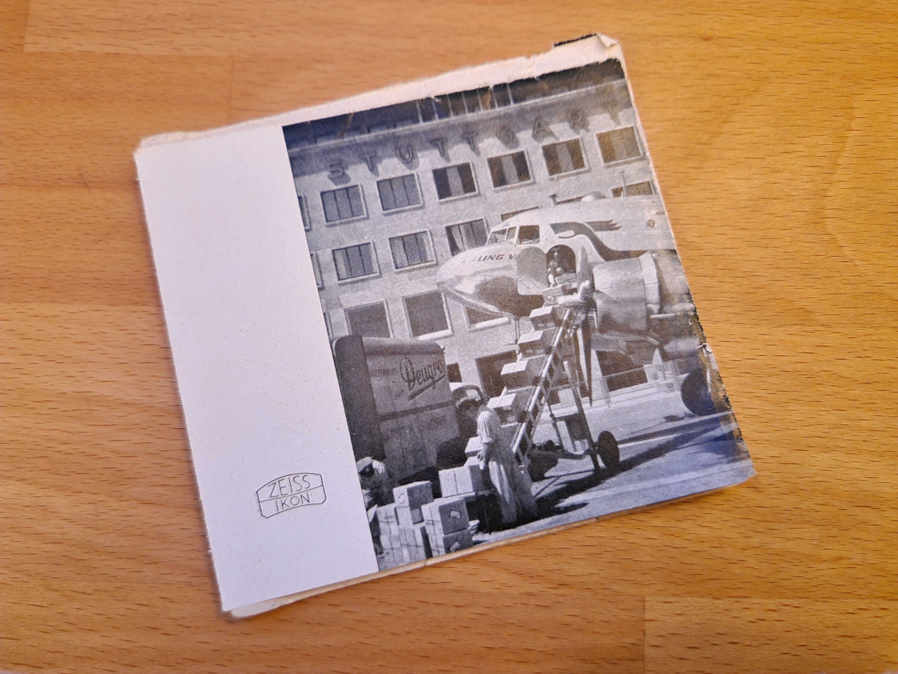

And it contains many beautiful images in it, all from early 50's:

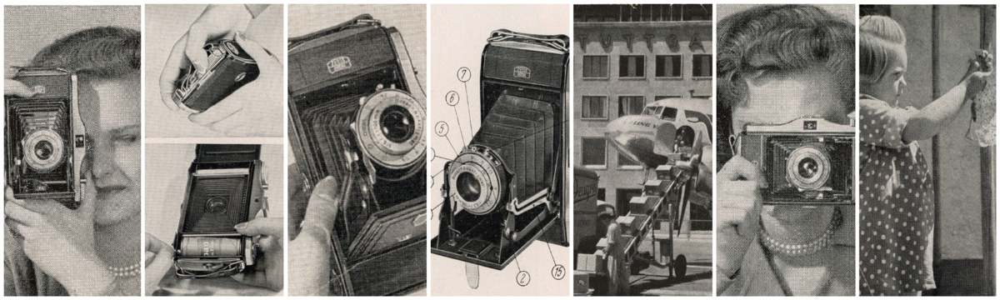

One page in particular caught my attention. A hand-written name and address, which I assume is from the first/original owner:

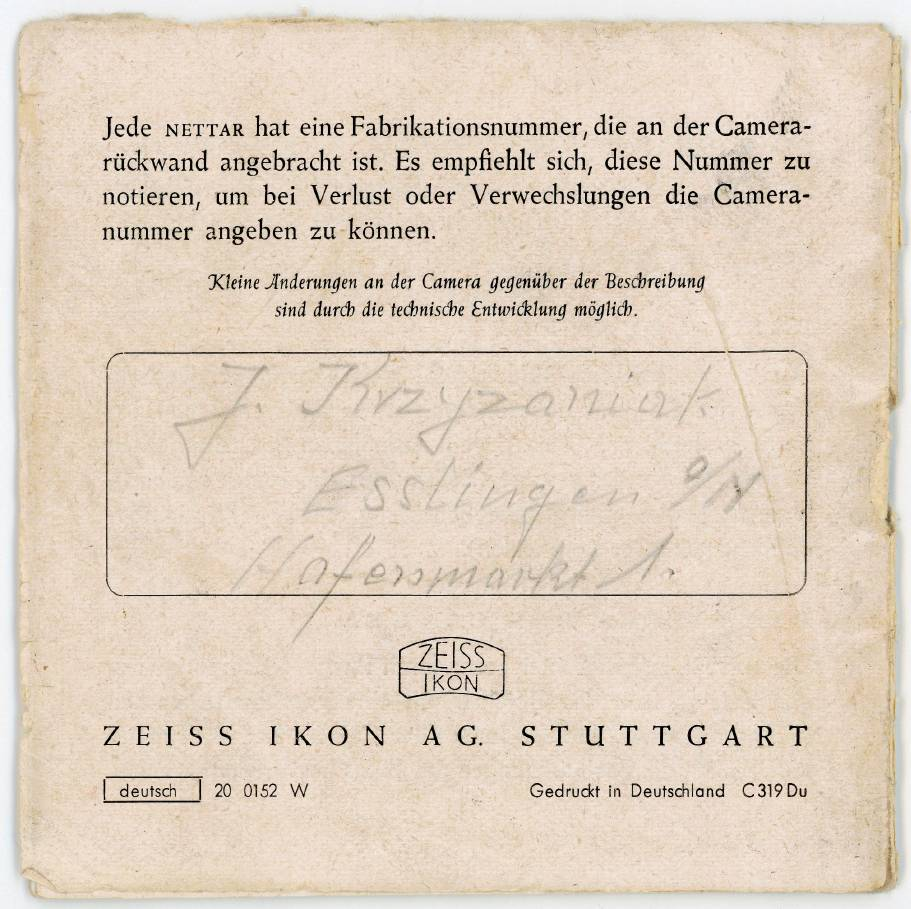

It says that you're supposed to note the "serial number" in that field, but the owner decided to identify himself/herself! It looks like the name of the person is **J. Kvzyzaniat**, and the address is **Hafenmarkt 1, Esslingen**, which according to Google Maps, would be that building in the center:

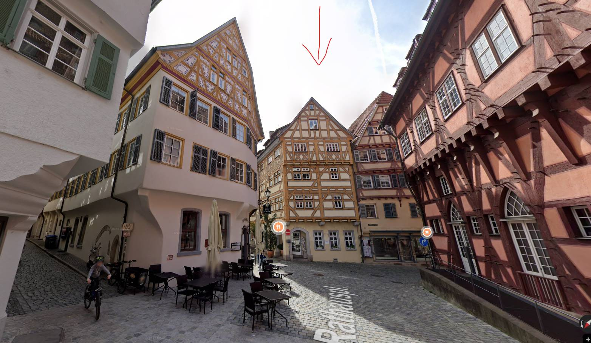

Another interesting thing about this manual is that at any moment it refers to the camera as **517/2**, or even **IIc**, as it says in the [**Camera-wiki.org**](http://camera-wiki.org/wiki/Nettar#Nettar_517.2F2) article, it refers to it just as **Nettar II**. I know it's the same camera because apparently it's the only one with the round design around the viewfinder (which I think is definitely the best-looking one). Maybe those number notations came only after.

Well, I scanned the whole manual and you can view it here, in case you're interested: [Nettar 517/2 Instruction Manual](https://drive.google.com/file/d/1c7YnWJKudfXwS24FV-qhUajFgE3bZoCa/view) 

## First shot

First thing I do when I get a new camera, especially from eBay or less reputable sources, is check if it looks like it's working with all lens appertures and different shutter speeds. Then I put on a cheap black and white film roll through it and take some pictures. I went to the park close to home, in one of the last warm-ish days of the year of 2023 and took some pictures **using a tripod**. I decided to go for a more static approach at first because, I don't know if those pictures make justice to the size of the camera, but that camera is absultely gigantic!

 Finished the 8 pictures in less than half an hour and sent it to a lab right after. Two weeks later I got back the negatives and scanned them in my Epson flatbad scanner. It pretty much worked out flawlesly! Except for maybe two photos with a little bit of a light leak, they were pretty gorgeous, even though the light was harsh. Here are some of the pictures I took, with reduced size and quality, for the sake of this server's price. The negatives were scanned in 6000x3842:

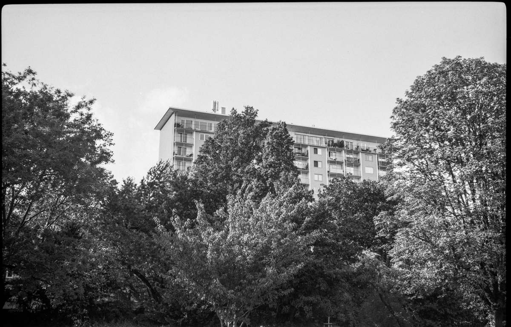
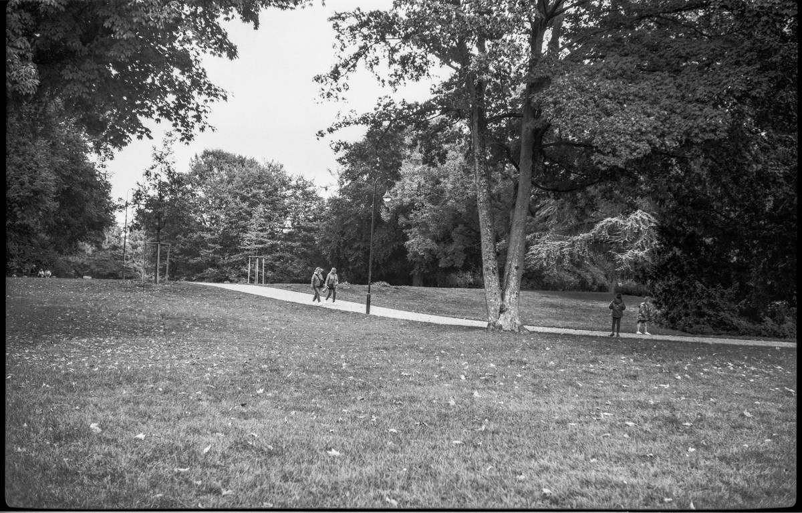

I was very glad with these pictures. So it was time for a real use!

## Taking it to vacations!

In november we took a week-long vacation in Mallorca. I took my **Fuji X-T20** for the first time in over a year. But I also brought two film cameras, the **Yashica T3** and the **Nettar**, just in case. With it, 3 rolls of medium-format color film: **Gold 200**, **Portra 400** and **Lomo 400**. I didn't take any tripod, that'd have to be all handheld.

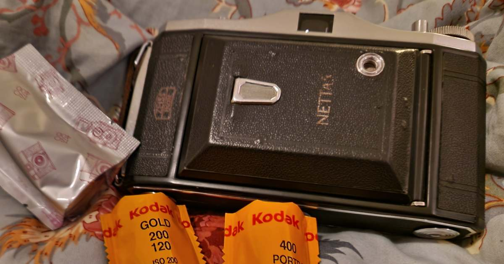

There was a total of 24 photos to be taken. However, I messed up the first shot of Portra, so 23. I found the experience of shooting it handheld pretty good actually. It's huge and heavy, so no way carrying that on my hands all the time. But every time I found a good possible picture, I'd take my time, grab the camera in the bag, take it from the case, configure the apperture, shutter speed and focus and boom:

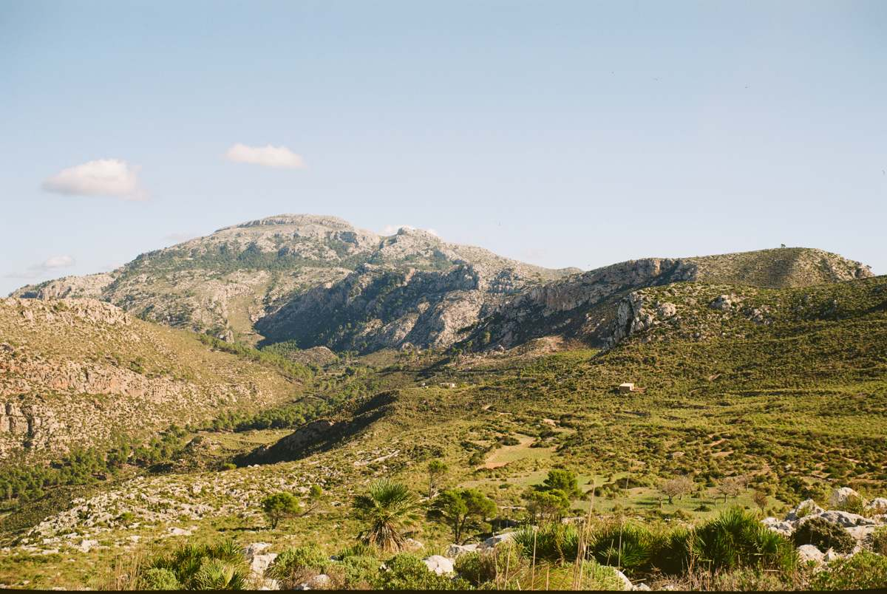

This time I opted for a more professional lab, the cool guys at [**Safelight Berlin**](https://safelightberlin.com/), and got the best scans I could ask for. I shipped my rolls from Düsseldorf to Berlin and in pretty much a week I got back those scans, at an incredible size of 7000x5000! The ones I'm posting here are a lot smaller and with the quality drastically reduced.

The images were absolutely gorgeous. It was definitely my best experience shooting medium format so far. I did get a couple that were a bit underexposed and this one with some back light-leak, that I can't really tell if it's because of the camera's light seals or just the little window in the back that displays the current film count:

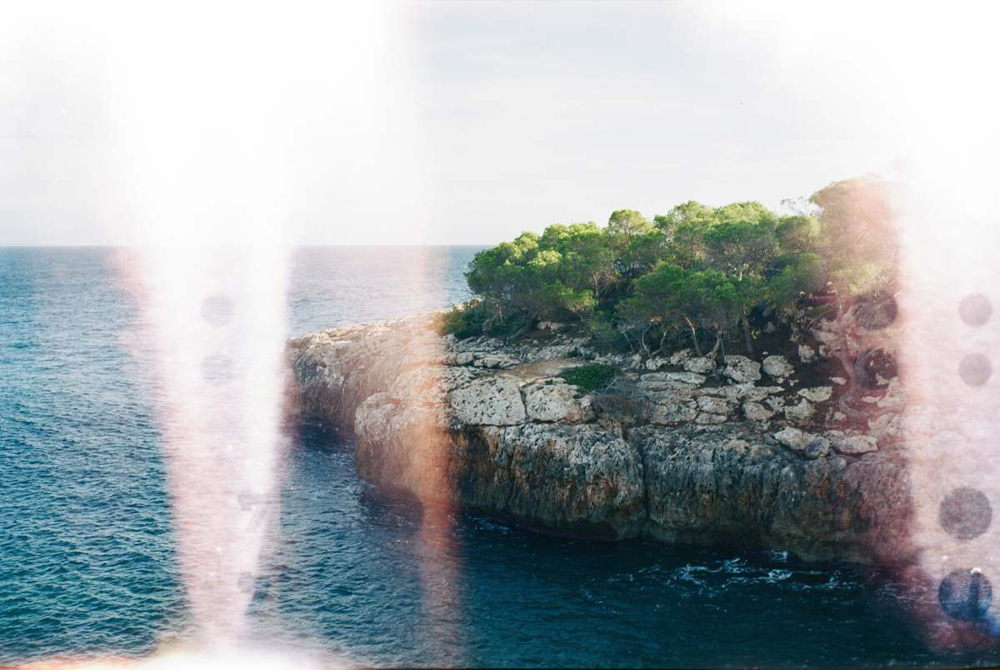

These lightleaks are just _happy little accidents_, and I love them.

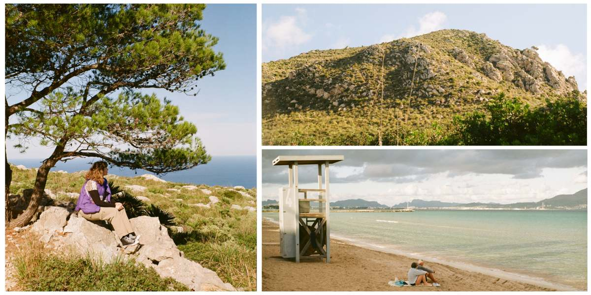

In the end, I think it's a really cool camera, especially for landscapes in bright days. I'll definitely take it out more often.

To finish up, there's this one, that I cropped a bit to look more "panoramic":

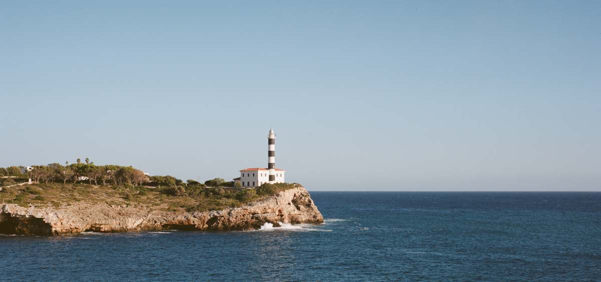

