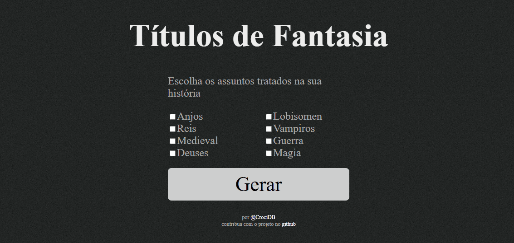

Back in 2012, I was really into fantasy and historical fiction books: **The Name of the Wind** (Patrick Rothfuss), **A Magic of Twilight** (S. L. Farrell), **Armageddon** (Eduardo Spohr), **The Warlord Chronicles** and **The Saxon Stories** (Bernard Cornwell), etc. I was also listening to a lot of podcasts on the subject, and following most of the latest releases in these genres in Brazil. I eventually noticed a pattern in the book titles.

I think it's much more obvious in the translated Portuguese titles than it is in English, but I'll explain it with the English titles, because I can find enough examples that follow the rule. Most of the books are titled something like:

```
[Article] Noun _of_ [Article] Noun
```

Examples:

 - The Name of the Wind
 - A Magic of Twilight
 - Enemy of God
 - Lords of the North
 - A Game of Thrones
 - The Fellowship of the Ring
 - The Wheel of Time

In English, you'll sometimes find a slightly different structure, with an adjective coming before the noun, like **The Pale Horseman**. In Portuguese, since the adjective always comes after the noun, I think it's much more common to use **adjective phrases** instead of just a single adjective. Plus, in English there are two ways of forming adjective phrases: `Noun Noun` and `Noun of Noun`, and they often mean different things. In Portuguese, this difference is not as clear.

Based on that, I created a "fantasy book title generator", and it's been online for about 13 years now, at the same address: [https://labs.crocidb.com/fantasy-generator/](https://labs.crocidb.com/fantasy-generator/). Somehow it's still popular.



Even in the age of LLMs, it still gets around 100 visits per month. I've had people tell me they've used it for their DnD campaigns, including people who didn't even know I was the one who made it in the first place.

---

The implementation is really basic. All I have is a list of nouns for the subject and another one for the adjective phrase:

```javascript
["O", "Anjo"],
["Os", "Anjos"],
["O", "Rei"],
["Os", "Reis"],
["O", "Deus"],
["Os", "Deuses"],
["O", "Panteão"],
["A", "Irmandade"],
...
```

Articles are separated because sometimes they can be omitted, which multiplies the possibilities even further.

For the adjectives, Portuguese helped me even more, because we always combine the preposition and the article that comes after it. For example, in "Lords of the North", the "of the" would be "de o Norte", but "de o" becomes "do", so it's shorter and easier:

```javascript
["do", "Trono"],
["do", "Reino"],
["da", "Coroa"],
["do", "Castelo"],
["da", "Guerra"],
["da", "Paz"],
["da", "Coragem"],
["da", "Justiça"]
```

I kept them separated because at some point I was going to introduce indefinite articles to the mix, but I just never did.

Those nouns and adjectives are divided into different categories, things like "Angels", "Kings", "Gods", "Vampires", "Magic", etc., from which the user can pick their own combination. The code to generate a title is really simple, and the last change was 13 years ago:

```javascript
function generate()
{
	var nouns = [];
	for (var i in noun)
	{
		var element = $("#" + i);
		if (element.length == 0 || element.attr("checked"))
		{
			nouns = nouns.concat(noun[i]);
		}
	}
	
	var index = Math.floor(Math.random() * nouns.length);
	var selectedNoun = nouns[index];
	var article = Math.floor(Math.random() * 3) == 1;
	
	var generatedName = "";
	if (!article) generatedName += selectedNoun[0] + " ";
	generatedName += selectedNoun[1];
	
	var adjs = [];
	for (var i in adj)
	{
		var element = $("#" + i);
		if (element.length == 0 || element.attr("checked"))
		{
			adjs = adjs.concat(adj[i]);
		}
	}
	
	index = Math.floor(Math.random() * adjs.length);
	var selectedAdj = adjs[index];
	
	generatedName += " " + selectedAdj[0] + " ";
	generatedName += selectedAdj[1];
	
	$("h1").text(generatedName);
};
```

An LLM nowadays can give you results that are so much better, more diverse and more complex than that, but I find some beauty in simple solutions like that. Before I tried implementing a [zodiac horoscope generator](https://labs.crocidb.com/horoscope/) too. It was a bit more complex, because I had to divide phrases in different parts to have full sentences that made sense, but it worked beautifully too.
