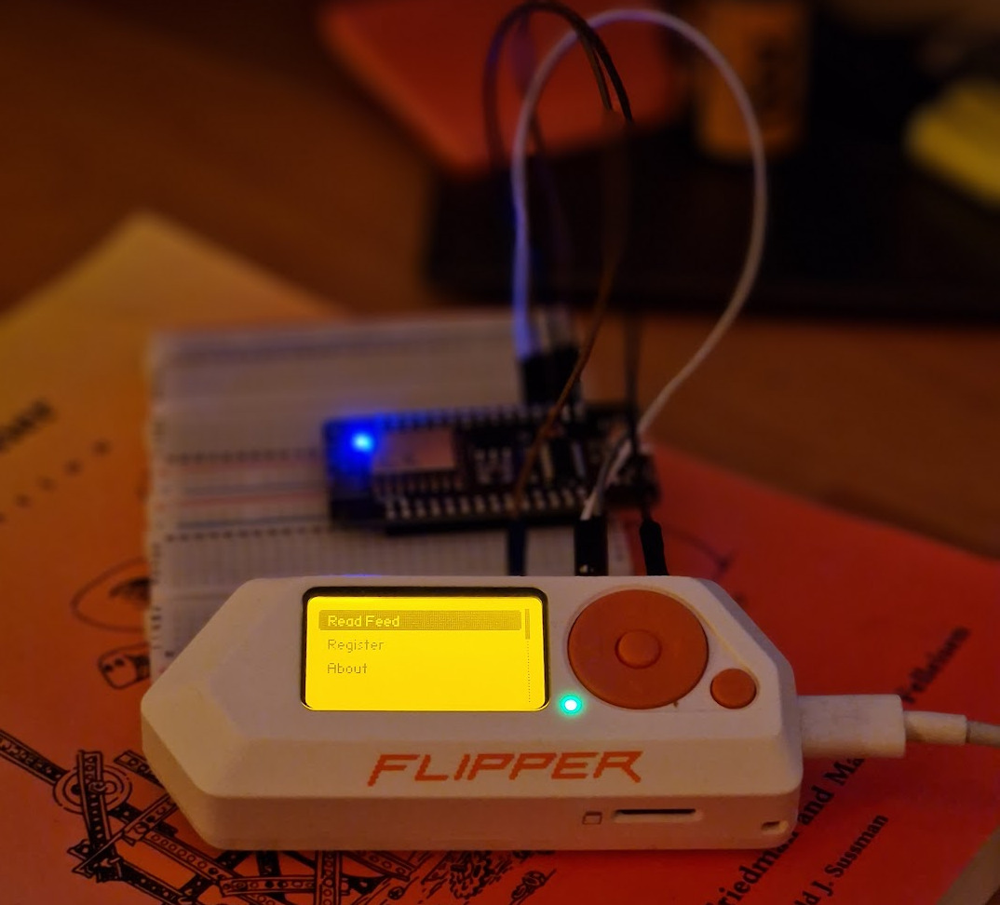
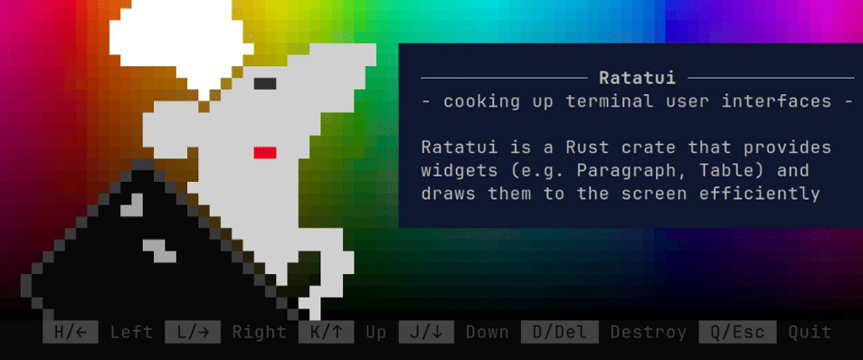

I'm happy to officially announce one of the projects I've been working on this summer. It's [**bulletty**](https://github.com/CrociDB/bulletty), a pretty, open-source TUI feed reader written in Rust that stores the articles locally as Markdown, giving the user total freedom over the articles.

> For those unfamiliar, TUI means a [Text-based user interface](https://en.wikipedia.org/wiki/Text-based_user_interface), it means the program's interface is implemented in text in a terminal. That's also why **bulletty** has a **TTY** postfix, it's an old terminology for text terminals that tracks back to typewritters. Now you know why **ghostty**, **kitty**, **mintty**, or the linux `/dev/tty*` devices.

More than a decade ago, **Google Reader** was one of my main applications when I was sitting in front of my computer. I had accumulated lots of good blogs that I liked to read by then, so opening the app to check what was new was my comfort thing. Eventually Google killed that reader, but it was a time where we were more interested in following the writers on Twitter. Easier to interact with them about their texts, but slightly harder to keep up with their published content, because you could easily miss the tweet.

But it was like that for some time. Then came the programming article boards, such as [Hacker News](https://news.ycombinator.com/news) and [/r/programming](https://www.reddit.com/r/programming/). Which for years were my daily source of information related to tech world, and still is. But more recently I felt like I wanted to go back to having my own feed subscriptions, as I discovered many great blogs using these platforms. Since the death of Google Reader, I had an account on **feedly**, so I used it. Although it didn't tick all the boxes for me. I was constantly shown ads, the UI didn't feel quite right, and I had zero desire to pay for yet another subscription I didn't truly need. So, I decided to explore other options.

I thought of TUIs, since a lot of my personal project work I do through a VPS, it would be cool to just open my feed reader in another tmux pane while I work. I tested a few options, but honestly didn't get used to any of them.

At the same time, I was fixing some issues with the feed for my blog, because I never really gave too much attention to my own feed generation before, I rely on **Hugo** for the blog generation and I just trusted it to generate the RSS/ATOM well, but turns out it's the theme you're using the responsible to format the feed. And it was kind of broken, so I took some time to fix it and I wanted to promote it. I wanted more people to subscribe to my blog through the feed.

So I thought of creating a small project that I could write about and then bring this subject up. First idea was a feed reader for the **Flipper Zero**, because why not? I didn't have the WiFi module for the flipper, but I had a **ESP8266** lying around, so... I'd implement my own feed fetching and send it to the Flipper Zero through UART...

... well, I was on the right track. Wrote the flipper app first, started a communication with my own arduino program running on the ESP to exchange information, but then, when I was going to write the network part I realized that it only has around 80KB of RAM, and my whole feed xml file is over 200KB. Which means I'd have to stream it. At the same time I'd have to parse the XML, and parse the HTML within the content... That seemed like too much work for a small, week-long project, so I gave up on it.

Back to nothing, I realized I'd just go and implement my own feed reader the way I wanted it to be. Analyzing the options, I thought of a feature set that would make it my favorite feed reader:

 - It must be a TUI, because I'd like to read my subscriptions on my SSHd remote machine
 - It must be easy to use, using a similar VIM-like keybindings that I'm already used to
 - It must look good and offer a good terminal reading experience
 - It must save my files locally in a Obsidian vault-like file structure. I've been using Obsidan a lot lately and I'm very used to its simple structure. I can sync my whole feed library with git and have it on any device
 - It should allow me to add articles to a read later section
 - It should allow me make highlights of the text, and also add notes to it

That sounded like a compelling piece of software to make. So I started looking for good TUI libraries to make it a really good experience. At first, Zig was going to be my language of choice, but didn't find any library for Zig that caught my eye. Then I read about [ratatui](https://ratatui.rs/), for Rust. I only ever wrote Rust before in 2019, when I started doing the [Ray Tracing in One Weekend](https://github.com/CrociDB/pathtracer), by **Peter Shirley**. But since Rust was still on my list as a language to learn, I took the challenge. I'll write about this experience of writing Rust later.

In only a few days, maybe a week, of course using many available **crates**, I had a raw sketch of a feed reader that would sync the sources, download the articles and have them available in my file system. So I went ahead and implemented all the base features I needed to start using my own feed reader.

Right now, it's still far from being my dream reader, but it's already very usable. You can subscribe to sources into different categories, sync them, read them in the reader or open them externally, the vault-like disk structure of the files is there, so it's Bring Your Own Sync-method. That's the moment I thought I should put it our and show it to the world. Also, make sure I make the project open to contributions. It's [Hacktoberfest](https://hacktoberfest.com/) time, and I already added its tag. So, if you know Rust and you're into contributing to open source software, here's your chance!

I'm creating [Issues](https://github.com/CrociDB/bulletty/issues) in the GitHub page for bugs and features that are on the roadmap. But basically, the most important features to be implemented next are:

-  **Themes**: I want it to support multiple common themes like **catppuccin**, **kanagawa**, **gruvbox**, etc
-  **Read later**: an essential category for all the interesting articles I'll probably never get around to reading
-  **Article Highlighting**: I want to be able to highlight parts of the articles and keep it stored in a way that's easy to access alter
-  **Notes on articles**: similarly to the highlights, I think it's important for me to keep notes on interesting texts
-  **Web View**: that's an interesting idea, since all the articles are being stored as Markdown files, I could theoretically generate a static webpage from it and serve it to read on my phone and other devices
-  **Mouse support**: although it runs on the terminal, it's very handy to have it respond to mouse commands, just like any NeoVim or tmux
-  **Image support**: that's an important one, it should display the images when using a modern terminal emulator, using the _kitty image protocol_, or _sixel_

I'll be working on those features myself, without any deadline, just as I feel like doing. But I'm very open for contributions. Whether it's a bug fix, a bug report, refactoring, writing tests to make it more robust, or just simply ideas to make this software better.

If you're into the idea, give it a try. Install it with `cargo install bulletty`, subscribe to your feed sources, test it on different platforms (so far I've only ran it on Linux), and don't forget to subscribe to this blog's [feed](/index.xml)!
