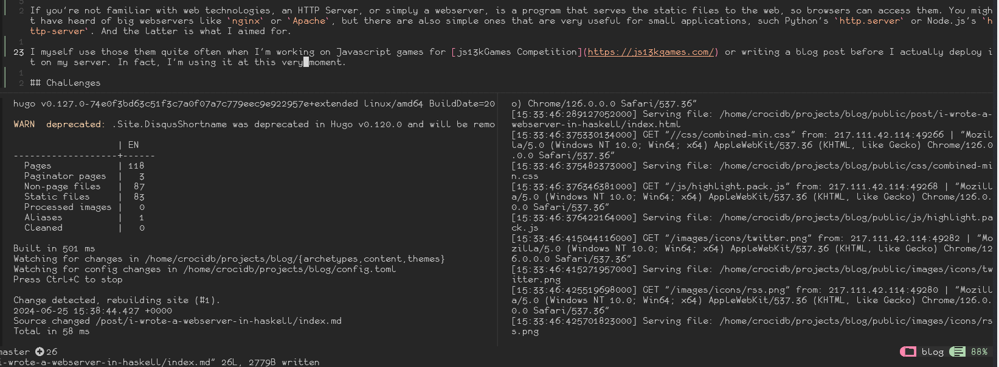
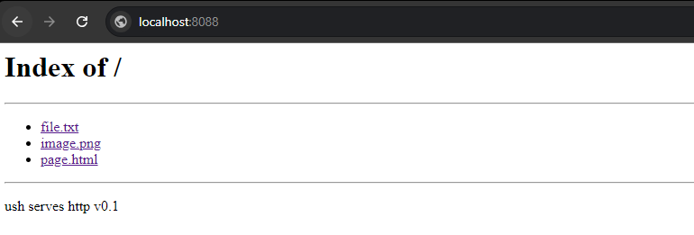

Haskell's been an intelectual curiosity of mine for decades. In 2016 [I finished](https://courses.edx.org/certificates/99fc6647f1574c28a1d6148f90fd1522) **FP101x: Introduction to Functional Programming** course at **edX**, given by _Erik Meijer_. That was really my first time effectively writing Haskell. I don't remember the contents exactly, but it was very focused on the pure and lazy aspects of the language, with a simple introduction to the theme of **Monads** at the end. Meijer's way of teaching is fun and kept me really entertained while learning, so I was waiting for a follow-up course on Monads and how to write non-pure (IO) code.

That never happened, or I lost track. Months later I ended up doing some of the [Scala](https://www.coursera.org/account/accomplishments/verify/VB8MREDQM7FA) [courses](https://www.coursera.org/account/accomplishments/verify/BJTK5G2Q6953) at **Coursera**, but I just can't deal with anything Java. After that, I barely wrote functional code until my recent [LISP Adventures](/tags/lisp-adventures). Recently, however, I came across [CodeCrafters](https://app.codecrafters.io/r/healthy-otter-219488), this platform with very interesting tutorials/challenges, stuff like how to create a simple git, a bittorrent client, a shell and of course an HTTP Server. It supports many languages and it essentially breaks the project into small steps and validate them when you're done. By the end of the challenges, you built your own version of that project, so you learned a new language and how such software works. The HTTP Server project was available for free this month of June, so I decided to make this my month project, and I think I succeeded.
 
For the first time I was able to write a proper piece of software em in Haskell, and learn a bit more how the non-pure code works.

# [ush serves http](https://github.com/CrociDB/ush)

If you're not familiar with web technologies, an HTTP Server, or simply a webserver, is a program that serves the static files to the web, so browsers can access them. You might have heard of big webservers like `nginx` or `Apache`, but there are also simple ones that are very useful for small applications, such Python's `http.server` or Node.js's `http-server`. And these are what I aimed for.

I myself use them quite often when I'm working on Javascript games for [js13kGames Competition](https://js13kgames.com/) or writing a blog post before I actually deploy it on my server. In fact, I'm using it at this very moment: one terminal Hugo compiles it when there's a change, the other ones `ush` serves it so I can check how it's looking in my browser.



The project is available at https://github.com/CrociDB/ush. It's BSD-3 licensed and is open for pull-requests if you feel like it.

#### Installing

Assuming all the Haskell tools are installed:

```text
git clone git@github.com:CrociDB/ush.git && cd ush && stack install
```

#### Usage

Simple as going into the directory and invoking `ush`.

## Development

Well, honestly, it's a pretty straightfoward project. It's essentially an application that binds to a socket address and port, parses a request header, opens a file and spits out the response with a header and the file contents to the socket. My main challenges making this project was actually Haskell itself. Starting by setting it up.

The Haskell tooling is robust, but a tiny bit confusing. There's `stack` and `cabal`, that honestly seem like two implementations of the same tool. They are like `npm`, project build management, dependency packages installing and deployment. And then there's `ghcup`, a tool for managing the versions of `stack`, `cabal`, `ghc` (the compiler) and `haskell-language-server`. I had a few problems building some libraries in my VPS due to low memory, but fixed setting up more SWAP memory.

I recently posted about [switching to **neovim**](/post/from-ides-to-the-terminal), so I had some fun setting up the tools in it. Luckily, it was simple to setup the language server with `mason.nvim`, however there was some more work necessary to get a formatter to work. I'm using the plugin `formatter.nvim`, and it only supports `stylish-haskell` out of the shelf. The problem with this formatter is that it doesn't format the whole source file, but rather improve alignment in import and case clauses. Not really what I was looking for, as I'm not used to write Haskell code and wanted something format/ident everything for me, so I needed something more complete, like `ormolu` or `fourmolu`. So I implemented the support for these tools in `formatter.nvim` and [created a push request](https://github.com/mhartington/formatter.nvim/pull/337), which is still open weeks later. Not sure what's going on with that project (no updates in over three months), but if you need to setup these formatters with it, use [my fork](https://github.com/CrociDB/formatter.nvim).

After setting it all up, the challenges were very meaningful and not too complicated. Stuff like start by binding a socket to a port, then getting the message sent by the client, then parsing it, then opening a file, then finally writing the response and sending it back. They don't _teach_ you how to do it, which is precisely what I love about that system. You have to research, poke and test every step until you can solve it. And in the end, I didn't have a ready webserver, but rather had a program that could do pretty much everything a webserver needed. So I just had to rearrenge stuff around, implement some small missing features and boom.

## Cool features

There's a step in Codecrafters that's about implementing `gzip` compression of the response. So the server also supports it! Something else I did was a simple directory listing/indexing, so if you try to request a folder that doens't contain an `index.html` file, it will show this:



Using `System.Console.CmdArgs` I was able to implement basic command line configuration with ease. So invoking `--help` will bring this:

```text
ush --help
ush serves http v0.1

ush [OPTIONS]

Common flags:
  -d --directory=DIR    Directory to serve
  -p --port=ITEM        Port
  -a --host=ITEM        Address
  -? --help             Display help message
  -V --version          Print version information
     --numeric-version  Print just the version number

A simple HTTP Server to serve your files
```
  
## Conclusion

Of course it's not a production-ready webserver or anything like that. I can serve my blog and it works pretty well, but there's still many things to be implemented. Cache control is one of them. The server is a bit slow at the moment, it opens and serves every file at any request. Even if the browser says it has that file cached. Also some files could be kept open in memory for a fast serving. The server totally doesn't handle anything that's not an HTTP request, and will crash if that happens, or if the request header is not perfect. Text encoding is also a pain. At the moment, it doesn't support unicode characters.

There's a lot to be made, but I don't know if or when I'll be making it. I think it was a fun project and I learned a lot from it.
