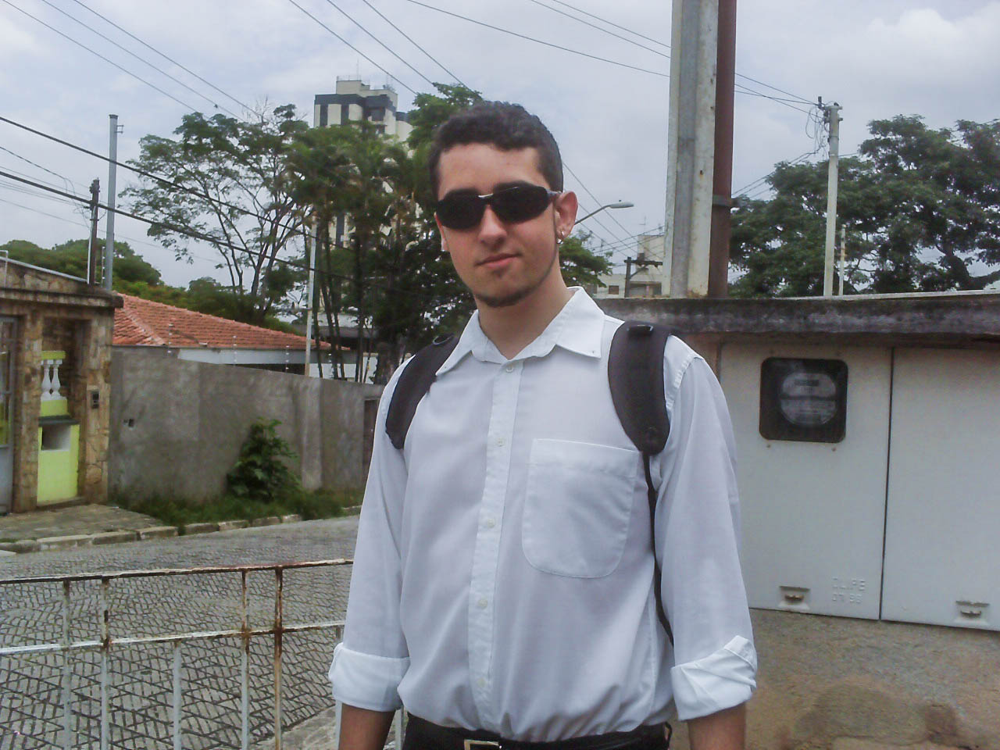

Back in 2008, I was in my last year of high school (or _medium school_, as we call in Brazil) and I learned about this program called **Students2Business** by Microsoft. That was basically a couple-month class on their development platform that would connect a student to a brand new intern job in a _dream corporate company_.

I've been programming little games for fun since 2002, when I was 11 years old, and I was finally leaving school and getting ready for university. But I come from a humble family, living in Guarulhos, a nearby city of São Paulo that had fewer opportunities in technology, and I had no other option than finding a job and work as I studied my way into my new programming career. Microsoft's S2B sounded like a big opportunity to land myself a good-paying half-period job to help my family and myself during those years.

It all started with a programming assignment to select who would get into the program. Then after some weeks of classes every other day, another assignment for phase 2, and there were a total 4 or 5 phases. I had to skip some days at school to do those classes, but my mom talked with the school managers and we proposed I was gonna deliver some homework to prove I was still studying the subjects. The venue where the S2B classes happened were pretty far away from home, more than 2-hour commute, but thanks to my uncle, who would wake up a lot earlier than usual to drive me to somewhere in between his job location and the place I needed to go, it was a lot easier (still 1+ hour bus ride from there).

I made my way to one of the last phases and had several .NET classes, assignments and projects. But more importantly, there lied the interview with big companies for an intern position, as they promised. And this story is about this one company interview specifically: intern programming working on ERP software. At the end of one class, the presenter said "whoever wants to apply for this company, we'll do a programming test tomorrow". It looked like a big successful company to me, their office was in one of the most expensive/commercial areas of São Paulo, very close to this recently-open bridge that turned out to be a postcard of the city. I remember well they were offering a **BRL1,500.00** monthly compensation for one year of internship and high possibility of getting hired as a Junior afterwards. That number was incredibly good for me, an 18 year-old boy. My dad, who passed away in a traffic accident (commuting from Job1 to Job2) three years before, worked 15 hours a day and was making only around 1k a month only.

Back then, I was also informally working for this guy, making websites for small business in my hometown, in my free time after school. He paid **BRL200.00** a month, and that was already pretty exciting, but I was betting all on that internship, that would make my family's life a lot better, as I could contribute the household income (that was solely pension from dad's death), and could pay for all my meals and commutings to University, as well as books and all the studying material I would need.

I did the test and the next day, one of the class staff members told me informally they were impressed with my results, because I scored the highest, even though I was one of the youngest in there. It gave me more confidence. A week later they scheduled an interview. 

That day, I wore a social outfit, slightly oversized white button shirt, black pants and a pair of shoes that completely destroyed my feet. My mom took a photo of me before leaving, because I was looking good. Then I walked towards my first bus-stop of the day. Took a bus, a metro, another metro, another metro and a train and after around two and a half hours, I arrived at their office, all I remember is that amount of natural light coming through the big windows facing the newly constructed bridge. I sat there with other young people, all waiting for their turn to being interviewed for an internship position.

When someone called me, I entered the meeting room and there were three people to whom I got introduced: a tech person, a manager and... a psychologist! That was so confusing, but I took it as a good thing back then, after all they want to check how I fit with the company. The conversation started with some very awkward moments that I can't forget, stuff like "oh, so... _Croci_... are you an italian ascendant?", "makes sense, by your nose I would say either arabic or italian". No technical questions were asked, but they appraised my test. Most of the questions were the cliché interview questions you probably heard too. "Where do you see yourself within the next five years?", "If you were to be an animal, what type of animal would you be?", "What's the person you admire the most?", and more personal questions like "I can see you bite your nails, are you a nervous person? Does that affect your life?", all stuff that an unprepared eighteen year old can't even reason about.

I left with a bit of a bittersweet taste in my mouth. My mom asked if everything went well and I was like "no clue", I was totally lost. But a few days later I got an email inviting me for a "group interview" with other candidates. Sounded like progress, I got excited again.

A week later, same procedure to get to their office. The same three interviewers, but around 10 competitors. They had a few open positions, so some would get hired, some wouldn't. I was somehow confident. I did well on the technical test and I managed to get through the non-sense questions the week before, so I just tried my best. 

They put us all in the same room and had us do some activities. All the time there was that reality-show kinda mood, where everybody is working together and doing stuff together, but they're actually competing for the prize. They divided the group into smaller teams and we had to work together to come up with something they proposed. That involved doing some paper crafting fantasy product, and each one of us had a different role in our team. After a couple hours of this, they said "you're not making easy for us, let's go one by one and you say your football team and your zodiac sign, we'll pick based on that". What?! I was surprised, I could understand how that activity could help finding a good candidate, but random information like that? It made me a big angry at the moment, but not brave enough to question it. I said "Palmeiras, Virgo" on my turn and just expected that to be the lucky one. "Virgo? Oh no..."

One of the candidates in that room was a school colleague of mine. He joined the program at the same time I did and we were trying to share all that was happening with us. I helped him do the programming assignments when he had questions; I gave him spoilers of the programming test for this company, because my class group did it first; and also told him all about the first interview. But this time we were doing it together. And in the end, his zodiac sign was the correct one.

He got the internship and I didn't even get a rejection email. I was ghosted. A few months later I got an internship as a PHP web developer that paid **BRL400.00**, completely unrelated to the program. It was a bit closer to home and it did help me get my way into the first year of university.

For so many years I tried to make sense of all that. I think I probably wasn't a good fit for the company anyway, I lived too far away, I mentioned my target career would be video games, I didn't have the correct outfit to walk that region of the city. Or it was really just my zodiac sign or the football team that my family supported.

The bast part of the Microsoft program is that I got to interact with a lot of people and talk about programming, which was something I breathed, but had very few friends that shared interest. Some of the guys I met there turned out to be university colleagues in the next year. I also learned C# there, which is to this day, the programming language that I coded the most in my professional career, due to Unity3D.

