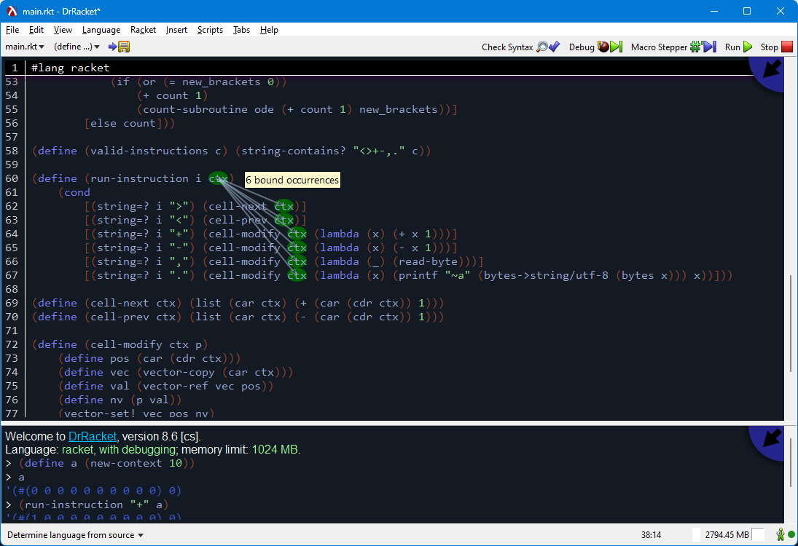

Lisp is the second oldest programming language and is considered one of the most powerful, despite the fact that it is absolutely the most simple. I've always had admiration for it, but never quite got into it because it seems that, except for Clojure, there was no other popular version of lisp with real-world use. And I really don't like anything related to Java--which is a shame because I think Scala is also a fantastic language, but that's subject for another text.

After a some consideration, I picked Racket because it's maintained and has an active community. Also because, I don't know much about other lisps, but I like how Racket supports functional, procedural and even object-oriented programming. All the examples seemed straightforward to understand, at least once you get past the swarm of parentesis.

[](https://xkcd.com/297/)

I decided to dive in and create a project with it. Something that wouldn't be too big, too long or too complex, but still challenging: [Brainfuck](https://en.wikipedia.org/wiki/Brainfuck). If you don't know it, it's a turing complete esoteric language that only has 8 tokens. It runs in an array of cells and all the commands do is move the pointer in the array, incremend and decrement the value, input and outputs one byte from the current cell and loops untils the current cell is different than zero. That's all, I just described the whole language.

The tokens are:

| Token | Function |
| -- | -- |
| `>` | Increase the cell pointer |
| `<` | Decrease the cell pointer |
| `+` | Increment the value of the current cell |
| `-` | Decrement the value of the current cell |
| `.` | Prints the byte at the current cell |
| `,` | Accepts the input of one byte into the current cell |
| `[` | Opens a loop scope. Everything between `[` and `]` will execute until the current cell is zero |
| `]` | Closes a loop scope |


As an example, this is the code for the classic `Hello, World!`:

```brainfuck
++++++++[>++++[>++>+++>+++>+<<<<-]>+>+>->>+[<]<-]>>.>---.+++++++..+++.>>.<-.<.+++.------.--------.>>+.>++.
```

# Interpreting Brainfuck

I don't know if that's only be, but every time I'm writing functional code, I tend to divide better the problem before writing code, and then I implemnent the small pieces before the whole struct. That the opposite in languages such as C++, where I have to create the base of the structure before solving the problems. In this case, I started, of course, by defining how to define the data for the interpreter. As I said before, brainfuck runs in an array of cells (with numbers inside), and the only data I need to save is the current cell pointer it's running.

I tried to make the whole interpreter functional, with pure functions. So I don't need to save a pointer to the current instructions, because it runs on a recursive functions. So I define a context for the brainfuck program to run like this:

```racket
(define (new-context x) (list (make-vector x) 0))
```

For people who doesn't know Lisp, or are used to another Lisp flavor, in that case I'm defining a function called `new-context` that accepts one parameter `x` and returns a list with two components, a **vector** of size `x` and a number of value `0`. I didn't create any custom datatype or struct, I only created a list with a vector and a number. And I call it a context. The cell array is a vector and not a simple list because it's easier to set/get values in arbitrary positions with vectors than lists.

After that, the first problems I started solving were the easier instructions: increment and decrement of the cell pointer:

```racket
(define (cell-next ctx) (list (car ctx) (+ (car (cdr ctx)) 1)))
(define (cell-prev ctx) (list (car ctx) (- (car (cdr ctx)) 1)))
```

Both accepts the context as a parameter and reconstruct a context list with the first element of the old context (the data array) and the second value changed. To change the value of a cell, however, we need a more complex function:

```racket
(define (cell-modify ctx p)
    (define pos (car (cdr ctx)))
    (define vec (vector-copy (car ctx)))
    (define val (vector-ref vec pos))
    (define nv (p val))
    (vector-set! vec pos nv)
    (list vec pos))
```

The data array is a `vector`, and it's a bit of a cheat in terms of a purely functional code, because vectors are _mutable_. However, I thought that it would be a better choice than breaking the list in 2 and append them in order to change in value, which is something the program will do a lot. But I'm still avoiding side-effects by copying the vector on every change. So that function will accepts the context and a _predicate_ `p` that is applied the value in the current cell.

Then I created a function that checks the tokens for all the instructions:

```racket
(define (run-instruction i ctx) 
    (cond
        [(string=? i ">") (cell-next ctx)]
        [(string=? i "<") (cell-prev ctx)]
        [(string=? i "+") (cell-modify ctx (lambda (x) (+ x 1)))]
        [(string=? i "-") (cell-modify ctx (lambda (x) (- x 1)))]
        [(string=? i ",") (cell-modify ctx (lambda (_) (read-byte)))]
        [(string=? i ".") (cell-modify ctx (lambda (x) (printf "~a" (bytes->string/utf-8 (bytes x))) x))]))
```

The `run-instruction` function accepts an instruction and a context and it will execute that and return the context updated. The function `cell-modify` is used for all the instructions that uses/changes the cell value. Both increment and decrement of the values accept a similar lambda function: `(lambda (x) (+ x 1))`, that accepts `x` and returns `x + 1`, then this lambda function is applied to the current cell value. The token `,`, input, will ignore the current value and just get the value in the input stream. The print instruction lambda function, though, prints the value and returns the same value.

That is most part of the language, and it can run programs already, but without loops. And loops are very important because that's where conditions are. It's also the most challenging part of this project.

The main interpreter function is:

```racket
(define (-run-program code ctx count) 
    (cond 
        [(non-empty-string? code) 
            (define c (substring code 0 1))
            (define ode (substring code 1 (string-length code)))

            (cond 
                [(string=? c "]") (values ctx (+ count 1))] 
                [(string=? c "[")
                    (define-values (iter_ctx iter_count) (-run-subroutine ode ctx))
                    (define new_ode (substring ode iter_count (string-length ode)))
                    
                    (-run-program new_ode iter_ctx (+ 1 count iter_count))]
                [else
                    (define-values (new_ctx new_count) 
                        (if (valid-instructions c) 
                            (values (run-instruction c ctx) (+ count 1))
                            (values ctx count)))
                    
                    (-run-program ode new_ctx new_count)])]
        [else (values ctx count)]))
```

It accepts a string with the code, the context of the program and a instruction counter value. It's a recursive function that will call itself with an updated instruction counter on every step and the updated code without the instruction it just ran. There's a special case for the loop.

--- EXPLAIN LOOP ---

## Bonus: Command Line

To make it accept a parameter of which file to run from the command line. Racket, fortunately, has the `racket/cmdline` module. And it's fairly easy to create a command line definition:

```racket
(define num-cells 100)

(define file-to-compile
  (command-line
   #:program "brainfuck interpreter"
   #:once-any
   [("-c" "--num-cells") c
                         "set the number of cells. the default is 100"
                         (set! num-cells (string->number c))]
   #:args (filename)
   filename))
```

I think it's a bit complicated to understand that at first, especially because it seems to halt the execution of the program if the mandatory parameter requisites are not met. But in summary, it says that you can pass the file name as a command line parameter and you can optionally set the number of cells to run the program. Example, when I run the program without parameters:

```shell
$ racket main.rkt
brainfuck interpreter: expects 1 <filename> on the command line, given 0 arguments
```

It also creates a help command:

```shell
$ racket main.rkt --help
usage: brainfuck interpreter [ <option> ... ] <filename>

<option> is one of

  -c <c>, --num-cells <c>
     set the number of cells. the default is 100
  --help, -h
     Show this help
  --
     Do not treat any remaining argument as a switch (at this level)

 /|\ Brackets indicate mutually exclusive options.

 Multiple single-letter switches can be combined after
 one `-`. For example, `-h-` is the same as `-h --`.
```

If you pass a proper path, it will keep the flow of execution and run:

```racket
(define code (file->string file-to-compile))
(define-values (context _) (run-program code (new-context num-cells)))
```

In the last line, I set the return of `run-program` to some variables so it doesn't print out, because Racket will always print the values it evaluates.


# DrRacket IDE

During most time of the development of this project, I was writing it in VSCode with the Racket extension installed for repl, but then I found out about DrRacket. It helps a lot with the parenthesis and has some good visualizations:



It's not perfect, though, the text editing features, such as moving lines, are a bit poor in my opinion. But I'm having a very good time working on it.

# Conclusion

The project is available at [GitHub](https://github.com/CrociDB/racket-brainfuck). That was my very first project in Racket and I feel like it was very enlighting. I'm currently working on the problems of [Advent of Code 2022](https://adventofcode.com/) in Racket, and in only a few problems, I can see how much I learned about the language. I'll try to bring some of the problems solutions for discussion next post in this series.