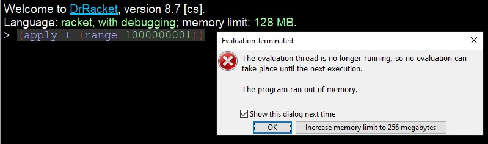
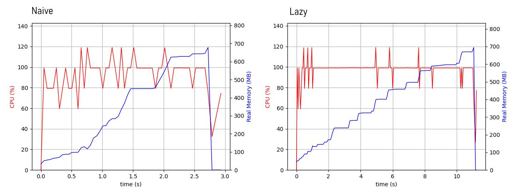
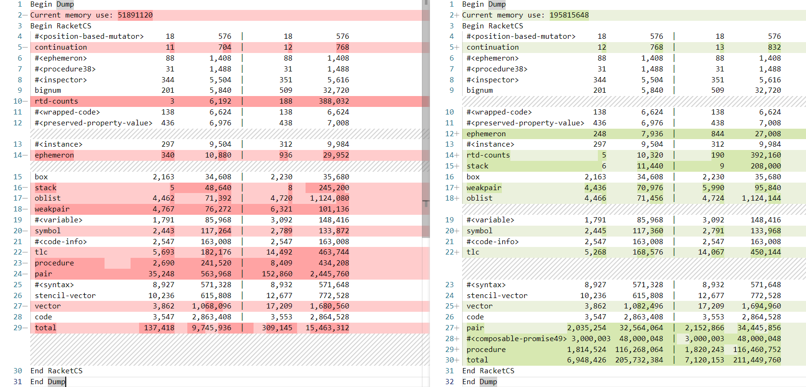
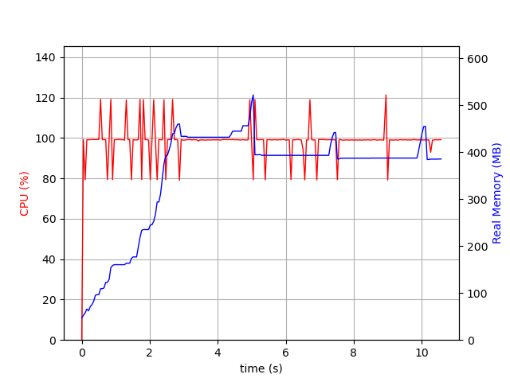
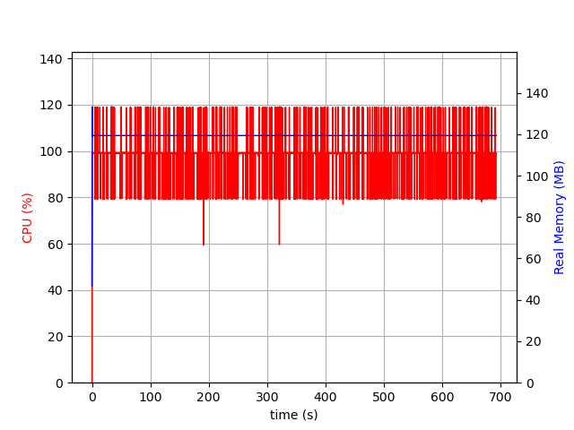

Imagine you want to count the sum of the numbers from **1** to **1,000,000,000** (one billion). If you come from an imperative programming background, you might be already thinking on a loop and what number type to hold that value. You might come up with something [similar to this](https://godbolt.org/z/Gos5Tvenn) if you're writing C:

```c
uint64_t sum = 0; 
for (int i = 1; i <= 1000000000; i++)  
    sum += i;  
printf("%lu\n", sum);
```

Good, it runs quite fast and we get the solution. But let's try to write a solution for that problem in a functional-style Python:

```python
sum(range(1,1000000001))
```

It's more elegant and simpler. I like it. But I'm not satisfied and I want to do it in Racket:

```racket
(apply + (range 1000000001))
```

Since Racket doesn't have a `sum` function, I use `apply` and pass the function `+` to it. But when I try to run in DrRacket, I get this error:



It makes sense, because the `apply` function basically gets every element in the list and apply as parameters to pass to the function specified. Example:

```racket
(apply + (range 10))
```

Will expand to:

```racket
(+ 0 1 2 3 4 5 6 7 8 9)
```

And considering that Racket uses big numbers as the default numeric type, I can imagine that it'll take a lot of memory to expand a million values. But that's unecessary, let's try a different way, let's fold that list:

```racket
(foldl + 0 (range 1000000001))
```

> `foldl` stands for `Fold Left`, it will _reduce_ the list using the _procedure_ passed in the first parameter with the _accumulator_ in the second parameter. In that example, it will call the `+` procedure with 0 and the first element in the list, then update the _accumulator_ for the next element in the list and so on.

Oh no. Same memory problem. But expected again, after all, we're still using the `range` function, that creates a list with the numbers within that range. Which means that it's not the `foldl` that is breaking our program, but the `range` itself. But what if we could make it lazy? I mean, only compute that range as we consume it? 

**Time splits here, in one timeline I went straight to the [Solution](#the-solution), in the other one I decided to explore other options:**

Luckily, Racket has a lazy version of it, all we need to do is set `#lang lazy` at the beginning of the code file:

```racket
; Regular Racket version
#lang racket
> (range 11)
'(0 1 2 3 4 5 6 7 8 9 10)

; Lazy version
#lang lazy
> (range 11)
'(0 . #<promise:...7/pkgs/lazy/base.rkt:299:29>)
```

Okay, that looks _promising_! ;) 

[**Lazy Racket**](https://docs.racket-lang.org/lazy/) already provides all the basic list functions adapted to use those promises, so we can use our `foldl`, right?

```racket
(foldl + 0 (range 1000000001))
```

. . .


Argh! Memory error again. Let's try to figure out why.

# Tracking Memory Usage

We know that it is consuming too much memory to the point where the Racket interpreter is killing it. I'm gonna use [psrecord](https://github.com/astrofrog/psrecord) to track the memory of our process and plot it to a graph. It's pretty simple to run it in a debian-based system.

## Setting up psrecord

```shell
$ pip3 install psrecord
$ sudo apt-get install python3-matplotlib python3-tk
```

Then I created a shell script `plotprocess.sh` to help tracking it:

```shell
#!/bin/bash
$* 
&P1=$!
graphfile="$(date +%s).png"
psrecord $P1 --interval 0.05 --plot $graphfile
P2=$!
wait $P1 $P2
echo "Graph plot in '$graphfile'" 
```

Now we only need to call `$ ./plotprocess.sh process` to start the process and plot the memory/cpu of it.

## Tracking with ./plotprocess.sh

I created two files with both regular and lazy racket code for the foldl:

```racket
; foldl-naive.rkt
#lang racket
(foldl + 0 (range 1000000001))

; foldl-lazy.rkt
#lang lazy
(foldl + 0 (range 1000000001))
```

So now I can track the memory usage of both of them: 

```shell
$ ./plotprocess.sh racket foldl-naive.rkt
Attaching to process 10866
./plotprocess.sh: line 6: 10866 Killed               $*
Graph plot in '1680099684.png'

$ ./plotprocess.sh racket foldl-lazy.rkt
Attaching to process 10914
./plotprocess.sh: line 6: 10914 Killed               $*
Graph plot in '1680100084.png'
```



The memory usage of the process is clearly rising up to 700mb. Then it's killed. But there's an important thing to note here: the execution time. The naive version gets killed after around 3 seconds, whereas the lazy one goes over 10 seconds. That tells me that the lazy version is actually iterating over the list for some time, but bloating the stack or the heap with garbage.

In fact, I decided to test it with the `trace` library that Racket provides. The problem is it only traces custom procedures. So I had to reimplement `foldl`:

```racket
(require racket/trace)

(define (lfoldl f v l)
  (if (empty? l)
      v
      (lfoldl f (f (car l) v) (cdr l))))

(trace lfoldl)
```

Now running it for both regular racket and lazy racket gets me me this:

```racket
> #lang racket
> (lfoldl + 0 (range 1000000001))
Interactions disabled; out of memory

> #lang lazy
> (lfoldl + 0 (range 1000000001))
>(lfoldl #<procedure:+> 0 '(0 . #<promise:...7/pkgs/lazy/base.rkt:299:29>))
<#<promise:...e/pkgs/lazy/base.rkt:364:27>
>(lfoldl #<procedure:+> 0 '(1 . #<promise:...7/pkgs/lazy/base.rkt:299:29>))
<#<promise:...e/pkgs/lazy/base.rkt:364:27>
>(lfoldl #<procedure:+> 1 '(2 . #<promise:...7/pkgs/lazy/base.rkt:299:29>))
. . .
```

Until a point where it gets killed due to memory usage.

## Trying to track with Racket's `(dump-memory-stats)`

Racket has a [timid set of memory diagnostics functions](https://docs.racket-lang.org/reference/garbagecollection.html) available. The `(dump-memory-stats)` function will print to the error output the memory usage at the moment. 

I tried retrieveing the information at the beginning of the program execution and at the last iteration of the `lfoldl` function:

```racket
#lang lazy

(dump-memory-stats)

(define (lfoldl f v l)
  (if (empty? l)
      (let ()
        (dump-memory-stats)
        v)
      (lfoldl f (f (car l) v) (cdr l))))

(lfoldl + 0 (range 1000000)) ; high enough number, but runs to the end
```

The full output with the two dumps is [here](https://pastebin.com/xkDF5rkz). It's a bit confusing at first, but after removing the useless information (all the data that didn't change from one to the other) and comparing the two dumps, we have this:



I don't know exactly the difference between the two sets of columns, but I imagine the columns in them are object count and size. I'm also assuming all the sizes are in bytes.

The **Current memory use** values don't really line up with the values in the `total` line. The first execution shows the memory usage to be around `51mb` and the total being `15mb`. And the second `195mb` vs `211mb`. Also those numbers are a bit off from what _psrecord_ tracked:



But that all won't keep me from looking at what changed between the two dumps. And the most important lines are:

```
 pair                   2,035,254   32,564,064  |  2,152,866   34,445,856
 #<composable-promise49> 3,000,003  48,000,048  |  3,000,003   48,000,048
 procedure              1,814,524  116,268,064  |  1,820,243  116,460,752
```

All of these objects had an incredible growth in objects and size and are the ones that consume the most amount of memory. `#<composable-promise49>` wasn't event present in the first dump. My assumption is that all those promises are stuck somewhere in the stack, considering that the `lazy` language is making all sorts of operations a promise, the conditional and the call to the `f` function within `lfolfl` are probably becoming promises too. Leaving the Lazy Racket aside...

# The Solution

The solution for this problem is the use of [Streams](https://docs.racket-lang.org/reference/streams.html):

```racket
(stream-fold + 0 (in-inclusive-range 0 1000000000))
```

It does take quite some time to run, but it works. The principle is the same, the function `in-inclusive-range` will generate a [Sequence](https://docs.racket-lang.org/reference/sequences.html), that is lazy by default. 

The execution graph is not very impressive, the memory use is stable:



I also wrote a custom version of the `stream-fold` function that dumps the memory at the last iteration so I can have more insights on that difference from the Lazy Racket one, but there's not a significant change. So I'll stop here.

# Conclusion

I was motivated by [this repository](https://github.com/clarkzjw/one-two-three...infinity) with implementations in several languages on this problem. I actually had the implementation with Streams quite early, but I wanted to explore a bit more other lazy structures in Racket, and more specifically the Lazy Racket. In the end, seems like it's not as simple to use as I imagined. 

While I didn't really learn a lot about the internals of the lazy implementation of Racket, I enjoyed this whole process. If you happen to know more about this, I'd love to hear from you.


