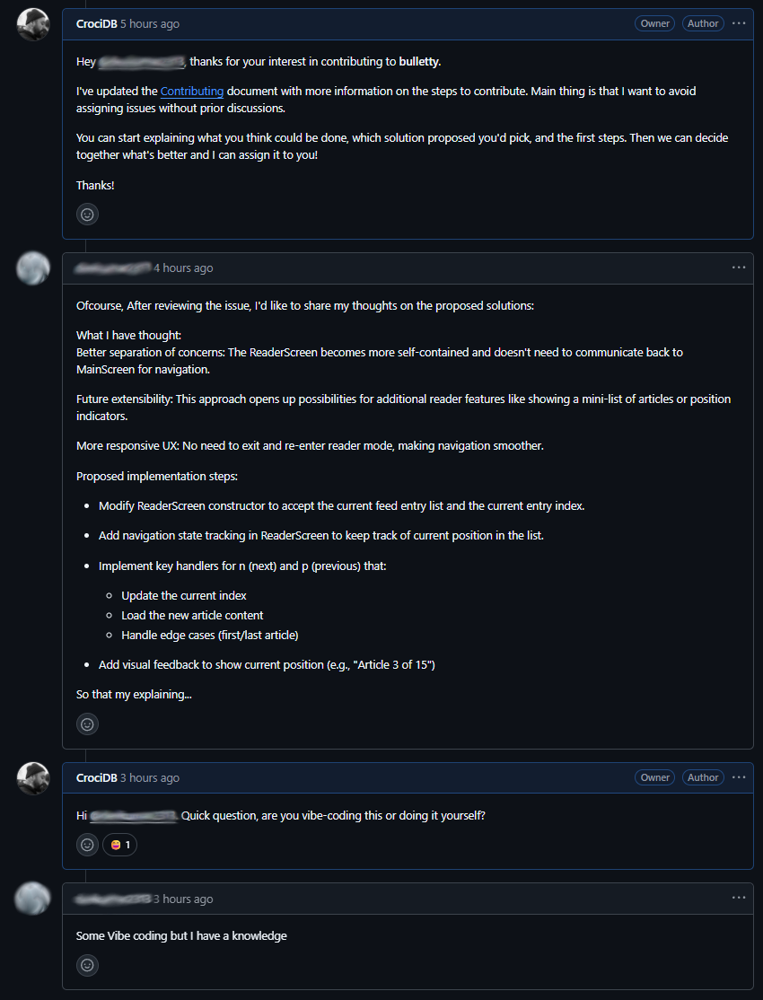
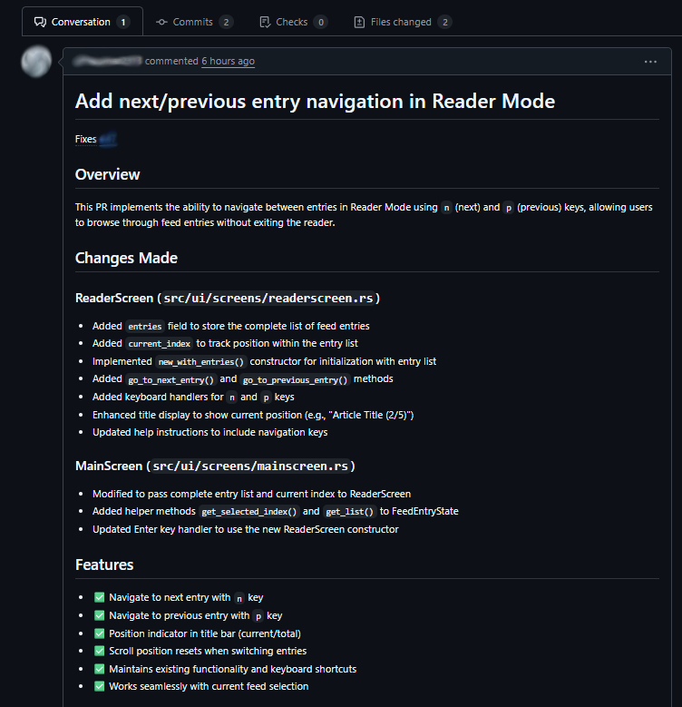
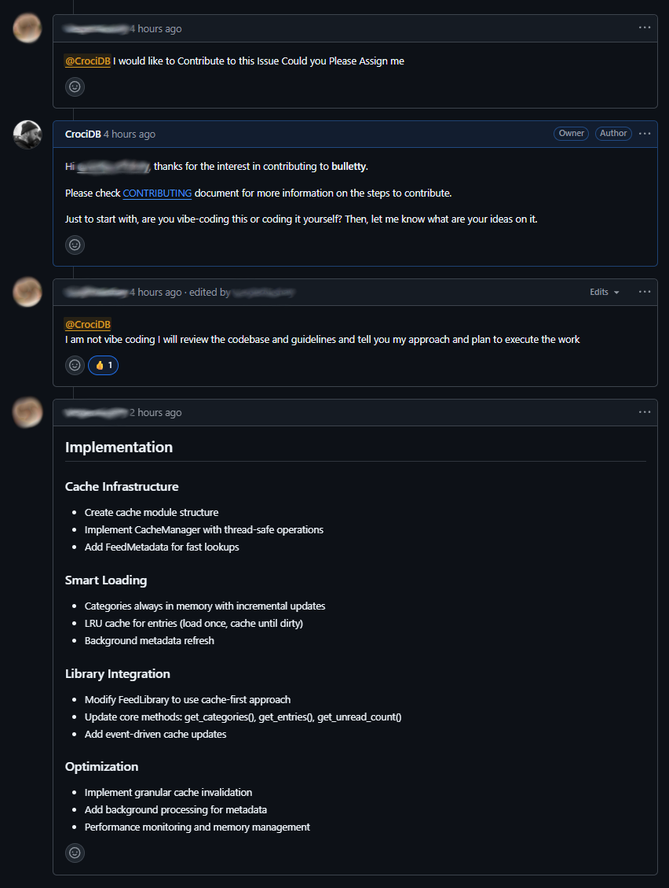

I was finalizing the first working version of [**bulletty**](https://github.com/CrociDB/bulletty) when I realized it was close to [Hacktoberfest](https://hacktoberfest.com/), the event created by DigitalOcean where they give t-shirts for people who contribute to open source software (more specifically, when you complete 6 successful PRs during the month of October). So I thought it could be interesting to have people contribute and help me make the feed reader better, also bringing more visibility to the project.

I started by organizing the Issues in the project: one for each feature from the project roadmap and for bugs, with many details and images. Then I added appropriate tags, such as "Improvements", "Bugs", "Good First Issue", and of course the "Hacktoberfest" tag. I also wrote a pretty generic **CONTRIBUTING** file, mostly explaining how to proceed when suggesting changes, reporting bugs or submitting a PR.

To make it public, a few days before October, I posted on my personal accounts on X, Bluesky and Mastodon, then posted on the `/r/hacktoberfest` subreddit. Then I figured out there's an official Hacktoberfest discord server with a channel for people to recruit contributors, so I did it too. I tried Hacker News, but honestly was the channel where I got the fewest views.

In just a few days, I saw the star counter on GitHub go to almost a hundred. Got many replies on all the platforms and I considered it an absolute success. Then October started...

On the very first day, I started getting multiple comments on issues of people asking me to assign the issue to them. Without any type of discussion first:

I thought that was a bit too quick and I realized that I didn't want to assign issues to people without discussing what they're planning to implement in the first place. Maybe if someone already came with a pull request, I could consider their implementation and would review the code and discuss if that's the best way. But just assign them the issue and wait for whatever they came up with felt a bit too risky, because that meant that other people would not even check on that issue if someone is already on it.

So I updated the **CONTRIBUTING** file with some more information on how to work on the issues:

> **Working on Issues**
>
> First requirement: use the program. I've seen people wanting to contribute without using it. Issues will only be assigned to users when enough discussion about their implementation has taken place. It's important that nobody keeps an issue assigned without making progress, as this prevents others from contributing. So, if you want to write code for an existing issue, start by discussing the issue and your proposed solution first.
> 
> I do think it's fine if you submit a PR for a bugfix you made without prior discussion, as long as you take the time to explain the why and the how. In that case, the issue won't be assigned to you until the merge is complete. 

So I replied that user:

I instantly suspected the user would be vibe-coding due to the way they described their proposal for the issue. So I asked, and they confirmed some sort of vibe-coding workflow. So I had to go and update the **CONTRIBUTING** file once again:

> **Generative AI use**
>
> I don't want to go as far as prohibiting anyone from using AI. After all, at this point, some AI use is inevitable. However, purely vibe-coded PRs are not going to be approved. If you're using AI to generate code, you must make it very clear. And you'll have to own it and maintain it. I will review and ask as many questions as necessary about the code, and I reserve the right to judge whether I think the contribution is worth it or not.
>
> Also, not properly communicating that you're using generated code in your PR is considered dishonest. If I find out, I'll have to close the PR.

I use some AI myself, it's not the problem. However I see people simply delegating to an LLM to write all the code for them, and I think it's just bad.

That user eventually submitted a PR for that:

The PR didn't even build; the code wasn't formatted (despite me explicitly saying it's important in the CONTRIBUTING file); the two commits were titled _"Update readerscreen.rs"_, without any logical division; there was even an instance of a method's name that was changed, but without changing the name in the Trait it inherited from:

So many indications that the user just asked their own agentic copilot for the changes and just tried to submit the PR. I closed the issue with some harsh words, something like "please avoid wasting both our times".

---

Some of the issues got people adding _"attack plans"_ that looked very clearly LLM-generated, because they didn't make much sense to begin with. For example, one of the issues is caching the feed library, something that needs to be done but can be as simple as keeping a local variable of the feed entries per feed source, instead of querying the disk on every interaction (which is still happening to this day). One user suggested very vague and nonsensical _cache infrastructure_ right after affirming they were not vibe-coding:

I remember reading from other maintainers that during Hacktoberfest, it was really common to get spammy PRs with mostly typo fixing, simple comments being added or removed, or plainly useless changes. Now, with AI coding and advanced agentic models where you just show your codebase and ask for modifications and it does it all in place, maintaining open source software is getting more complex. For simple tasks, it might not even be a problem, but I can see users contributing with big refactors that were completely machine-made, possibly introducing not only a series of bugs, but eventually creating a code that nobody fully understands. Simply because [LLMs have no "theory"](https://ratfactor.com/cards/naur-vs-llms), as in [Peter Naur's "Programming as Theory Building"](https://ratfactor.com/papers/naur1).

Plus, everyone seems to have their own conviction on what has been created with AI or not. This whole post is about how I dealt with _possible_ AI generated contribution mostly based on the behaviour and messages of the user proposing them. But these could be just mistakes, maybe they were really just made by humans. For example, I see some people judging texts that are _overly_ formatted with italics, bold and underline as something that LLMs could have done, but I myself do it quite a lot since forever. AI could be creating noise in the open source software community. 

## There were good contributions

Nevertheless, there were good contributions. After the first wave of weird PRs, some more well-intentioned people got interested and started contributing to the project. Highlight to these PRs:

### [Add next/prev navigation to the reader](https://github.com/CrociDB/bulletty/pull/54)

A very important feature that was missing, the ability to navigate previous/next posts from the reader screen itself. The implementation taught me about `Rc<RefCell<>>` in Rust.

### [Feature: Read Later](https://github.com/CrociDB/bulletty/pull/73)

The ability to store articles in a separate category to be read later. This was an extremely nice PR made by [alfaarghya](https://github.com/alfaarghya), after some very nice discussion on the best ways to implement it. He also contributed with other nice PRs during the time.

---

Some other PRs that I've reviewed and merged into the project were:

 - [feature: implement delete command for bulletty cli](https://github.com/CrociDB/bulletty/pull/61)
 - [feature: add new 'dirs' command to display important directories](https://github.com/CrociDB/bulletty/pull/57)
 - [Fix integer underflow in macOS debug builds](https://github.com/CrociDB/bulletty/pull/55)
 - [fix: remove flawed if blocks in feedparser](https://github.com/CrociDB/bulletty/pull/49)

These inspired me so much that I ended up implementing many features during this time too. Since I was submitting PRs for myself to approve too, Hacktoberfest considered these and also sent me a t-shirt (that hasn't arrived yet).

---

In the end it was a good idea. **bulletty** got some visibility, code contributions, many people also posting bugs and suggestions, even after the event. The project has now **250** stars on GitHub:

