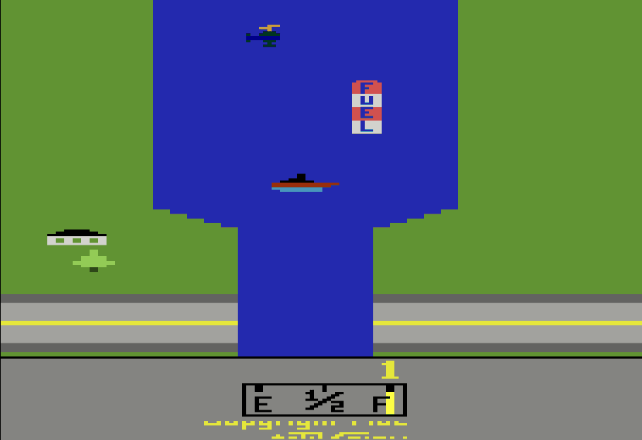
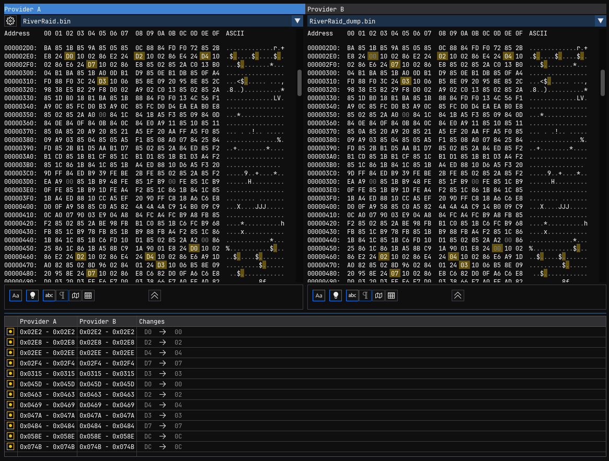
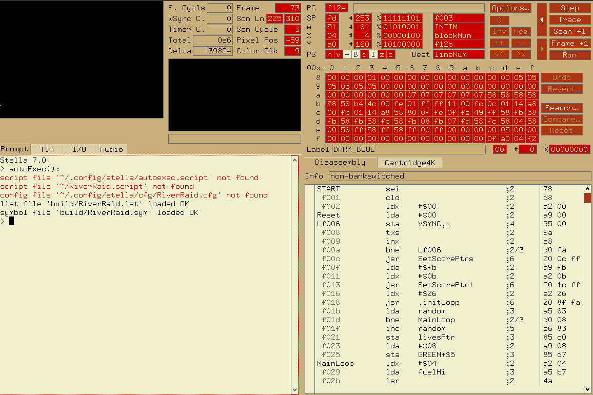
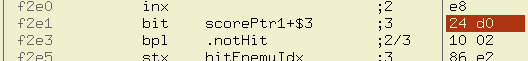
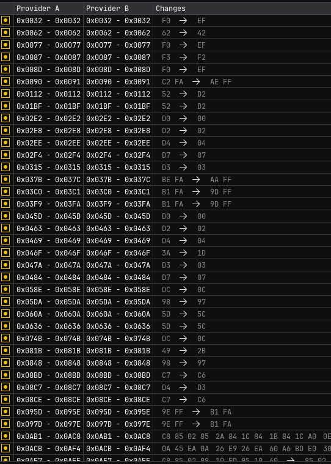
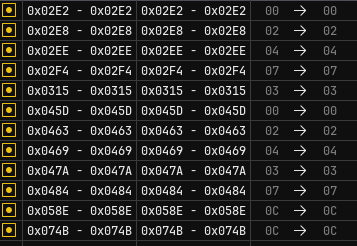
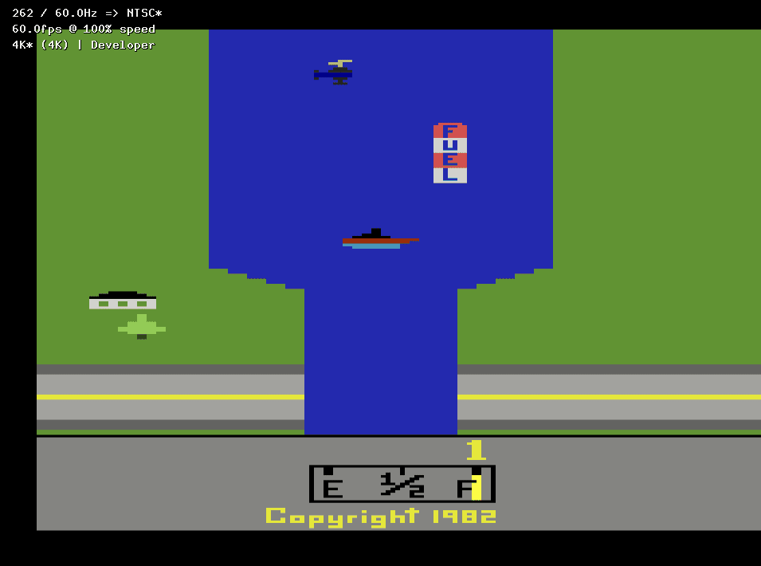
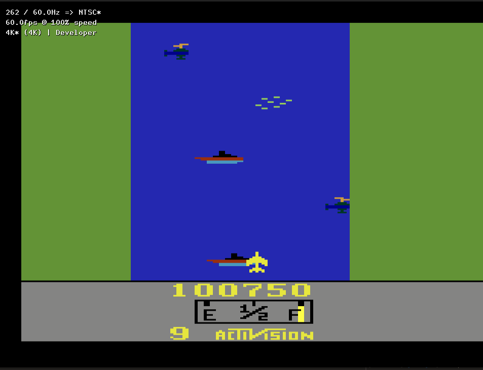

As a kid, my first video game console was an Atari 2600. Not in the seventies, it was late 90's already, but that's what I could have. If I remember the story well, it was my dad's old console, that he found and brought back to life. Back then, however, 20 years of console evolution wasn't that big of a difference. The console I asked, the SNES, was released 13 years after the Atari, but its CPU was based on the same architecture.

I had a lot of fun with it anyway. Some of the games we had were Pac-Man, Space Master X-7 and, of course, River Raid. The latter was the most special because it felt huge, infinite even, although being too difficult for me. After all those years, I was wondering what happened after the first few levels, so I thought I could try and remove the collisions.

# Disclaimer

I haven't played any Atari games in a long time, and I didn't notice, when I started this, that most of the emulatores already come with an option to disable collisions. So, this text is mostly a rewritten version of my notes while going through this. You'll follow my thought process and mistakes, but maybe you'll have fun. Remember, it's all about the process!

# First steps
After a quick research, I found a [disassembly of the game online](https://www.romhacking.net/documents/518/), made by [Thomas Jentzsch](https://www.romhacking.net/community/1322/). He's still very active in the [Atari 2600 community](https://forums.atariage.com/profile/45-thomas-jentzsch/), and has interesting [games of his own](https://github.com/thrust26) for the platform. The code is really well documented, which makes my job much easier.
Ok, first thing is: compile and run it. I followed this tutorial [Atari 2600 Programming for Newbies](https://www.randomterrain.com/atari-2600-memories-tutorial-andrew-davie-01.html) to setup my environment with DASM and Stella, the assembler and the emulator.

Then I created a Makefile to build it:

```makefile
BUILDDIR = build
NAME=RiverRaid
SRC = $(NAME).asm
BIN = $(BUILDDIR)/$(NAME).bin
LST = $(BUILDDIR)/$(NAME).lst
SYMBOLS = $(BUILDDIR)/$(NAME).sym
ATARI_LIB=/opt/dasm/machines/atari2600/

$(BIN): $(SRC)
	mkdir -p $(BUILDDIR)
	dasm $(SRC) -I$(ATARI_LIB) -f3 -o$(BIN) -l$(LST) -s$(SYMBOLS)

clean:
	rm -f $(BIN) $(LST) $(SYMBOLS)
```

Just explain a bit why the assembler generate three files, `RiverRaid.bin` is the rom, and it's all that's needed to play it; `RiverRaid.lst` is a _listing file_, the assembly after macros and addresses resolving, with the address of every instruction; and finally `RiverRaid.sym`, with the symbols, to help us debug. It also has to explicitely set the environment variable `ATARI_LIB`.

There's only one problem:



Interesting. The game never starts. When you try to move the ship, it gets self-destroyed.

To make a fair comparison, I found a rom of the game online and gave it a test and it worked fine. So I fired up a hex-view to check the difference between these two roms and that's what I found:



There are some difference. But what's the best way to tackle that problem? Try to understand these changes? Patch them after building?

The first ROM in the file is the one we're building, the other is the one I found online. One interesting thing to notice... all these bytes are shifted by `D0`! Let's check if there's anything obvious in the code. Now to debug...

One idea is try to identify where those bytes are. They're either code or data. I can create breakpoints on them and neighboring bits to identify if they're code.

Stella has an embedded debugger, so we can start it using the `-debug` flag:

```shell
stella build/RiverRaid.bin -debug
```



It already loads the symbol file, so it's a much better experience debugging it. First let's try to find the position where the first divergence is. In the hex editor, it's shown at `0x02E2`. Since the ROM starts at address `0xF001` in the system, we can just add them together and find `0xF2E3`. It looks like:



`D0` is an argument passed to the `bit` instruction. That, in the source code, looks like:

```asm
; check collisions for the last displayed block:
       BIT    CXM0P-$30         ; 3             player missile hit enemy?
       BPL    .notHit2          ; 2
       STX    hitEnemyIdx       ; 3             save block number
```

Interestingly, it's messing with some address defined in `CXM0P`, but in the emulator disassembly it shows `scorePtr1+$3` rather than `CXM0P` at all. But that, I imagine, is because the disassembler in the emulator will look for the closest address symbol in the symbols file? Anyway, it's very likely nothing to do with `scorePtr`.

In `vcs.h`, the header file that comes with the specific machine in DASM, it defines as:

```asm
;-------------------------------------------------------------------------------

			SEG.U TIA_REGISTERS_READ
			ORG TIA_BASE_READ_ADDRESS

                    ;											bit 7   bit 6
CXM0P       ds 1    ; $00       xx00 0000       Read Collision  M0-P1   M0-P0
CXM1P       ds 1    ; $01       xx00 0000                       M1-P0   M1-P1
...
```

It looks like they're related to `TIA`, which is the revolutionary video chip (Television Interface Adapter) bundled in the console. So at this point I wonder if those values are different because of the different type of video systems, like NTSC and PAL? Maybe there's nothing wrong with the disassembly of the game, but rather with the compilation. Since there was no instructions at all how to build the game, let's investigate a bit further.

Well, at the beginning of the assembly file there are comments that I should have read before! Turns out it already handle both systems and all you have to do is change this value:

```assembly
;===============================================================================
; A S S E M B L E R - S W I T C H E S
;===============================================================================

FILL_OPT        = 1             ; fill optimized bytes with NOPs
SCREENSAVER     = 1             ; compile with screensaver code
TRAINER         = 0             ; enable training mode
NTSC            = 1             ; compile for NTSC
```

It's set default for NTSC. So I turned it into 0, built and run on the emulator and... well, it does change the aspect ratio of the game, but the issue is exactly the same! And diffing the roms just gave a lot more more divergences:



Well, definitely not what I'm trying to do. Reverting back to NTSC.

Back to the value of the parameter to the `BIT` instructions, it's subtracting it by 30, which seems a bit strange that it's not saved in a constant.

```asm
BIT    CXM0P-$30         ; 3             player missile hit enemy?
```

Searching by other uses of `CXM0P`, I see it's also subtracted the same value. Searching by the subtraction specifically, I found that there's exactly 12 occurrences, just exactly as many as the number of divergences. I removed all these subtractions (`:%s/-$30//g`) and then:



All the values are correct! Didn't even had to do hex math, sometimes following the gut feeling pays off!

Ok, so now I have a functioning assembly of River Raid that I can hack into. I tried playing, but turns out I'm still pretty bad at it. This game is hard, just as it was when I was a kid.

## God Mode

I want to make the player invincible. That means it won't kill when colliding. But what about colliding walls? I have no idea what would happens if the player went over the walls, so I'll just start with colliding enemies, let's try to remove it completely.

Luckily, the last issue I had to deal with was literally on the part of the code that deals with collision, so we can build up from there.

```asm
; check collisions:
; (the collsion check between jet or missile and playfield aren`t
;  really neccessary for each block, but the collison registers
;  are cleared after each block)
       INX                      ; 2
       BIT    CXM0P             ; 3             player missile hit enemy?
       BPL    .notHit           ; 2
       STX    hitEnemyIdx       ; 3             save block number
.notHit:
  IF TRAINER
       BIT    zero1
  ELSE
       BIT    CXP0FB            ; 3             jet hit PF?
  ENDIF
       BPL    .noPFCrash        ; 2
       STX    PFCrashFlag       ; 3
.noPFCrash:
  IF TRAINER
       BIT    zero1
  ELSE
       BIT    CXM0FB            ; 3             player missile hit PF?
  ENDIF
       BPL    .notHitPF         ; 2
       STX    missileFlag       ; 3
.notHitPF:
  IF TRAINER
       BIT    zero1
  ELSE
       BIT    CXPPMM            ; 3             jet crashed into enemy?
  ENDIF
       BPL    .noCrash          ; 2
       STX    collidedEnemy     ; 3             save block number
.noCrash:
```

First we can see these are like the if conditions of one type of collision. Looking at the first part, `BIT CXM0P` [tests a bit masked from register A](http://www.6502.org/users/obelisk/6502/reference.html#BIT) and then `BPL .notHit` will [jump if that bit is positive](http://www.6502.org/users/obelisk/6502/reference.html#BPL). To test which collision exactly that is, I'm changing instruction `BPL` to simply `JMP`, which will jump to `.notHit` regardless of the value. Building and running gives me:



The ship still collides with the other objects, but not its shot! So that is the test for the ship bullet collision. But not what we want just yet. Reverting that.

That's when I noticed there is already a macro for `TRAINER`:

```asm
;===============================================================================
; A S S E M B L E R - S W I T C H E S
;===============================================================================

FILL_OPT        = 1             ; fill optimized bytes with NOPs
SCREENSAVER     = 1             ; compile with screensaver code
TRAINER         = 0             ; enable training mode
NTSC            = 1             ; compile for NTSC
```

How did I miss it when I was checking the video signal format? Anyway, changing that o 0 did the trick. So I could finally reach score over 100.000:



I also realized that after playing that for almost 10 minutes straight still makes me a bit dizzy and everything looks like it's moving down on the real world.

But since it was too easy and my initial idea was already implemented by the source code reverse engineered by the author, I decided to make something different. Let's make a mod and change the rules of the game, re-purposing some of the mechanics:

- No collisions anymore. You're flying an aircraft, it won't collide with the land, ships or helicopters
- No more fuel logic. Let's say you have infinite fuel
- However, you have to keep destroying the enemies in order to keep flying, the fuel counter now counts how much you destroy, and that keeps you flying
- Destroying FUEL tanks actually gives you score
- New color scheme
- Faster plane
- Fix rotation of plane to the correct side
