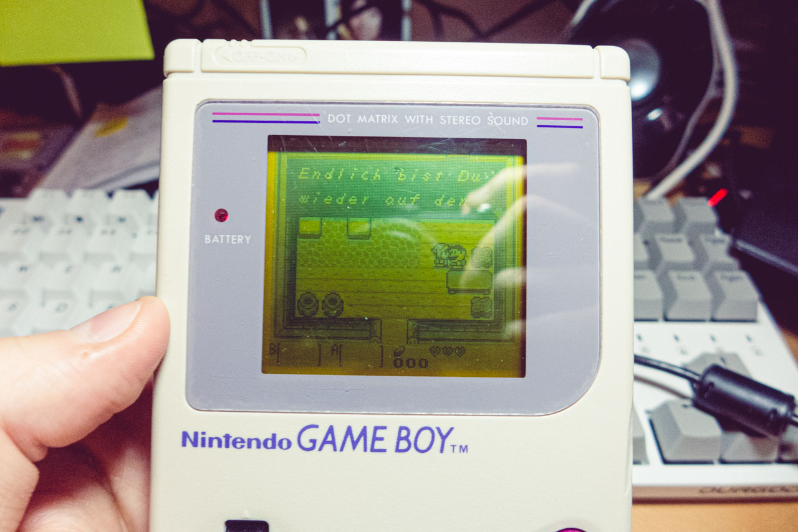
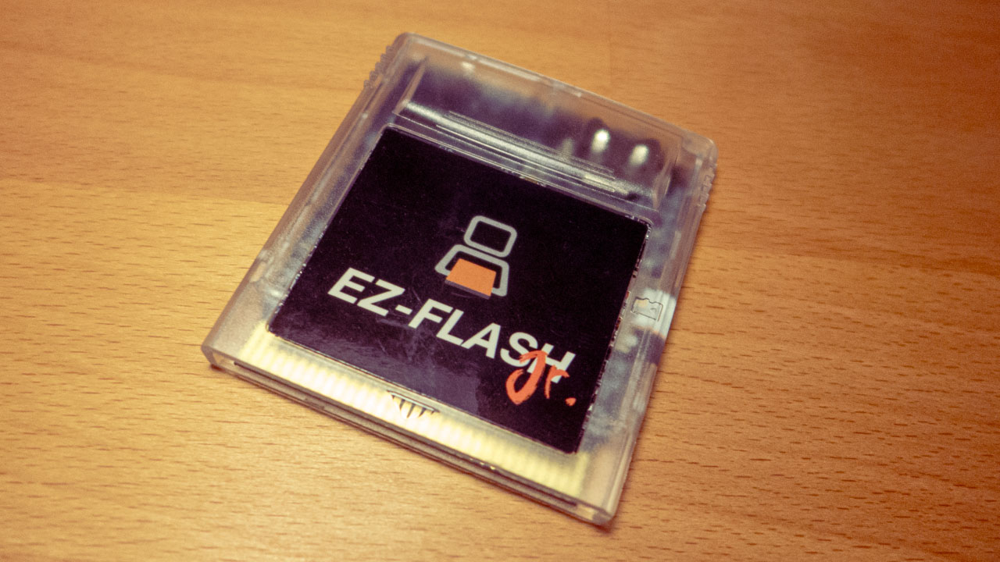

It is 2023 and I got my first Gameboy. My parents never had the finnancial condition to get me one when I was a kid, and to be really honest, nor did most of the families of my street friends and school colleagues. It was probably only by the early 2000's when I first heard about it. Pokémon Yellow was the reason I downloaded my first emulator and <s>pirate</s> roms.

For so many years after that I didn't play any other games in that platform. I even started [writing an emulator](/post/gameboy-emulator1/) for it a few years ago, but not because I like it especifically, more like because I found out it's not the most complicated system to start studying emulation. But this time I got interested in getting the actual hardware to play some old games and make a small game for it myself. It must feel really good to play a game I build myself from scratch in such an interesting device.

So I started by finding one on ebay, focusing on the DMG version, the first flagship model. Turns out there are a lot of them and it's not really that expensive, especially coming from an old camera buying background.

To play with it, I decided to buy one of the best games for the platform, according to Internet: **Zelda: Link's Awakening**. Joined an auction and due to system issue that said that I didn't win it at first, I joined another one and ended up getting two cartridges for the same game.

But more impressive is that I didn't, at any moment, think that buying a game in Germany ultimately means the game is localized in German. Back in a time where there's only one language embedded in the game.

When I finally accepted that I bought two copies of the game in German, I decided to play and figure out my way through it, after all, many times my ADHD doesn't allow me to follow the story in games anyway.

I noticed, though, that the d-pad had some issues. The right key was constantly being pressed even when I didn't want it to. But thanks to the whole community still modifying and playing with this console, it was easy to find replacement parts.

There are countless websites selling many different parts for the Gameboy and they cost very little. Got the d-pad and started the process of replacing it. Opening it is very exciting and also a bit enerving because I have close to zero experience in electronic or anything repairing related, and I don't want to break it because I think that, once you're into these kind of old devices (just like I am with old cameras), you have to have some responsability with keeping them in a good state, since there's a limited amount of it out there and maybe one day you won't want it anymore, but someone else will.

It was really no problem opening it. Pretty straightforward. Also I imagine the devices from that time were made for easy repairing, unlike today's. A few more screws down and I could remove the front panel and switch the buttons.

That was fairly simple and now my Gameboy was working. Just to realize that that screen... it's just so difficult to play with it!

---

So I started working on a game. There are several options of tools to create games for that platform, but I picked the [GBDK](https://github.com/gbdk-2020/gbdk-2020), a C toolkit. Thought of simple game concept that can be fun and then started coding it. After a few hours of work creating the map tiles and building it to the screen, I got this:

I'll eventually post more about this project, because I'm writing a cool level editor for it in Racket.

I wanted to try that on the device, so I bought a flash cartridge, where I could run a rom created using the toolkit.

And boom:

Not that you can see anything, but it was pretty rewarding to see that. Now I want to get a Gameboy Color, because at least I'll be able to play something.

Ah, and the flash cartridge was also useful for something else. I can play Zelda in English!

