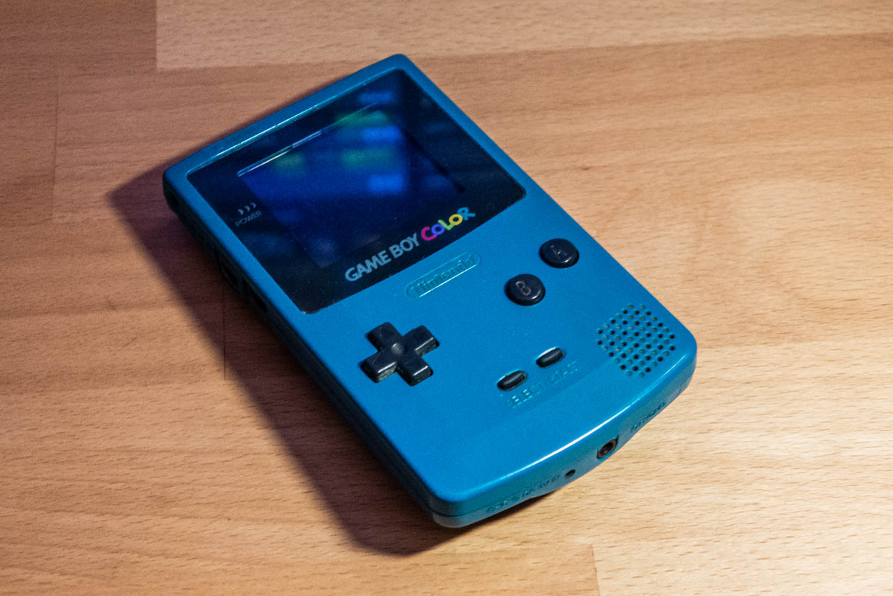
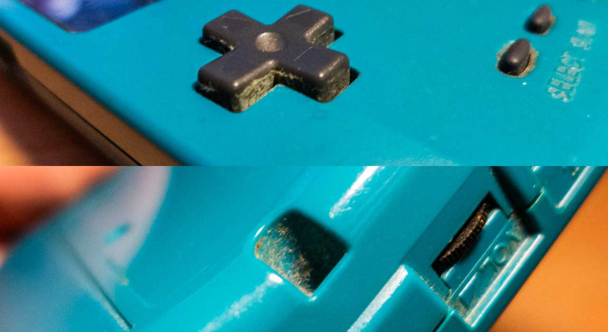
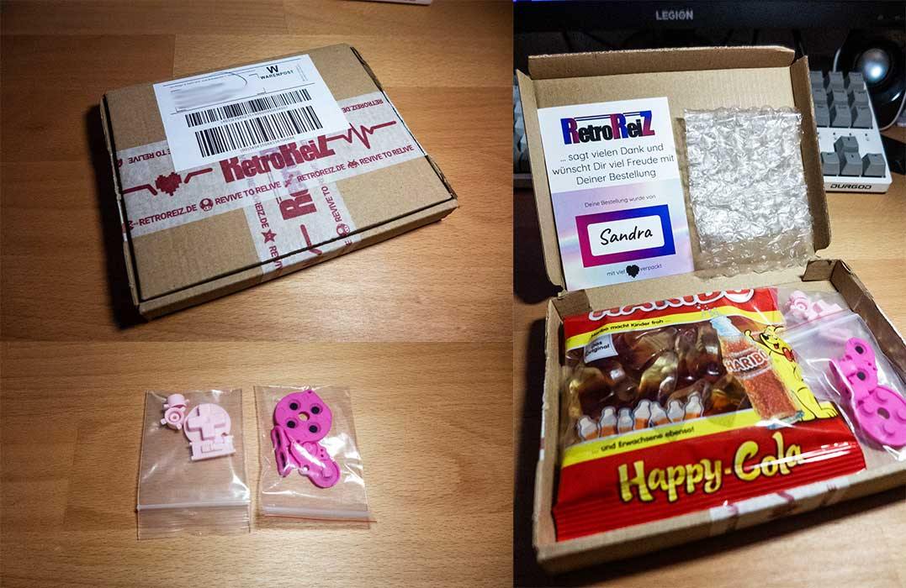
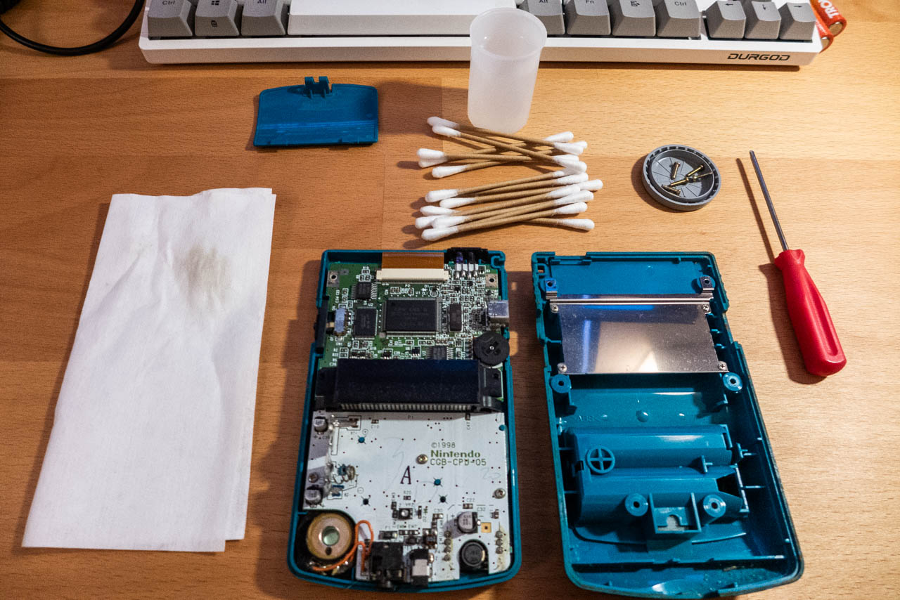
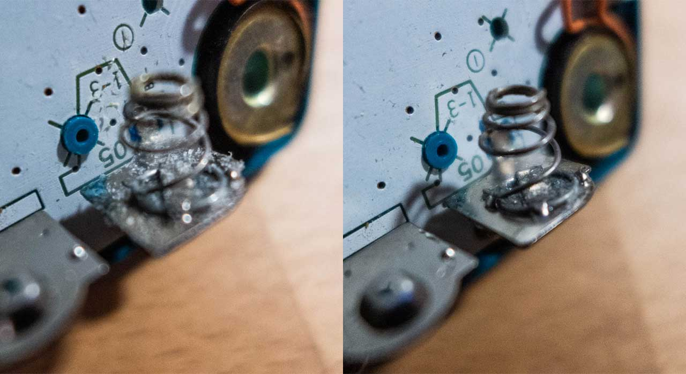
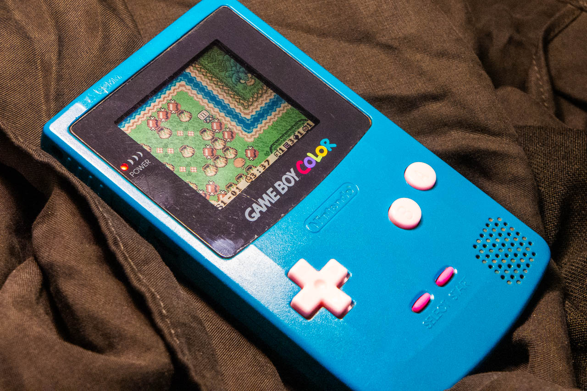
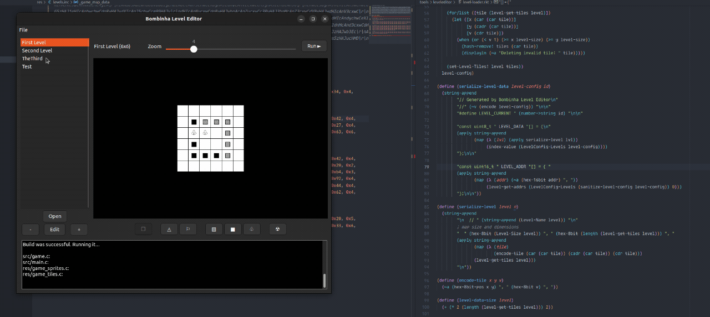
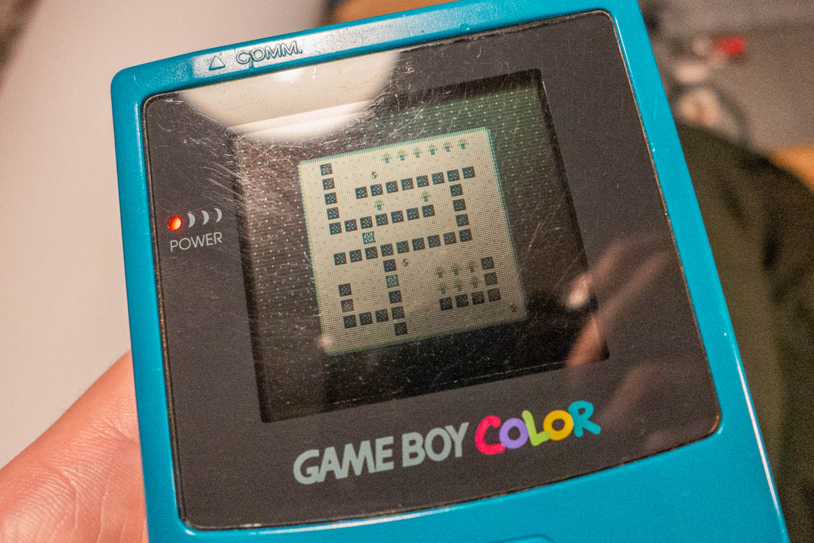

Following [my first GameBoy](/post/my-first-gameboy), It was the time to get a GameBoy Color! Not my favorite color, but the one available.



The seller said it was "working", but didn't mention some of the buttons weren't. Also, the d-pad was so soft that it kept pressing after only a touch.



So I got the replacement parts and started working.



[RetroReiz](https://retroreiz.de/) is very quick and always has the replacement parts for GameBoys, totally recommend if you are in Germany.



Inside wasn't too bad, only a few corrosion spots from the battery, but it was easy to clean with q-tips and some vinegar.



After that, it was good to go! I really like the combination of that light pink on the blue case better now. And it works perfectly now.



---

## Update on the game

I've been working on this game, inspired by Bomberman. It's still very early in development, but big part of my time was working on the level editor, in Racket. I opted to make a custom level editor so I can simplify the level format.



It exports a C file with levels in a custom format:

```c
const uint8_t _game_map_data[] = {

  // First Level
  0x6, 0xd, 0x31, 0x3, 0x43, 0x3, 0x13, 0x4, 0x12, 0x5, 0x11, 0x4, 0x44, 0x3, 0x24, 0x4, 0x21, 0x3, 0x14, 0x4, 0x34, 0x4, 0x41, 0x3, 0x42, 0x3, 0x22, 0x5, 

  // Second Level
  0xa, 0x29, 0x66, 0x6, 0x73, 0x5, 0x65, 0x6, 0x32, 0x5, 0x57, 0x4, 0x24, 0x4, 0x54, 0x3, 0x46, 0x6, 0x52, 0x4, 0x42, 0x4, 0x22, 0x4, 0x23, 0x5, 0x55, 0x3, 0x00, 0x1, 0x74, 0x4, 0x47, 0x4, 0x33, 0x6, 0x76, 0x5, 0x37, 0x5, 0x67, 0x5, 0x27, 0x4, 0x44, 0x3, 0x64, 0x6, 0x34, 0x6, 0x98, 0x3, 0x77, 0x4, 0x45, 0x3, 0x25, 0x4, 0x75, 0x4, 0x56, 0x6, 0x43, 0x6, 0x63, 0x6, 0x89, 0x3, 0x99, 0x2, 0x72, 0x4, 0x88, 0x3, 0x62, 0x5, 0x36, 0x6, 0x26, 0x5, 0x35, 0x6, 0x53, 0x6, 

  // TheThird
  0xc, 0x4b, 0x19, 0x4, 0x32, 0x4, 0x57, 0x6, 0x78, 0x5, 0x24, 0x4, 0x54, 0x4, 0x46, 0x4, 0x52, 0x4, 0xb6, 0x5, 0x14, 0x4, 0x42, 0x4, 0x60, 0x5, 0x7a, 0x4, 0xa2, 0x4, 0x86, 0x4, 0x47, 0x4, 0x4b, 0x4, 0x41, 0x6, 0x16, 0x4, 0x50, 0x5, 0x82, 0x4, 0x20, 0x2, 0x80, 0x5, 0x56, 0x4, 0x90, 0x5, 0x89, 0x5, 0x72, 0x4, 0x26, 0x4, 0xa3, 0x5, 0x79, 0x5, 0x66, 0x4, 0x13, 0x4, 0x73, 0x5, 0xb4, 0x5, 0xa4, 0x5, 0x8a, 0x4, 0x93, 0x4, 0x10, 0x4, 0xb5, 0x5, 0x11, 0x4, 0x00, 0x1, 0xaa, 0x4, 0x74, 0x4, 0xa5, 0x5, 0x92, 0x4, 0x1a, 0x4, 0x76, 0x4, 0x94, 0x4, 0xa6, 0x5, 0xbb, 0x6, 0xa0, 0x5, 0x48, 0x3, 0x96, 0x4, 0xa9, 0x4, 0x2a, 0x4, 0x4a, 0x4, 0x44, 0x4, 0x64, 0x4, 0x98, 0x5, 0x34, 0x4, 0x3a, 0x4, 0x49, 0x4, 0x95, 0x4, 0x43, 0x5, 0x12, 0x4, 0x88, 0x5, 0x99, 0x5, 0xb3, 0x5, 0x62, 0x4, 0x36, 0x4, 0x18, 0x4, 0xa8, 0x4, 0x35, 0x3, 0x70, 0x5, 0x9a, 0x4, 

  // Test
  0x5, 0x19, 0x01, 0x5, 0x13, 0x3, 0x32, 0x6, 0x30, 0x5, 0x24, 0x5, 0x44, 0x5, 0x21, 0x3, 0x14, 0x5, 0x34, 0x5, 0x20, 0x5, 0x42, 0x6, 0x22, 0x6, 0x10, 0x5, 0x31, 0x3, 0x23, 0x6, 0x43, 0x6, 0x03, 0x5, 0x12, 0x3, 0x00, 0x5, 0x11, 0x3, 0x33, 0x6, 0x04, 0x5, 0x41, 0x5, 0x40, 0x5, 0x02, 0x5, 
};

const uint16_t _game_map[] = { 0x0, 0x1c, 0x70, 0x108, };
```

I'll eventually write a post on how the tiles are enconded, but not yet because it'll likely change, since I'm not convinced with the 8x8 tiles. When working only in the emulator, that looks good enough, but in the small screen of the gameboy, it's almost unplayable.


