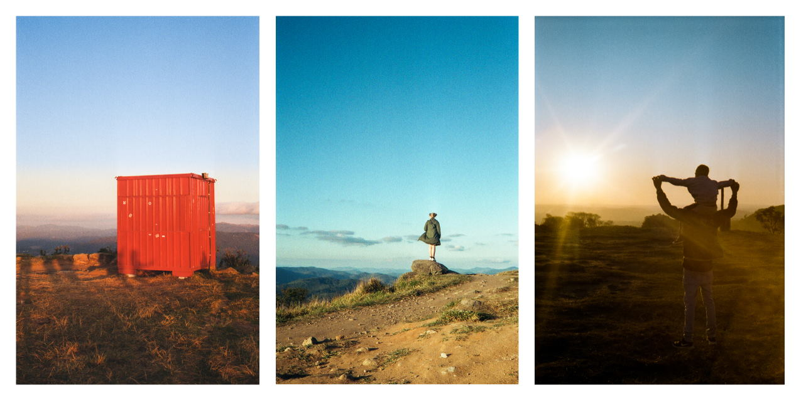
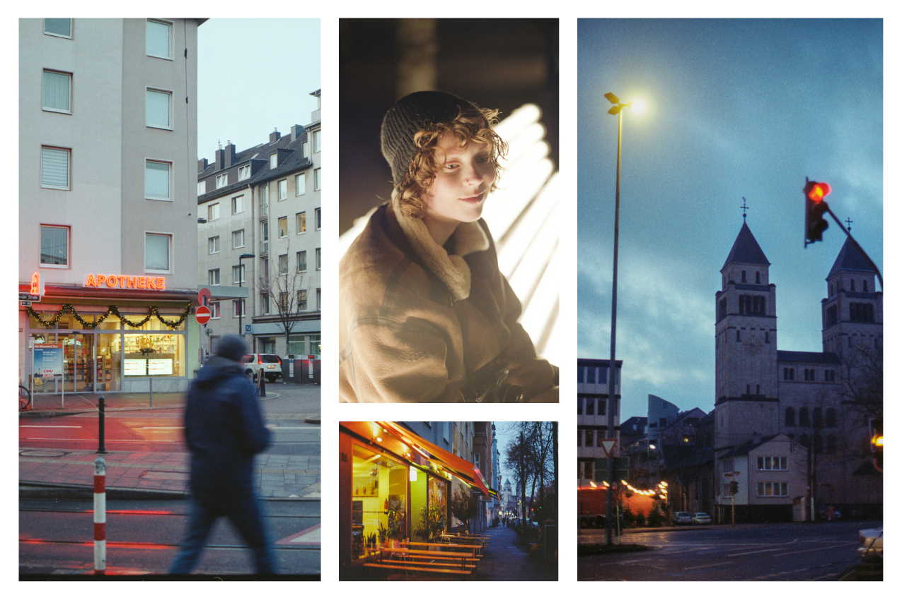
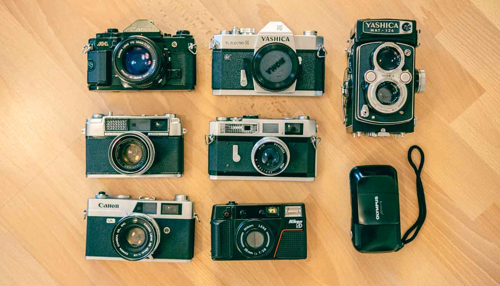

Photography has been in my life forever. Probably started with my dad, who had an old film camera to take photos of our family. I remember the camera sitting there, on the highest possible shelf in the living room, so the kids wouldn't try to take it. And I also remember how often I did that when nobody was looking just so I could trigger the flash and pretend I'm a photographer. Have you ever heard an old flash (or any proper flash for that matter) going off? There's a very satisfying high-pitched noise when you fire it, and then an even more satisfying reload sound, 100% recommended.

When I was a teenager, my grandma gifted me a digital camera and that was when I started enjoying taking photos. I loved the idea of having a camera with me all the time so that I can shoot spontaneous beautiful sunsets, buildings, people doing funny stuff on the streets, or just my friends and family. For the last few years, I've been studying photography more seriously and taking my Fuji X-T20 out more often. I got good lenses and filters that would help me take the best photos possible at the moment. And I was dreaming of a Sony a7iii, a very expensive full-frame mirrorless camera.

However, everything changed when my girlfriend brought her old film camera to one of our photo walks. I was intrigued by why someone would shoot film nowadays, with so many fantastic digital cameras on the market. After that day, somehow, social media started showing me ads for film cameras, which kept my interest in it. At some point I started watching videos about it and decided to buy a camera and try that for myself, after all, it could be a fun experience. Searched for "best film cameras to buy in 2021" and watched reviews about several of the cameras I saw and ended up buying a Canon A-1. The fact that it's an SLR gave me a good feeling, because I was used to shooting with DSLRs, and since it was sold very well in the 80s, there are a bunch of them available in good condition and at good prices. Found one for sale on the [Safelight Berlin](https://safelightberlin.com/) (a fantastic film lab and store, by the way) website and bought it. 

After the first walk out with the "new" camera, I quickly understood why many people still love shooting film. The first obvious different thing compared to the way I was used to photograph was the limited amount of photos. With my digital cameras, I'm always on _spray and pray_ mode. It's not that I don't think about the composition, but I just feel like I'll take all the photos I can possibly take of this moment because I want _the perfect photo_. Ironically, not having a screen where you can see the photo I just took, makes me _less anxious_ about it. Having to wait two weeks to see the final result sounded awful at first, but it's been an excellent experience for me. When I shoot film now I just pay more attention to the exposure and focus and I shoot with more confidence than ever before. Then I just simply move to the next photo, I don't feel anxious about having the best possible capture, because it doesn't really matter. The photo is just about you capturing it as it is about what is captured. High-level photographers nowadays try to make a photo so perfect that it's all about the subject, they take themselves off the result. But a photo always tells two stories, the one of the subject and the one of the photographer.

This one year of shooting film taught me so much about the technical aspects of photography, things like how to properly expose photos using the exposure triangle, understand all the particularities of the lens I'm using, how film behaves when under or overexposed, the different types of films and their differences in terms of image rendering, etc. But the most important was the subjective (p)art of photography. Before, in the digital world, the "best image quality" was my goal. Less noise, more dynamic range, more sharpness, blah, blah, blah. But I'm not a professional photographer working with clients, the cases where those things are important. I care about creating a piece that carries some emotion, a piece that you can look at and see a story, not a fact, but a narrative that I created when I triggered the shutter.

That made me reflect so much about art. I was raised in a culture where art means fine art, classic art, or something that involves so much technique that very few people will ever make it there. But that's so absurdly wrong. And it's like that so we classicize artists and put ourselves in our own place. Art must be stimulated. You don't need to know how to read sheet music to write a song that will move someone. In fact, you can do it with a couple chords in an old guitar and a few days of practice. But the experience of writing the song and playing it is art.

And the experience of photographing is, in the end, the most important reason I love shooting film. There's something about shooting with a manual lens in a mechanical camera exposing light to a film that will carry physical structural changes to itself until some chemistry reactions will turn that into a palpable image. Every camera behaves differently, some have huge mirrors (SLRs) that produce extremely satisfying sounds when it flips with the shutter, vibration and the movement to advance the film with the lever will create such a repetitive routine that at some point it just produces pleasure. Focusing is so important as an experience that I barely felt it while shooting digital. If you're in a rangefinder, you need to align a ghost image with your subject, or just a normal through-the-lens focusing system, where you see what you're getting, will both make you think so much more about what you're photographing. _Focusing_ is focusing on the photo. All those aspects combined create the experience profile of every camera. And some days I just feel like operating a specific camera more than taking photos per se.

Of course, there's the aesthetic aspect and it's one of the most important for the photos. The final image will have a specific look to it. The grain is completely different from digital grain, and the colors are distinct from what you would expect from a digital camera, even after scanning the negatives. Film stocks have independent sensitivity curves for each one of the colors, vintage lenses render color and micro-contrast differently and, of course, some minor inaccuracies on mechanical shutters can cause exposure variances that influence the colors. If we consider the film processing, the chemicals, temperatures, and timing influence so much the final image. The surprise element is not only always present, but very important. You also learn to love eventual artifacts from light leaks.

All the processes involved, from picking the correct film stock for the situation, shooting, processing (or sending it to a lab for development), scanning, and editing, are fun to me. Also, collecting vintage cameras have been incredibly fun, and expensive. I have a page here with all the [cameras I currently have](/cameras) and some minor descriptions and thoughts about them.

So, in summary, film photography helped me understand a lot more about how to capture light properly, and made me more interested in the history of photography and its artistic and philosophical aspects. It gave me a new hobby collecting and, hopefully soon, maintaining vintage bodies. Film is alive!

