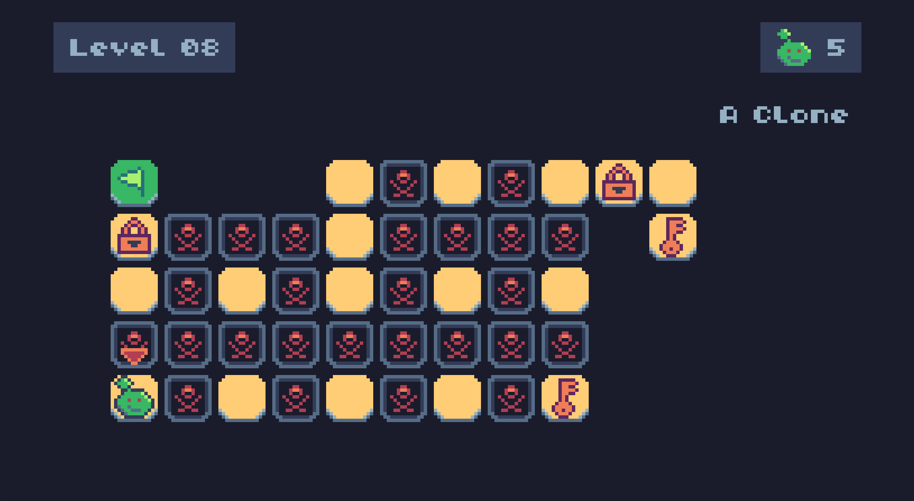
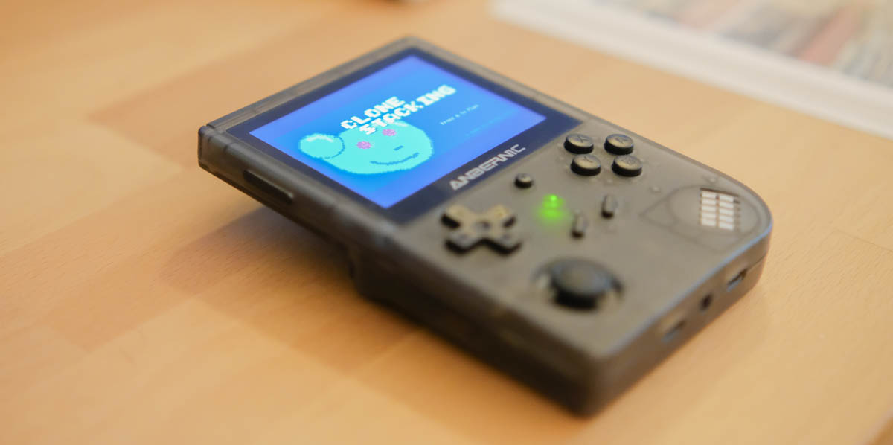
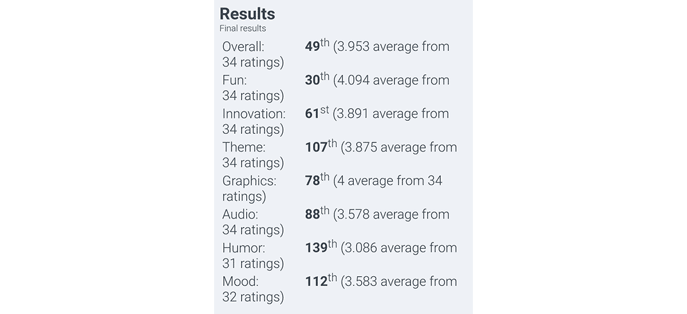

I recently participated in the Ludum Dare 55 compo, and created the game **Clone Stacking**, a puzzle little top-down game where you have to reach for the exit of every level, and by that you need to clone yourself in order to get keys or stand on top of buttons to unlock ways to proceed. The theme was **Summoning**, which can be interpreted in any way. Unlike a lot, if not most games that went to the _"demon summoning"_ direction, here you _"spawn a clone of yourself"_.

Brainstorm doesn't usually work for me. Most gamejams, if I try to come up with an idea when the theme comes out, I end up giving up. Nowadays, I try to think of game ideas I'd like to implement before the jam, along with a platform/tech stack, stuff like "a psx-styled 3d game in Godot", or a "pixel-art puzzle TIC-80", "UI game in HTML5/JavaScript", etc. When the theme is available, I try to come up with a way to make that work with my previous idea. That way I usually have more solid games that I can actually implement.

I've been working on a bomberman-inspired game for gameboy, and a week before the jam, already sure that I wanted to use TIC-80 in it, I decided to write prototype of my gameboy game in this platform. I didn't get anything done except for some map rendering. When the theme was out, I tried to actually apply the theme in my previous idea, and it worked out pretty well. So well in fact that I think that I'll shift my gameboy game to be more similar to **Clone Stacking** now.



[Play it on itch.io](https://crocidb.itch.io/clone-stacking).

## Tech Stack

 - TIC-80
 - Fennel Language
 - Visual Studio Code

It was my first time writing a game for a full fantasy platform like **TIC-80**, which is very similar to **PICO-8**. Last Ludum Dare I used **WASM-4**, but it's more like a fantasy console, especially because it doesn't have many authoring tools except for the compiler for a few languages (I used C, but it also supports Zig, Rust and Odin, for example) and a sprite-to-source converter. I've done some demos in TIC-80 before, but never used the whole suite like the sprite, map, sound and music editors. I was so positively surprised of how simple it is to use them. All of them are pretty basic editors, the sprite one, for example, doesn't even have shapes, only a brush and that's it. But in the end I think that's a positive thing, because you can learn really quickly how they work and just let your creativity flourish.

One good thing is that it's Lua based, but you can actually pick several languages that run over Lua, such as a Lua-compiled Python or Ruby and three different LISPs: Scheme, Janet and Fennel. I went for the last one.

A big difficulty of that is that all the source code for your game and the assets are serialized in a single source file. For that reason I used VS Code to edit rather than the code editor in the console because the screen size is too small and it's really difficult to read a 400 line source file.

I recorded a timelapse for the development, produced a hifi version of the main track and edited a video with the making of the game:



### Fennel

Fennel is a programming language that is inspired by Lisp and is 100% compatible with the Lua libraries and tables. I picked it because it's the only Lisp specifically targeting Lua and with a good documentation. Even if in the end it turns out that I coded the whole game in Lisped-Lua, because I didn't use much of the Lisp advantages in it. But more on that later.

It looks like this:

```Scheme
;; Particles
(var particles [])
(fn ps-create [x y color amount lifetime speed]
  (var ps {:x x :y y :particles [] :lifetime lifetime})
  (for [i 0 amount]
    (var p {
            :active 1
            :x (+ x (math.random -3 3))
            :y (+ y (math.random -3 3))
            :dir (math.random 0 360)
            :color color
            :lifetime (- lifetime (* lifetime (math.random)))
            :speed (+ speed (* speed (math.random) 2))})
    (table.insert ps.particles p))
  (table.insert particles ps))

(fn ps-update []
  (var rp [])
  (each [k v (ipairs particles)]
    (each [pk pv (ipairs v.particles)]
      (set pv.x (+ pv.x (* pv.speed (math.cos pv.dir))))
      (set pv.y (+ pv.y (* pv.speed (math.sin pv.dir))))

      (set pv.lifetime (- pv.lifetime 1))
      (when (< pv.lifetime 0) (set pv.active 0))

      (when (= pv.active 1) (pix pv.x pv.y pv.color)))
    (set v.lifetime (- v.lifetime 1))
    (when (< v.lifetime 0) (table.insert rp k)))
  ;; remove particle systems
  (each [rk rv (ipairs rp)] (table.remove particles rv)))
```

This is the basic particle system for the game.
## What went right

Overall this was a very successful gamejam project. The theme is out around 3AM of a Saturday in Germany, so I just wake up normally on Saturday, at like 8 or 9 and start from there. I worked a lot the first day, probably until like 11pm and then I went to bed and read for a couple hours a bit in order to calm down my brain, otherwise I get into a hyperfocus state and I can't sleep. Sunday I started a bit later, around 11am and went until 1am. I had good food and good sleep, and I think that's paid out. I even went out for some good Mexican dinner on Saturday night, no alcohol, though.

Picking TIC-80 was a good idea for that kind of game because of the embedded editors, and the ease of them made possible to me to implement sounds. Until a few years ago, I wouldn't take too much attention to the audio part of the game, but now I know how much important that is for the feel of the game, one of the main aspects that I really try to get right on a gamejam game. The music tracker in TIC is a bit confusing at first and I'm not used to trackers, but I'm proud of what I came up with. So much so that I actually produced the whole track after the jam ended and can be [listened to in SoundCloud](https://soundcloud.com/bruno-croci/clone-stacking).

The levels that I managed to make, I'm mostly proud. I got so many good feedback on levels 9 and 10 and I really think they are fun to play.



## What went wrong

### Fennel

Picking Fennel was an idea because I wanted to write Lisp. I've been writing a series [Adventures in Lisp Programming](/tags/adventures-lisp-programming) and I have been writing more stuff in Racket, such as all the [level editor for the gameboy game](/post/my-second-gameboy/#update-on-the-game) and other small tools, doing the game in a Lisp would be even more practice for me to get used to the overall concepts of it. However, there was a few problems that definitely hold me back, one of them is that the Fennel plugin for VSCode would only basically color the tokens and the parenthesis. That means I wrote the whole game in a hurry without even a simple intellisense or code complete for even variable names. That and the fact that I didn't know much about the TIC library functions, really hold me in the beginning. Only after the first 5 hours I felt more confident coding it, but then the code was growing too long for me to remember all the function names.

Another issue is that I noticed I didn't write many LISP specific code. No fancy macros and no functional programming. It was basically Lua with parenthesis. Since Lua tables are first-class citizens in this language, even working with basic LISP lists were either not possible or not encouraged, even basic functional constructs like map, fold and filter are not included for default lists. So you need to use some [Fennel macros](https://fennel-lang.org/tutorial) to do similarly with those Lua tables:

> Lua's standard library is very small, and thus several functions you might expect to be included, such map, reduce, and filter are absent. In Fennel macros are used for this instead; see icollect, collect, and accumulate.

### Puzzles

On the gameplay side, I regret taking taking too long to make the puzzles. The last gameplay mechanic I implemented was the "button" one, where you need to stay on top of some buttons in the level in order to open a "door". I only had the basic tutorial levels made by then and then only after that I started implementing the puzzle levels for real, and it was like 10pm of the last day and I was absolutely exhausted. Level 11 was made without too much thinking and after that I was like "I can't do it anymore", it involved too much thinking to get the puzzles right and on top of that, the map editor of TIC only positions tiles in the map, but not the dynamic objects that I created, they had to be implemented in code, like this:

```lisp
(var LEVELS [
  (lambda [] (map-create "Level 01" "The green flag is your goal!" 0 1 {:x 8 :y 8 } [] [] 0))
  (lambda [] (map-create "Level 02" "Remember to summon your clone with A.\nYou can die now." 1 1 {:x 8 :y 8 } [] [] 1))
  (lambda [] (map-create "Level 03" "How many clones can you summon?" 2 1 {:x 8 :y 10 } [] [] 2))
  (lambda [] (map-create "Level 04" "Life out there is dangerous!" 3 1 {:x 2 :y 14 } [] [] 4))
  (lambda [] (map-create "Level 05" "The key to follow is... the Key!" 4 1 {:x 8 :y 8 } [{:x 18 :y 8 :kx 12 :ky 6 :locked true}] [] 1))
  (lambda [] (map-create "Level 06" "You may need to sacrifice something..." 5 1 {:x 8 :y 8} [{:x 4 :y 8 :kx 20 :ky 8 :locked true}] [] 1))
  (lambda [] (map-create "Level 07" "Stay on top of the buttons to follow!" 6 1 {:x 8 :y 8} [] [{:x 16 :y 8 :pressed 0 :lastpressed 0 :buttons [{:x 12 :y 6} {:x 12 :y 10}]}] 2))
  (lambda [] (map-create "Level 08" "Life is made of choices..." 7 1 {:x 2 :y 13} [{:x 20 :y 5 :kx 18 :ky 13 :locked true} {:x 2 :y 7 :kx 22 :ky 7 :locked true }] [] 5))
  (lambda [] (map-create "Level 09" "Oh wow, you made it here. There's more!" 1 0 {:x 2 :y 11} [{:x 2 :y 7 :kx 24 :ky 11 :locked true }] [{:x 24 :y 9 :pressed 0 :lastpressed 0 :buttons [{:x 18 :y 11} {:x 12 :y 7}]}] 5))
  (lambda [] (map-create "Level 10" "Order matters!" 2 0 {:x 2 :y 14} [{:x 14 :y 10 :kx 24 :ky 8 :locked true } {:x 2 :y 8 :kx 24 :ky 14 :locked true } {:x 22 :y 14 :kx 2 :ky 10 :locked true }] [{:x 22 :y 4 :pressed 0 :lastpressed 0 :buttons [{:x 12 :y 10} {:x 16 :y 10} {:x 12 :y 4} {:x 14 :y 6}]}] 6))
  (lambda [] (map-create "Level 11" "The LAST ONE!" 3 0 {:x 10 :y 10} [{:x 8 :y 10 :kx 24 :ky 4 :locked true }] [{:x 6 :y 10 :pressed 0 :lastpressed 0 :buttons [{:x 20 :y 12} {:x 22 :y 12} {:x 20 :y 8} {:x 22 :y 8}]}] 5))
])
```

That's a lot of hand-placing in virtual positions, and I had to do them before testing, and then iterate and change. Too much mental effort and I was so tired. So I just decided to stop right there.

Now I think that, if I had an extra stretch of say 2 hours to make better levels and they them on, the game would have had a much better performance on the rating process. Or maybe I shouldn't have let it all for the end, but rather make better levels with the mechanics I had implemented and only then implement another mechanic.

### Serialization

As I mentioned before, all the data and code for the whole game is serialized in the same file, sometimes I would edit a resource in TIC and not save it and edit the code in VSCode and in losing all the changes in TIC. The assets are serialized like this at the of the file:

```lisp
;; <TILES>
;; 002:0000000000044444004444440444444404444444044444440444444404444444
;; 003:0000000044444000444444004444444044444440444444404444444044444440
;; ...
;; </TILES>
;;
;; <SPRITES>
;; 002:0000000000000000000000000000000000000000000000000000333300003222
;; 003:0000000000000000000000000000000000000000000000003333000022230000
;; ...
;; </SPRITES>
;;
;; <WAVES>
;; ...
;; </WAVES>
```

### Input Buttons

I assumed that TIC-80 was mobile friendly, simple because WASM-4, the other fantasy console I've worked with previously were. I mean, both consoles can build a "standalone" web version, in WASM-4 that version automatically works on mobile with virtual controller and I assumed TIC was the same. It's not, the web player doesn't have mobile controllers. There's a TIC for mobile that can load the virtual game cartdrige, but it still doesn't have any virtual controller. That was a bummer and I just found out in the very end when I tested the game in my phone after submitting the game.

That was a bigger problem because all the game instructions use the virtual controller name, so for example, within the game it says "press A to start the game", but the button A is mapped to Z in the keyboard. That was extremely confusing and even with the actual instructions in the game page, a lot of people had problems (let's be honest, nobody reads the instructions), and I'm pretty sure the score was impacted by that problem. And not only that but I was very disappointed that I just couldn't play that on mobile with actual controllers.

## Game Ratings

In the end I was positively surprised with the ratings and the reviews given by the other contest participants. The game was rated 34 times and got some high-scores like 4/5 in Fun, placing 30th out of 462 compo entries! That's incredible!



I also really appreciate the [feedbacks](https://ldjam.com/events/ludum-dare/55/clone-stacking). Most people were very precise in pointing ou the puzzles were too easy and sometimes just stupid.

> I am jealous (in a nice way) at your ability to develop and execute such a nice package in such a short time. The controls are easy to grasp, the game explains itself by letting you play it. There are not too many mechanics for it to become complicated, but enough for it to have some depth. The audio adds to the game a lot, I really enjoy having all the clones walking into their demise to end up back at the original character after I achieved what I wanted. The game also does not feel too punishing and I think that makes it more fun to mess around with. Very well done! -- Hare Software

## What I learned

Certainly that sound is important. Most of the gamejams I did before I completely ignored the audio part of it. This time I went all in and worked on good sound effects and a simple soundtrack. And it made the game feel much better and more polished. But the most important lesson from this game is: focus even more on the gameplay content. Implementing good mechanics is irrelevant if you don't _use them_ well. I feel like there's infinite possibilities of puzzles with the mechanics I had here, but I just didn't explore them well.

Good learnings for the next gamejam!

