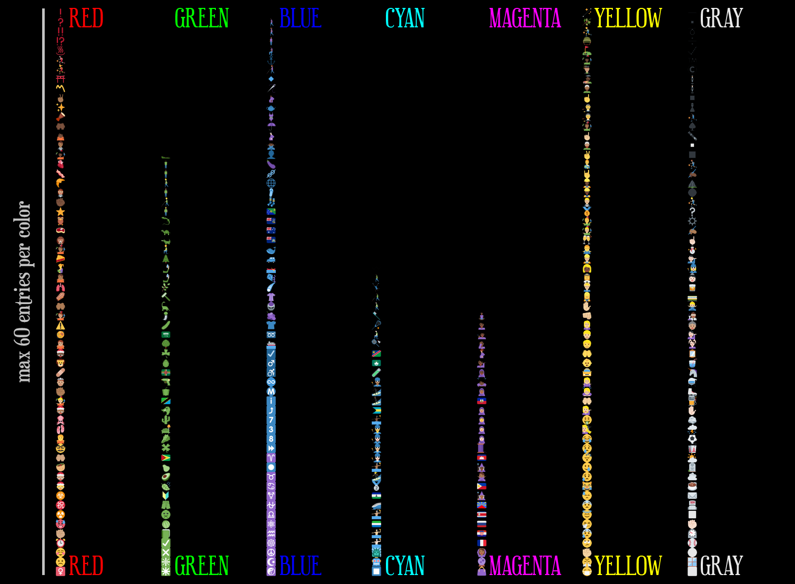
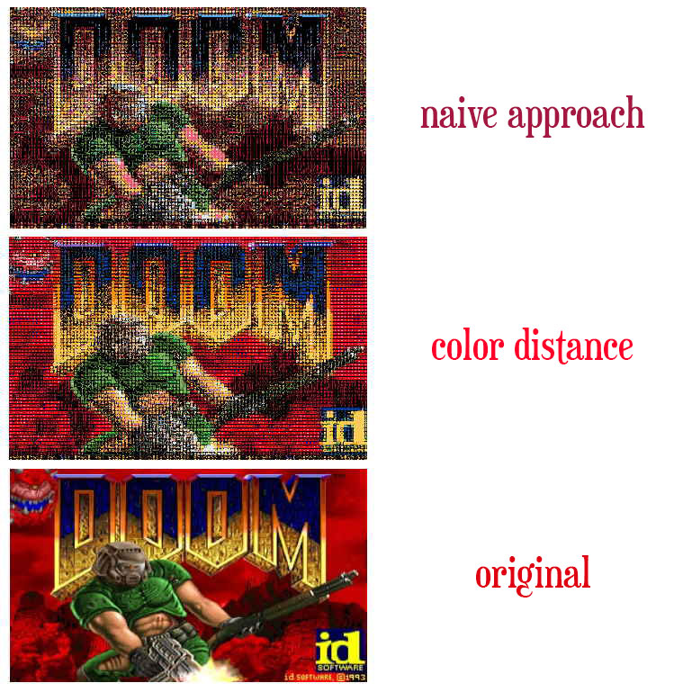

It seems that creating a doom port, or hacking doom in general, is a common place for programmers. If you search for ["doom port" on github](https://github.com/search?q=doom+port&type=Repositories), it's inspiring how diverse projects you can find. The fact that the source code for the game is completely open and self-contained (meaning it doesn't require dependencies) contributes a lot for this.

Back in 2020, I had an idea of a simple project to render doom using emojis because of some other doom renderer I saw on Twitter. I decided to take it as a weekend project, and although it took me around a week and a lot of bad code, it works and it's actually pretty interesting. I don't think anybody wants to play the game like that, but it certainly _looks cool_:

<iframe width="770" height="433" src="https://www.youtube.com/embed/pkuXc9W0XkU" title="YouTube video player" frameborder="0" allow="accelerometer; autoplay; clipboard-write; encrypted-media; gyroscope; picture-in-picture" allowfullscreen></iframe>


The project can be found in [GitHub](https://github.com/CrociDB/doomoji). The whole code for this rendering experiment is contained inside the files [`doomgeneric_sdl.c`](https://github.com/CrociDB/doomoji/blob/master/doomgeneric/doomgeneric_sdl.c) and [`hashtable.h`](https://github.com/CrociDB/doomoji/blob/master/doomgeneric/hashtable.h).

# Starting

I started using the [doomgeneric](https://github.com/ozkl/doomgeneric) project, because they made the very-portable doom code even more portable by isolating the drawing and input functions in a single file, so you just need to implement some specific functions. I used SDL for this port because it's simple enough to give me the results I wanted. So I imported the doomgeneric project and implemented the specified functions using SDL to have a proper doom being rendered.

I needed a set of emojis, and I found that Twitter has their emojis open source, so I downloaded the package with the emojis [here](https://github.com/twitter/twemoji). That's really kind, but they offer them in separated files, and it would take ages for the game to load individually thousands of small images, so I combined them in a single image file:

[](https://github.com/CrociDB/doomoji/blob/master/emoji_all.png?raw=true)
(click to enlarge)

Alright, that's all I needed to start.

# Understanding Dimensions

So, the idea all along was getting each pixel of the final framebuffer of the game and find an emoji that had a similar color. In order to categorize the emoji, I would save the average color in it, basically summing up all the colors together and dividing by the amount of pixels. That would mean that I would need one emoji per pixel, however, this brings me a problem.

The original doom resolutions is `320x200`. If I'm displaying a 10x10 emoji, that would already require a `3200x2000`. That's massive, and 10x10 is still a very small size for you to recognize what the emojis are. So after some tests, I decided to go with a 18x18 emoji size and scale the framebuffer by one third, making the game resolution a bit too small, but the emojis big enough to be identified. Now I have resolution of `1920x1200`.

```c
#define ORIGINAL_SCALE                  0.33
#define EMOJI_WIDTH                     18
#define EMOJI_HEIGHT                    18
```

# Categorizing Emojis by Color

The main idea is that an emoji can represent one pixel of color of the original framebuffer. In face of the 3k+ emojis and the almost 21k+ pixels in screen, I tried to think a simpler categorization of color. So I came up with this where I have 7 lists of base colors: `[Red, Green, Blue, Cyan, Magenta, Yellow, Gray]` and the images would go in each of the list sorted by their `brightness`:

```c
typedef struct _emoji_data
{
    SDL_Rect rect;
    uint8_t brightness;
} emoji_data;

typedef struct _emoji_table
{
    emoji_data red[EMOJI_TABLE_MAX_COL];
    emoji_data green[EMOJI_TABLE_MAX_COL];
    emoji_data blue[EMOJI_TABLE_MAX_COL];
    emoji_data cyan[EMOJI_TABLE_MAX_COL];
    emoji_data magenta[EMOJI_TABLE_MAX_COL];
    emoji_data yellow[EMOJI_TABLE_MAX_COL];
    emoji_data gray[EMOJI_TABLE_MAX_COL];

    uint8_t r, nr, g, ng, b, nb, gr;
} emoji_t;
```

Then I get the average color of the emoji and then I first check what's the most saturated color out of the list, basically checking every component using a magic saturation color, which in my case is `EMOJI_COLOR_SATURATION = .79`.

```c
    // This will check which color component is 21% more saturated than the other components
    float xr = EMOJI_COLOR_SATURATION;
    float ur = 1.0 + (1.0 - EMOJI_COLOR_SATURATION);
    
    if (r > g * ur && r >  b * ur)
        // Red value is 21% higher than blue and green
    else if (g > r * ur && g > b * ur)
        // Green
    else if (b > g * ur && b >  r * ur)
        // Blue
    else if (r < g * xr && r < b * xr)
        // Cyan, because red value is lower than 79% of blue and green
    else if (g < r * xr && g < b * xr)
        // Magenta
    else if (b < g * xr && b < r * xr)
        // Yellow
    else
        // The remaining is treated as gray
```

And after sorting that by brightness, I get a table similar to this one:



One thing to note is that not all colors have all the 60 entries, but that's simply because there's not enough emojis on the table that follows the strict color rule we are using.

That was giving me an okay result, as seen on this video:

<iframe width="770" height="433" src="https://www.youtube.com/embed/QsQr-bZ_7qo" title="YouTube video player" frameborder="0" allow="accelerometer; autoplay; clipboard-write; encrypted-media; gyroscope; picture-in-picture" allowfullscreen></iframe>

# A Better Approach

Another approach I thought initially was to treat colors as 3d points and check the distance between them. In this case I was going to get the most accurate color for every pixel in the framebuffer.

```c
typedef struct
{
    uint8_t r, g, b;
} color_t;

inline float color_sqr_dist(color_t a, color_t b)
{
    return (float)((a.r - b.r) * (a.r - b.r)) + ((a.g - b.g) * (a.g - b.g)) + ((a.b - b.b) * (a.b - b.b));
}
``` 

The only data needed for the emoji is its base color and where its located in the original atlas:

```c
typedef struct _emoji_data
{
    SDL_Rect rect;
    color_t color;
} emoji_data;
```

Then all the emojis will get evaluated and added to the `emoji_data` array on startup, and it will get the emoji with the closest color to that pixel color on every frame:

```c
emoji_data get_emoji(uint8_t r, uint8_t g, uint8_t b)
{
    color_t color;
    color.r = r;
    color.g = g;
    color.b = b;

    int index = 0;
    float distance = 99999.0;

    for (int i = 0; i < emoji_table_size; i++)
    {
        float d = color_sqr_dist(color, emoji_table[i].color);
        if (d < distance)
        {
            distance = d;
            index = i;
        }
    }

    return emoji_table[index];
}
```

This approach is a lot more simple and produces a much better result. It looks incredible better already on the title screen. Here's a comparison:



However, the framerate is extremely low due to the many computations every frame. There are over _65k color_ searches happening every frame.

# Optimizing: Lookup Table

The most simple way of solving this is associating the pixel colors with their closest matched emoji, so that we wouldn't need to do the search all over again every time that color is on screen. Considering that C doesn't provide any sort of hashtable implementation, I wrote a simple one my own, losely following this post: [How to implement a hash table (in C)](https://benhoyt.com/writings/hash-table-in-c/), but simplifying a lot to something specific for this case. All the implementation is in the [hashtable.h](https://github.com/CrociDB/doomoji/blob/master/doomgeneric/hashtable.h) file. 

*You can skip this part if you're familiar with how hashtables work.*

A good way to start is defining the interface to set and get matches to the table, the association is for a `color_t` to a `emoji_data*`:

```c
bool set_ht_emoji(/* table */, color_t color, emoji_data* data);
emoji_data* get_ht_emoji(/* table */, color_t color);
```

**The hashtable is nothing but a big array of entries and a hash function that transforms the `key` value into one unsigned integer which is a position in the array. In case of collisions, we keep increasing the position (in a cyclic way) until a free position is reached.**

So here's the entry struct for the entry:

```c
typedef struct
{
    uint32_t key;
    void* value;
} ht_entry; 
```

I made the key `uint32_t` and not a `color_t`, so I could use a `uint32_t -> uin32t_t` hash function. I'll explain later how to pack the three color components into one single variable. The value is `void*` because it won't manage that memory, only point to it, so the type is irrelevant. The hashtable structure goes like:

```c
typedef struct
{
    ht_entry* entries;
    size_t capacity;
    size_t length;
} ht;
```

The `capacity` is the total number of entries allocated, and the `length` is how many of those are being used. 

```c
#define HT_MAX_CAPACITY		1024000
```

All `HT_MAX_CAPACITY` entries must be allocated upon creation and destroyed when requested:

```c
ht* ht_create()
{
    ht* table = (ht*)malloc(sizeof(ht));
    if (!table) return NULL;

    table->length = 0;
    table->capacity = HT_MAX_CAPACITY;

    table->entries = (ht_entry*)calloc(table->capacity, sizeof(ht_entry));
    if (!table->entries)
    {
        free(table);
        return NULL;
    }

    return table;
}

void ht_destroy(ht* table)
{
    free(table->entries);
    free(table);
}
```

## Hashing

I used a simple `integer -> integer` hash function I found [here](https://stackoverflow.com/questions/664014/what-integer-hash-function-are-good-that-accepts-an-integer-hash-key). Apparently even [Apple's **libc** uses that function for maps](https://opensource.apple.com/source/Libc/Libc-1439.141.1/collections/Source/collections_map.c). It's incredibly simple:

```c
uint32_t hash(uint32_t x)
{
    x = ((x >> 16) ^ x) * 0x45d9f3b;
    x = ((x >> 16) ^ x) * 0x45d9f3b;
    x = (x >> 16) ^ x;
    return x;
}
```

But in order to use a color as an integer, I packed all the 3 components of the color, all 8bit unsigned integers, into one 32bit unsigned integer:

```c
uint32_t get_key(color_t color)
{
    return color.b + (color.g << 8) + (color.r << 16);
}
```

## Getting and Setting Entries

All is ready to finally apply the hash function to find out the final position in the array:

```c
void* ht_get(ht* table, uint32_t key)
{
    uint32_t hash_key = hash(key);
    size_t index = (size_t)(hash_key & (uint32_t)table->capacity - 1);

    uint8_t collision = 0;
    while (table->entries[index].key != NULL && collision++ < HT_MAX_COLLISION)
    {
        if (table->entries[index].key == key)
            return table->entries[index].value;

        index = (index + 1) % table->capacity;
    }

    return NULL;
}

bool ht_set(ht* table, uint32_t key, void* value)
{
    if (table->length >= table->capacity) return false;

    uint32_t hash_key = hash(key);
    size_t index = (size_t)(hash_key & (uint32_t)table->capacity - 1);

    uint8_t collision = 0;
    while (table->entries[index].key != NULL && collision++ < HT_MAX_COLLISION)
    {
        if (table->entries[index].key == key)
        {
            // key already exists, updates
            table->entries[index].value = value;
            return true;
        }

        index = (index + 1) % table->capacity;
    }

    table->entries[index].key = key;
    table->entries[index].value = value;
    table->length++;

    return false;
}
```

# Finalizing

Now completing the interface functions to get and set data into the [`doomgeneric_sdl.c`](https://github.com/CrociDB/doomoji/blob/master/doomgeneric/doomgeneric_sdl.c) file, so we can automatically apply the color packing and do the emoji data casting:

```c
emoji_data* get_ht_emoji(ht* table, color_t color)
{
    return (emoji_data*)ht_get(table, get_key(color));
}

bool set_ht_emoji(ht* table, color_t color, emoji_data* data)
{
    return ht_set(table, get_key(color), (void*)data);
}
```

Then just a slight change to the original `get_emoji` will do the trick:

```c
emoji_data get_emoji(uint8_t r, uint8_t g, uint8_t b)
{
    color_t color;
    color.r = r;
    color.g = g;
    color.b = b;

    // check if the pixel color has an emoji already associated with it,
    // then return it
    emoji_data* e = get_ht_emoji(emoji_ht, color);
    if (e != NULL)
    {
        return *e;
    }

    // otherwise, search it in the emoji-table...

    int index = 0;
    float distance = 99999.0;

    for (int i = 0; i < emoji_table_size; i++)
    {
        float d = color_sqr_dist(color, emoji_table[i].color);
        if (d < distance)
        {
            distance = d;
            index = i;
        }
    }

    // .. and save it to the hashtable
    if (ht_available(emoji_ht))
    {
        set_ht_emoji(emoji_ht, color, &emoji_table[index]);
    }

    return emoji_table[index];
}
```

Now the game runs at a reasonable speed. It's important to note that everytime a new color is used, it will have to do the search on the emoji list all over again, that's why the title screen and the beginning of gameplay still look a bit janky. But that's something I'm okay with for this project.

# Conclusion

It was a fun project. It's clearly not meant for people to play it like that, as it would be pretty difficult, but more of cool challange for me. I know there are still stuff that could be made to improve it, and I leave that for anybody who wants to do it, but I had to call it done at some point. 

Fork [the project](https://github.com/CrociDB/doomoji) if you feel like and don't hesitate to submit a PR if you manage to make something cool with it. :)
