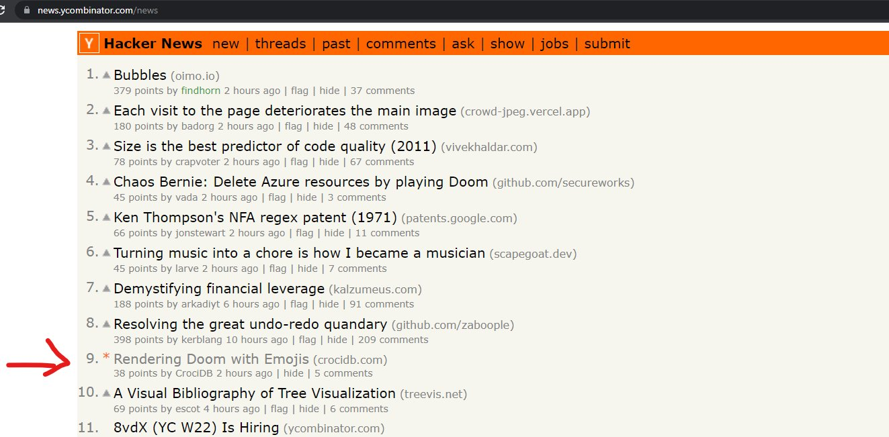
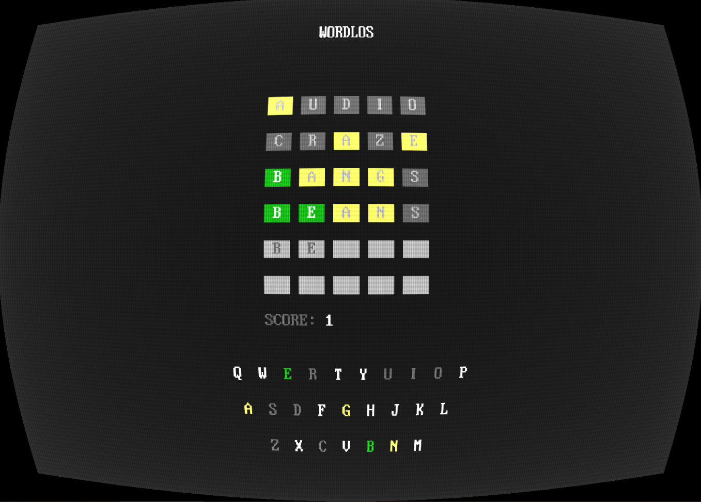
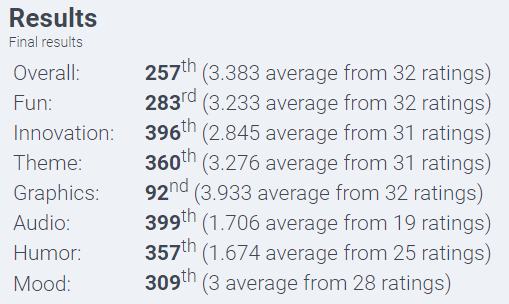
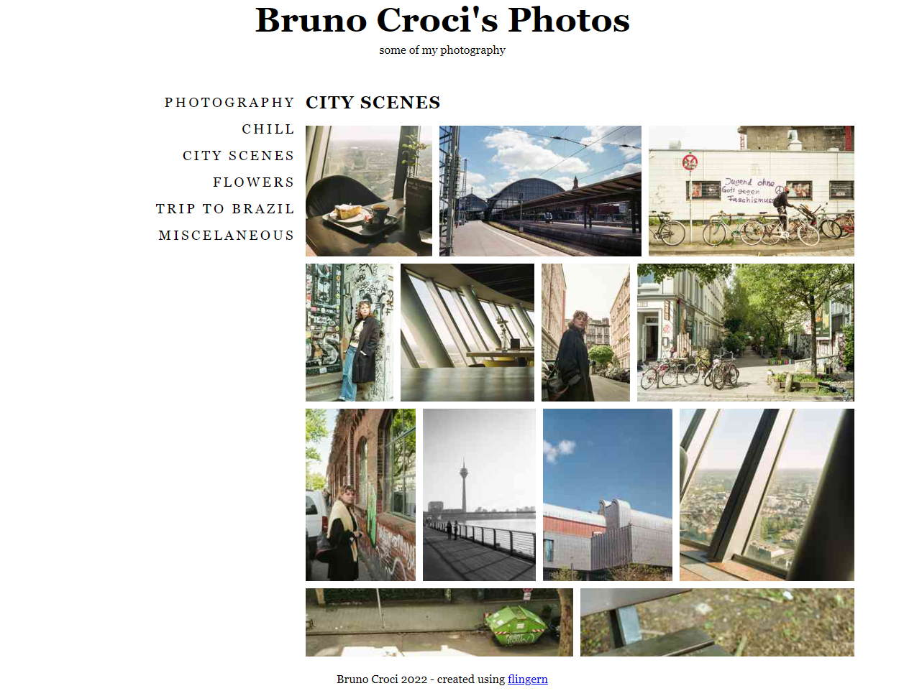
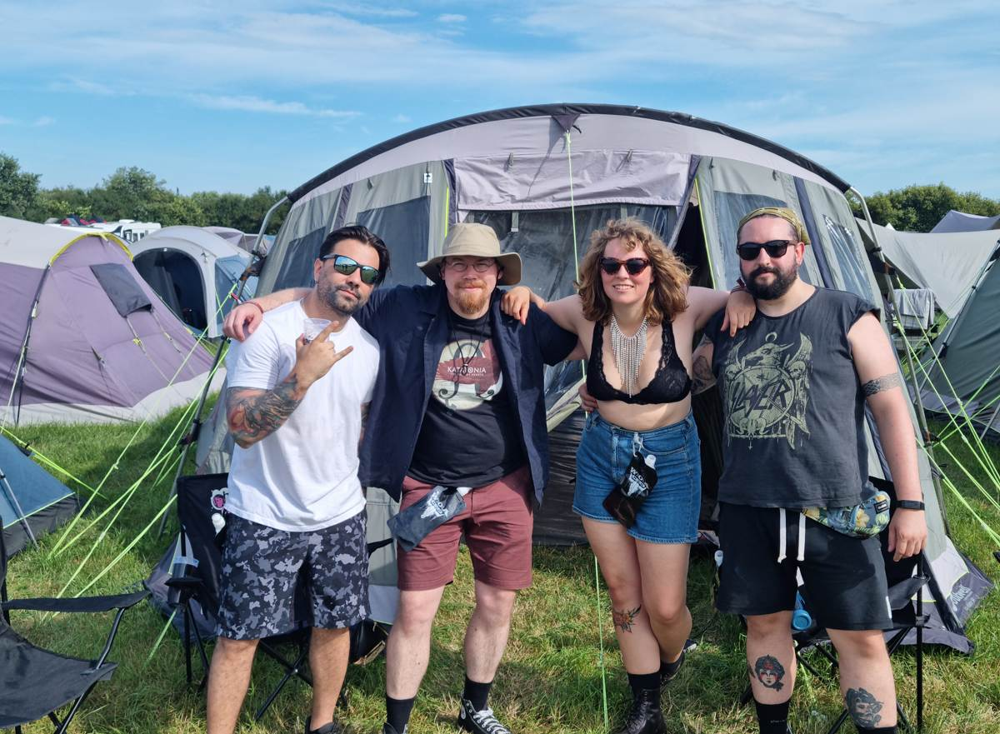
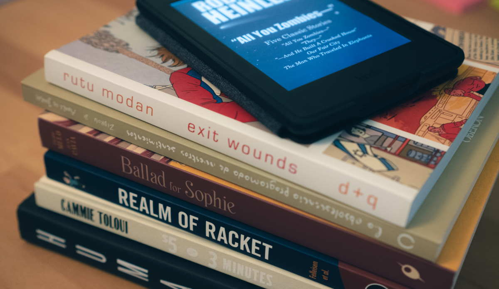

For the last few years I've been writing a tweet in the end of the year with some of my life achievements, projects and professional changes. This year, based on other blogs I read, I decided to make a more complete post and include also other interesting things like some of the book I read and events that happened this year.



# Projects

## Blog

This is, of course, one of the most important project and achievement of this year: I finally decided to write more to this blog. I've had blogs for over 15 years, but never really took it so seriously as now. I read somewhere _"don't think to write, write to think"_ and it got to me so much I decided to write a lot more about my projects and experiments. And it's been an amazing journey, I can feel how much writing has improved the way I think and learn about stuff.

My post about [**doomoji**](https://crocidb.com/post/rendering-doom-with-emojis/) made it to the first page of Hacker News and got a lot of upvotes on the `/r/programming` subreddit.

That all gave me more confidence to write more as a tool to learn more and get feedback for silly experiments like that one. I learned so much from the comments and nobody was hostile or pointing problems just for the sake of annoying, as I sadly expected.

## wordlos

Early 2022 was the year that everyone started posting those weird green/yellow/gray boxes to twitter and it took me some time to figure out it was about a new _cult_ word game: *wordle*. Didn't take long after for me to get addicted to it as well. So addicted indeed I also started playing other of the countless variations, such as the [Brazilian Portuguese](https://term.ooo/) version of it.

After having written [retro2048](https://crocidb.github.io/retro2048/), a port of the other [new classic 2048 game to the bootsector](https://crocidb.com/post/bootsector-game/) and DOS, I wanted to do more text-mode assembly games and wordle seemed like a perfect match for my needs. So I took a few weeks to work on it. The result is a perfectly fun wordle version that runs on any DOS system: [wordlos](https://github.com/CrociDB/wordlos).

This is was also the first time I ever got a pull request on an open-source project I wrote. [Paweł Łukasik](https://github.com/pawlos) wrote a fix for an issue with repeating letters and submitted it. It was such a cool moment to see people genuinely interested in a project I made to write a fix and submit a PR.

I didn't write anything about this project around here yet, but I want to at some point, at least about how I made to port it to be played online on [itch.io](https://crocidb.itch.io/wordlos), using a wasm version of DosBox and taking the output framebuffer to be rendered with ThreeJS with a CRT post-processing effect, looking like this:

## Space Lord X

For the first time in my life I finished an entry for Ludum Dare. So many times I started, but left at some point because of my extreme incapacity of making a proper game design.

This time I decided to pretty much clone a game for Atari 2600 that I used to play a lot as a kid, The [Space Master X-7](https://www.youtube.com/watch?v=ia4rGNuIh1g&t=10s). Thought that would be a cool experiment to implement in the [WASM-4 fantasy console](https://wasm4.org/), so this was the result:

It can be played on [itch.io](https://crocidb.itch.io/spacelord-x). I stll haven't written a post about this project here because I'm still working on improvements post-compo such as improving the player movement, boss behaviours and adding sound. I think input issues and the lack of audio really brought the game rating down, but I was very happy with the results.

## Photography Website Generator

For some time I've been disappointed with all the photo platoforms, nobody uses Flickr anymore; Instagram became another tiktok and doesn't distribute your photos anymore; pretty much all the other platforms are now all about NFTs. I considered many ways I could create a photo website and ultimately decided to create a static website generator: [flingern](https://github.com/CrociDB/flingern).

It's still on an early stage of development, but I can already create basic websites with it:

It's already capable of:

 - importing photos and set the quality/max size for both the thumbnails and display photo
 - generating pages from Markdown
 - website structure is defined using a simple yaml file

 Next features I want to support before calling it a proper version are:
 
  - display photo exif information
  - photo tags, so it's possible to see photos by tags and not only by pages
  - improve the layout of the theme
  - improve the experience using the command line client of _flingern_

To be honest, dealing with HTML/CSS has been one of my worst issues here. I have worked with it on the late 2000's, but haven't really kept up to date with it, so it's always a pain for me to make page layouts. If you're into that and feel like could be a good hand, please don't hesitate to contribute to: https://github.com/CrociDB/flingern.

# Photography

By the end of 2021 I was introduced to film photography and throughout the whole 2022 I pretty much only shot film. I wrote a [post about it here](https://crocidb.com/post/one-year-film-photography/) and also created a page to display my current [film camera collection](https://crocidb.com/cameras/), as it's became a very important hobby for me.

# Wacken Open Air - Music Festival

This year I went to my first music festival ever, and it wasn't just any festival, it was **Wacken Open Air**, the Holy Land for metal fans.

This was such a unique experience. And I say that not necessarily in the best possible way, because part of it was really awful for me. I'm not used camping or being in a place with so many people for such a long time like that. I love metal concerts and even though I'm going to many of them during these years, being in there was completely overwhelming for me. As if it wasn't too much already, I was also a bit sick with a sore aching throat and coughing and completely deaf from one ear, as I'd just come back from Brazil the previous day and the pressure change during landing messed my ears.

Constant bathroom lines and temperature variations (it was over 30 degrees during the day but got to 5 at night) on top of that made part of my experience pretty shitty. But I'm glad I was with friends that were very supporting and even if I might have ruined part of their experience, they were acknowledging and helping, and that's because of them that the good part of the whole experience was actually fantastic, so I already got a ticket for the 2023 edition!

To my friends Thiago and Jon and my girlfriend Fredi: I am deeply sorry for ruining part of it, but thank you all very much for being understanding and making this much better than I could expect.

# German Learning

I've been living in Germany for almost three years at this point and my German is still pretty basic. I did A1/A2 German school by 2020, but after that I dropped the courses and was mostly doing duolingo and try to _learn by living_. It works when you are exposed to the language every time of every day, but I am not, even though I live in Germany. The official language in the office is English, my closest friends here are also not from Germany, so English speaking pretty much all the time.

There are, of course, situations where I'm in a place with pretty much only German speakers, and I have to do it. These situations have been a little bit more common this year and I feel like my German has improved a bit because of this. I can understand a lot more than I could last year. Sometimes I even identify the words, but don't understand what they mean.

For 2023 I'll try to be more active and try to read more and try to talk a lot more. I wonder if I should get a proper private teacher for some sessions a month to help me going.

# Professional

By the end of the year I moved positions within the company. I became an Audio Programmer. Even though I don't have much experience with it, the Audio team embraced me and is very happy to have me learning all I can about it and contribute to that aspect of the games.

With it came some other cool stuff: I'm now officially working with C++ and the Ubisoft engine Snowdrop. Unity has been my main tool for almost 10 years, but always wanted to work with other engines. Finally being able to do C++ professionally is really important for me, since it's one of the first languages I ever learned and wrote for many personal projects, but could never really prove my knowledge in a big commercial project like the one I'm on right now.

On the Audio side of things, being exposed to so much content about it and working with many extremely talented professionals (other audio programmers and audio designers) is making my day-to-day job very exciting. I learn so many new topics everyday.

I don't want to write too much on it now because I'm planning on a post about my experiences as an Audio Programmer. Stay tunned!

# Books

I want to point just a few books that I read and liked this year. There are many of them, especially the tech ones, that I read parts, but not the whole, so I will only talk about the ones I feel I learned enough from, or that I really liked.

## Tech

### Realm of Racket

This year I started a project of finally learning and exploring Lisp and Racket was the dialect of choice. This book is similar to the classic **Land of Lisp**, but for Racket instead. I wrote about my first small project with it, based on stuff I've learned from this book so far: [A Brainfuck Interpreter](https://crocidb.com/post/lisp-adventures-1-racket-a-brainfuck-interpreter/)

I haven't finished it and I'm planning on more posts about my [Lisp Adventures](https://crocidb.com/tags/lisp/) in 2023.

## Photography

 - **Humans, by Brandon Stanton**: a lot more than a photography book because, in my opinion, the photography is secondary, but I think that's how it's categorized. The author of [Humans of New York](https://www.instagram.com/humansofny/) now went all over the world and interviewed random people on the streets. Some parts were really emotional for me. Totally recommend!
 - **$5 for 3 minutes, by Cammie Toloui**: photojournalist Cammie Toloui, working stripper in the 90's, offered a discout to her clients in exchange for a picture. The pictures are weird and have an underground feel to it.

## Graphic Novels

I've read fewer graphic novels in the last couple years, unfortunately, but some of the ones I really liked in 2022, in no particular order, were:

 - **Yellow Cab, by Chabouté**: a masterpiece of visual novel. Every frame could be an amazing movie still, there's just so much to learn from a photography perspective in this book, even though I think the story itself was a bit meh and missed some motivations for the main character. The Chabouté I like the least, nonetheless, totally worth it!
 - **Polina, by Bastien Vivès**: for the first half of the book, I was a bit confused and it didn't catch me, but I'm so glad I insisted. The art is weird, but truly amazing when you start to understand. The main character, Polina, and her teacher Bojinski have such an interesting visual representation. They're always recognizable even with just a few lines of Vivès' drawing. But I think that what stands here is the ambiguous relationship between those characters. Gave 5/5 Must Read!
 - **La obsolescencia programada de nuestros sentimientos, by Zidrou and Aimée de Jongh**: first of all I'm really proud I read the Spanish version of this book with only a few dictionary peeks. The art is gorgeus and the story is absolutely beautiful.
 - **Exit Wounds, by Rutu Modan**: simple plot, likeable characters, powerful moments. The visual narrative reminded me a bit of _Marcello Quintanilha_, another comic book artist I like.
 - **Ballad for Sophie, by Filipe Melo and Juan Cavia**: one of the best I read this year for sure. It's all I like in a graphic novel, fantastic art, amazing characters with compelling motivations and the perfect drama mood.

## Fiction

 - **Capão Pecado, by Ferréz**: a cult classic of the brazilian marginalized literature. Written and set in a favela in São Paulo, this is fiction, but based on the day-to-day life of the people who lives there. I was surprised for not knowing this type of literature before. I'm really glad I picked this book first because it gave me a lot more interest for this genre and even more appreciation for it's author, Ferréz.
-  **"All You Zombies...": Five Classic Stories, by Robert A. Heinlein**: I started reading this collection of sci-fi stories by Robert Heinlein because someone recommended the title story as a good way to understand the [Bootstrap Paradox](https://en.wikipedia.org/wiki/Causal_loop). And it was such a great story. Still looking forward for the rest of the book, but I thought that just that one was already worth of mentioning.
- **The Gods Themselves, by Isaac Asimov**: many years ago I remember falling in love by Asimov's The End of Eternity. I read the first pat of Foundation because of it, but to be honest it didn't get me so much involved. Now, I decided to take another book by him and I was so surprised when I started reading this, because the plot is absolutely fascinating, and the way he explains the science part of it totally convinces me that it what happens there could be real. But what really cought me is when he, on the second part of the book, described another type of creature in an alternate universe, that's so incredibly creative that I couldn't stop smiling while reading that.

# Games

Some of the games I played this year that is worth talking about:

 - **Elden Ring**: the first _From Software_ game I played, and now I can say I understand why people like it. I've always disliked the idea of playing a game that is too hard and punishes you all the time, but the way this game punishes you is _different_. It motivates you to keep playing and fine tune your movements to get better. I'm glad I played it, now I'll be more open to other games of the same style.
 - **Forza Horizon 5**: started playing after watching some videos, and it looks so incredibly good that I thought I'd give it a try, it's in Game Pass anyway. Such a good surprise! It's so calming and destressing to play. I feel like it respects all the skill levels of players, meaning it's not as competitive if you don't want it to be. Loved to play to relax after work listening to podcasts.
 - **Marvel Snap**: finally a mobile game that caught me! It's a very simple collection based card game. The tutorial is fantastic and you feel like you understand the game 100% when it's over. Played for many and many hours. Totally worth it!

