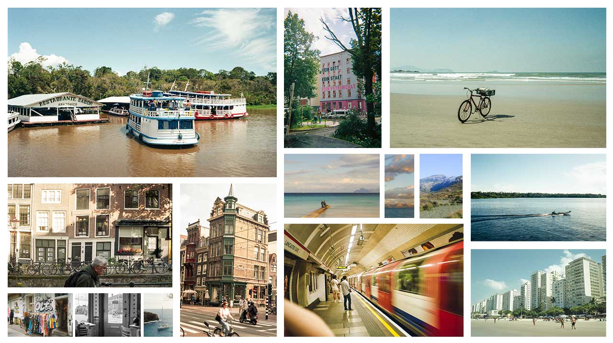
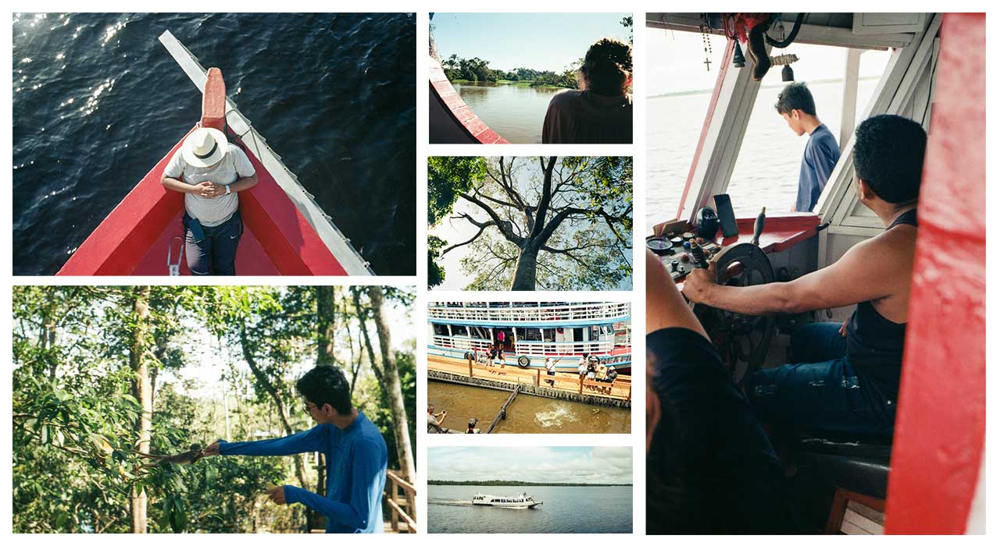

One more year and one more retrospective. I've been doing it for some years on twitter and since last year in this blog. All the retrospective posts will be listed [here](/tags/retrospective). I think 2023 wasn't a very productive year for me, as I didn't finish any projects, but I traveled more than the previous years and I reflected a lot about life.

## Overall

There's a few things I'm proud I started doing this year. One of them is notetaking. It's not that I never took notes of anything, but this time I'm trying to be more serious at it, take notes of books, articles, movies, games, trips, etc. There are techniques for that and I'm still not that advanced yet. I usually use Google Keep and most of the times just bullet points, but I can already see how it's improving my absorption and understandment of the contents.

As I grow older, I started to realize how much stuff I forget. Sometimes I forget pretty much everything out of a movie I saw a week before. I got more acquainted with the [Forgetting Curve](https://en.wikipedia.org/wiki/Forgetting_curve), and how to mitigate that with [Spaced Repetition](https://en.wikipedia.org/wiki/Spaced_repetition). Even though that's not the most efficient way, I'm pretty sure it's better than nothing.

Something else I'm very proud of is that I finally setup a VPS development workspace with Linux, TMUX and Neovim. Pretty much everything I wrote for this blog during 2023 was SSH'ing this server. Also most of the stuff that I made that's not GUI based was made in it. The server is located in Frankfurt and the lag from Düsseldorf is just neglegtable. The comfort of just connecting to your server from anywhere, attaching to your TMUX session and keep working from where you left off at any moment, that's just fantastic.

## German Learning

Not a very productive year in that regards, I'm still learning by osmosis, but I feel like I'm getting closer. Especially now I'm taking more notes of expressions, words and language constructions, so I can review later. I'm more and more comfortable with small conversations. 

## Projects

That was a slow year in terms of gamedev for me. I attended to a couple gamejams, but ended up dropping all. The one I got the farthest was **#JS13K**, where I had something visually interesting, but simply couldn't find the gameplay I wanted within my time constraints.

### Blog

I feel like I'm finally starting to give a good attention to this blog. I've posted around 10 texts this year, some technical, some purely thoughts about a subject. This is because the main role of this, for me, is to force me write about the stuff I'm learning or thinking, so I organize better my thoughts and learn more. Writing is a fantastic learning tool. I actually wrote many more texts than I published, either because they're unfinished or because I figured that was not an important topic. 

 - [Investigating a touch screen issue on the Steam Deck](post/investigating-touchscreen-issue-steam-deck/)
 - [Lisp Adventures #2 - One, Two, Three... Infinity](post/lisp-adventures/one-two-three-infinity/)
 - [Analog is a Privilege](post/analog-is-a-privilege/)
 - [My First Gameboy](post/my-first-gameboy/)
 - [Installing Portaudio for Racket on Windows](post/installing-portaudio-for-racket-windows/)
 - [Prosperity and Self Help](post/prosperity-and-self-help/)
 - [Simple Vector Implementation in C](post/simple-vector-implementation-in-c/)
 - [On C++ Modules and Containers for Build Systems](post/on-cpp-modules-and-containers-for-build-systems/)
 - [My First Job Interview for Intern Programmer](post/interview-intern-programmer/)

### Demoscene

I submitted my first [_demoscene_-like project](https://github.com/CrociDB/vccc2023), for [Vintage Computing Christmas Challenge 2023](https://logiker.com/Vintage-Computing-Christmas-Challenge-2023). The challenge was to draw a diamond-ish pattern on screen and I did it for IBM-PC bootsector, in real-mode assembly. The video with the results are here:



I still plan to write a post about it because there's an ugly artifact in my program that I still couldn't fix, so I think that'll be a nice breakdown post of the debugging to fix it.

## Trips

I've been to five countries and around nine cities. Visited **Amsterdam** for the first time, went to **Manaus** to see friends and took my girlfriend to see the **Amazon Rainforest** for the first time, did some cool hikings in **Mallorca**, thrift stored in **London** and, after not being able to enter Wacken 2023 due to endless rain, watched some amazing bands playing in a small club in **Berlin**. All of it with good friends around.

While in Manaus, I took a whole-day boat tour around the Rain Forest, something I never done while I lived there. That was fantastic, because I don't know Brazilians understand how rich that area is, but it was also a bit sad for the exact same reason: feels like those places are not respected enough. I could see so much plastic trash all over, and at the end of tour, where we stop at a (supposedly) native indigenous tribe, to watch a traditional dance presentation from them, there was just so many random people carrying wild animals so the tourists could take pictures with them. These people are invading the forest, capturing monkeys, aligators, snakes, sloths and other animals, drugging them so they're quiet and exploiting them for money. That should be illegal and those people punished. But other than that, it was a fantastic experience.

## Photography

And I've been carrying cameras with me all this time. Shot mostly film, but I did shoot a lot of digital too. These are the cameres I shot the most with this year:

 - **Yashica T3**: since I lost my **Nikon L35AD2** in an Uber in São Paulo, I got a new Point&Shoot for day to day film photography. And I've been using it as my main camera.
 - **Fuji X-A5**: I got this X-A5 modified with full-spectrum, and I've been using it for full black and white photos quite a lot. I love how portable that camera is with a Fujinon 24mm f2.8 pancake lens, so that has been one the most used combination for digital for me this year.
 - **Polaroid Impulse AF**: my instax camera broke in the previous year and I wanted to get a proper Polaroid camera, a vintage one. Since the **SX-70** SLRs are too expensive, I opted for a 600-film one and I wasn't disappointed. Shooting with this camera is really fun, and I kinda like the way it looks too.

I'm looking for another portable digital camera for next year, one that's not full-spectrum. Maybe a **Ricoh GR III** or even a **Fuji X-A7**. A camera with good film emulation in it that I can use the JPEGs straight from it.

## Professional

It's officially been more than a year working as an Audio Programmer and I've been learning so much about it. Digital audio content is part of my daily readings now. Working with an internal game engine is also a challenge that I mostly enjoy. Since I can't just google when I have issues with it, it forces me to explore the source code more and experiment before I ask anyone. 

Additionally, **Assassin's Creed: Nexus**, a VR game for the Meta Quest platform that I worked for some years, finally got released. And watching the gameplay videos and reading the reviews was really heart-warming for me. The game was well received by critics and VR gamers. Of course it has its issues, but I think that's part of big video game development, you just have to deal with them.

I'm allowed to say that I currently work on [XDefiant](https://www.ubisoft.com/en-us/game/xdefiant), a free-to-play FPS arena, that is being very well received by players as well.

## Games

What a year for game releases, huh? However, most of the games I played this year weren't that fresh.

 - **Slay the Spire**: I'm glad I stopped ignoring those deck-building roguelikes, because it's actually really fun to play. I still don't quite like the art style and the foes design in this game, though.
 - **Marvel's Midnight Suns**: tactic RPGs were also another genre I haven't been much interested into, but I'm happy I decided to play this. The most impressive, though, is how much the core loop was satisfying and how they manage to make such a long (and good, overall) story work so well with it. Playing it on my Steam Deck on bed, just before going to sleep, was really a pleasure.
 - **Vampire Survivors**: the first time I saw it on Game Pass I thought it was just a bad Castlevania ripoff or something like that. But that is so much fun, especially while listening to some funny podcast. Such a good night relaxing combo.
 - **Diablo IV**: it was overall a really good experience playing it. Good old relax-and-slay demons. 
 - **Baldur's Gate 3**: I'm not very much into D&D, in general, and haven't played the previous installments of the franchise, however, playing this with my girlfriend on the PS5 has been a fantastic experience.
 - **Starfield**: there was not a single moment I didn't complaying about something in this game. The player mechanics feel like the 2000's (and not in a good way), the bugs, the fast-travel/ship gameplay is terrible, some character interactions seem so fake, but I just couldn't stop playing. It runs very well on my Series S, the graphics were actually pretty good in my opinion, the plot is simple but really captivating, I don't know, there's just something about it.

I played the most on the Steam Deck and the PS5. Some on the Series S and pretty much nothing on the Switch or the PC. 

## Misc

These are stuff that I found out about in 2023 and I think are worth talking about:

 - **King Howl**: an Italian _heavy blues_ band. I watched them live in a club in Berlin for the first time and I was mind-blown by their sound and their whole show. It's surprisingly heavy and the musicians are super skilled. They were also super friendly and we talked a bit while drinking some beers.
 - **Blood, Sweat, and Pixels**: by Jason Schreier, tells a bit of the story of development of some big AAA games such as _Diablo 3_, _Uncharted 4_, _Stardew Valley_, and others. I think it's a really great book for anyone working on the industry, or that has interests, because I have seen so many of the situation he describes there in real-life, and knowing they are common is in a way reliefing, but also worrying. Making them public is probably a good way to have people reflect on some of the bad and good practices video game companies do.
