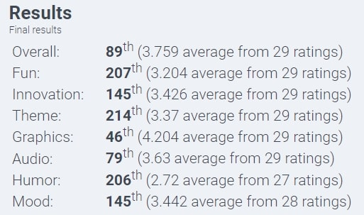

I was pretty excited to write this year's retrospective because it was pretty intense for me. Especially compared to the previous ones. As I [posted here](/post/retrospective-2023/), 2023 wasn't particularly productive. This one was much better, although not too smooth.
## Overall

I like to start it with a big picture. Last year, one of the highlights of this section was my recent notetaking habit. One round-around-the-sun later and I can confirm I've been doing it a lot more and I can already see the benefits. I started using Obsidian for general notes and doing some sort of [Zettelkasten](https://en.wikipedia.org/wiki/Zettelkasten) too. So now I have a git repo with my notes where I can sync anywhere and keep it safe.

The main advantage of that note taking technique is connecting different notes and subjects together and Obsidian offers a really nice graph view with the connections. It does require some good amount of maintenance in the notes to keep them updated and connected to other ideas, but I think that's exactly why it's so useful. I feel like every time I go through them I have something new to add or some more insights on it. Also, I find I can develop the ideas much better with them written down like that than just in my mind.

I'm still learning and still improving my technique, but I think that was incredibly mind opening for me. I never had a notetaking habit, I went through school without it, partially through university too. Maybe my brain was faster and more efficient back then, but I wonder how much more I could have learned if I did it.

Obsidian is not my only notetaking tool, though. I always start with a quick google keep note. And I use it a lot. Every moment I think there's something interesting happening or going through my mind, I write a quick note about it. Then, later, I get these quick ideas and do some research, think a bit harder and turn into a more concise idea I can add to my Obsidian. I feel I can finally develop ideas I have even when I'm about to sleep.

This year is also the year that I embraced NeoVim as my main editor outside work. I spent a lot of time customizing it, setting up plugins and learning how to effectively navigate the text with motions. It's been a wild ride of frustration and many many bursts of joy when I get the correct combination of keystrokes. I wrote about [my code editor history here](https://crocidb.com/post/from-ides-to-the-terminal/).

And since I already started with the topic of programming, I have to say it was a weird year. I had some sort of burnout at some point, but nonetheless it was one of the years I programmed the most in my life, since the first time I wrote a line of code, around 2002! And it was in so many programming languages that I'll have to list here:

- **C++**: most of my work activity
- **Javascript**: as I'll say later, worked on some JS games and other projects
- **Lua**: a big part of customizing NeoVim is done in Lua and I think I'm enjoying it a lot more
- **Haskell**: since my [Web Server](https://crocidb.com/post/i-wrote-a-webserver-in-haskell/), my first real project I ever wrote in Haskell, I decided to go for it in this year's Advent of Code and it was definitely a good idea
- **Zig**: I've been trying to learn Zig for quite some time, but since CodeCrafters offered me the possibility, I took it and did a project in it. Honestly, I thought it was a lot more _complicated_ than I anticipated. I'll post about it eventually.
- **Fennel**: last couple years I wrote lots of Racket, this year's Lisp was Fennel, a lisp that runs in Lua. I used it for my game [Clone Stacking](https://crocidb.com/post/postmortem-clone-stacking/), for Ludum Dare 55.
- **Dart**: I started a mobile app for personal use and I decided to use Flutter, because it looked simple, so I did have my time with Dart. Can't really say I enjoy it, but hey, it's a tool.
- **Python**: talking about tools, I always say python is like pliers. I don't particularly like using _pliers_, but there are moments where I need to use it and I think I can use it pretty well.

There were other stuff too, like **GDScript** for some Godot tests that I did, and I won't even mention the ungodly amount of **HTML** and **CSS** I did this year. I just think it was particularly a good amount of programming concepts going through and I'm happy I did it.
## Blog

I'm happy I kept this blog more alive this year than ever before, by a slight margin. There was a total of **11** new posts, ignoring retrospective ones.

- [Old Camera: Zeiss Ikon Nettar 517/2](/post/camera-zeiss-ikon-nettar-517-2/)
- [What's happening to Digital Books?](/post/whats-happening-to-digital-books/)
- [Capturing screen timelapses on Ubuntu (Gnome on Wayland)](/post/capturing-screen-timelapses-ubuntu-gnome-wayland/)
- [My Genuary 2024 Entries](/post/genuary-2024/)
- [Postmortem: Clone Stacking](/post/postmortem-clone-stacking/)
- [From IDEs to the Terminal](/post/from-ides-to-the-terminal/)
- [I Wrote a Webserver in Haskell](/post/i-wrote-a-webserver-in-haskell/)
- [Zig Slices and how not to use it](/post/zig-slices-and-how-not-to-use-it/)
- [Thoughts about reading on long commutes](/post/thoughts-about-reading-on-long-commutes/)
- [Transferring Browser Session: Oasis Concert Tickets](/post/transferring-browser-session-oasis-concert/)
- [Vi, Vim and NeoVim](/post/vi-vim-nvim/)

I actually have so many others that are not complete, but they'll make the light of day at some point in 2025.
## Game Jams

I attended to the two **Ludum Dare**s this year, 55 and 56.
### Clone Stacking

Main post is [here](https://crocidb.com/post/postmortem-clone-stacking/), but shortly, it's a puzzle game based on the mechanics of stacking clones of yourself. I really liked the mechanics and I got a pretty good position in _Fun_ as a result. So much I'm planning to make a version of this game for Game Boy.

### Fish Rescue



A chill game about leading a group of fish. Simpler mechanics, but more pleasing visuals and movement. I'm still to write a post-mortem about it, but a quick summary would be: I like how much attention to details I put into this one, but the gameplay mechanics were a bit too simple, maybe even boring, unfortunately. The presentation in terms of graphics, music and sounds, I love it. Unfortunately it didn't go that well compared to the previous entry, but I'm proud nonetheless.

# Professional

Despite some metal health issues, I am very proud of being part of the Audio Team of XDefiant, a fast-paced arena shooter released (and also killed) by Ubisoft. Unfortunately the game also got cancelled, along with two offices being shut and hundreds of people laid off, which I'm deeply sorry for. Nonetheless, I can't state enough how much I enjoyed the game and how glad I am for being part of it.

Here's a presentation on this game's audio by our Audio Director:



# Travel & Photography

In the beginning of summer, I did some cool photos experimenting with my custom full-spectrum Fuji X-A5 camera with a Samyang 12mm lens and I really liked it, especially because of the surreal colors that I could pull out of it.

So I knew what to take to our summer holidays in Portugal. We were in Porto, Lisbon, Aveiro and mostly Torreira. It was my first time in this beautiful country and I enjoyed it quite a lot. The food and the landscapes were even better than I anticipated. Despite the fact that I'm extremely disappointed that they still treat their invasion and colonization of Brazil as a "discovery" in popular culture, it's good to be in a place that shares the same language as mine.

In the end, I shot more film than the experimental full-spectrum gear, but nonetheless I think I managed to get some cool-looking shots with it.

There were more film photos in Portugal, though.

I also did some quick trips to Brussels, Copenhagen and London and I have posted the photos on my Instagram.

# Drawing & Art

I'm getting more and more acquainted with the concept of Art. Unfortunately, I wasn't raised with any type of incentive to make art or even to appreciate it. We were poor and my parents had many other things to worry about. It took me decades to actually understand what Art is, how to enjoy it and more recently that I can make it too. First of all is that it doesn't need to be _pretty_, it doesn't need to be _perfect_, it doesn't need to be _exact_. And you don't need to be _Van Gogh_ to paint or _Bach_ to compose. 

For some reason, deep inside, I thought that I _couldn't draw_, even thought I barely ever tried. Somehow we have this wrong idea that an artist is a person with divine skills, that was completely given on birth. The first misconception is that technique and skill don't make an artist. But I'm improving my technique while trying to make art with what I have.

I started drawing and painting with watercolor and a whole world of art opened to me. I feel more expressive, more free and more inspired. I have some sketchbooks at home and one that I carry around with a good liner. That aligned to the habit of taking notes, I feel like having a small notebook and a pen with me all the times is just necessary.

As a result, I'm focusing my thinking way more on creating cohesive things that don't need to be _products_. Stuff that is not about _making money_. So much of my thinking was going towards that direction, and guess what, I'm not rich. The takeaway is more art projects than art pieces. I don't care that much for good singular photos than I care for a project that ties photos together centered on an idea. Not about one drawing I make, but how I can tell a story by combining drawings together.

# Music Production

As part of my _blooming_ in art, I've finally started learning how to record instruments and produce a song. In fact, I already have an album (or an EP) concept in progress. It's an instrumental Guitar + Synth project, I already have a few songs complete, just waiting to be mixed. I'm still not set on how many songs I want for this project, more than I currently have, but the pressure of making it better may be keeping me from finishing it.

I bought an online course on mixing, since it seems to be one of the hardest parts for me. Hopefully that will be out in 2025!

# Other

- I did an incredible online workshop with the cartoon queen of Brazil, Laerte and her comic book artist son, Rafael Coutinho. It was a total of 4 online meetings through Zoom where they made a short comic book. The first night they came with the story, then followed by some _thumbnails_, then sketching and finally tracing on the last night. Of course they worked way more days than that, and by the end of the program, they still had a lot to do, but I'm really really looking forward to have that book in my hands and finally read the story. I feel like I learned so much about comic book production. So much I even have ideas for projects.
- I've always liked to cook, but not necessarily fancy dishes. Just straight up healthy fresh food. Lots of vegetable stews and soups and Brazilian traditional dishes. The pleasure of going home after work and focusing on making delicious and healthy dinner is something I never felt that much before. I guess I'm just getting old, or it's inspiration from so much good food I had out this year.
- I started more books than I finished, and most of the ones I did finish were comics/graphic novels.
- I'm getting more aware of my attention problems. One might just say it's ADHD, but I'm not fully convinced. We all are living in a world full of _attention offenders_, that are constantly training our brains to seek the quickest rewards possible. Reading a 400-page book is getting harder and harder. In that sense, I'm more open do drop books that don't interest me that much, focus on the ones that can grab me more, thus training long reading sessions.

# Conclusion

I get so excited by putting together everything that made me grow during the year, I think that really motivates me to do even better. I don't know what 2025 will bring, but I'm certainly sure that comes with a lot more Art for me, music composing and producing, drawing and painting, gamejams, and programming. Stay around for more!

