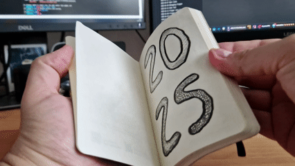
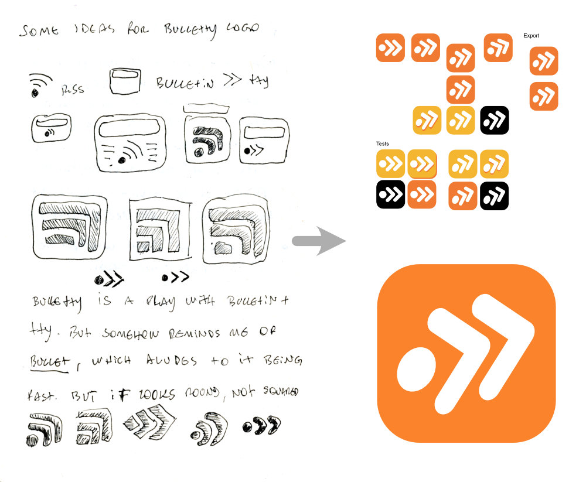
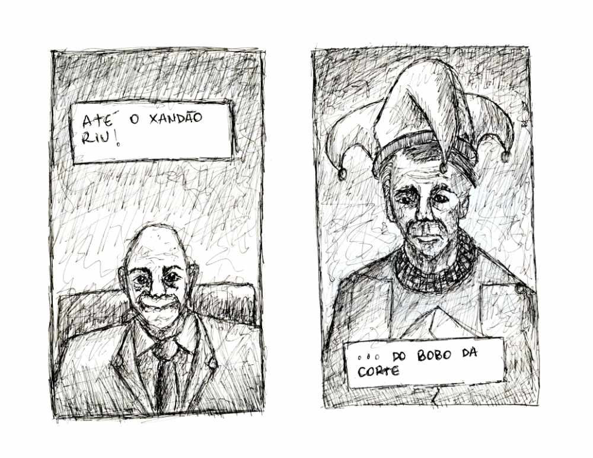
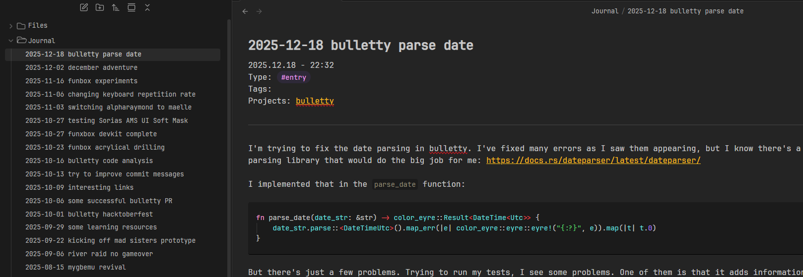
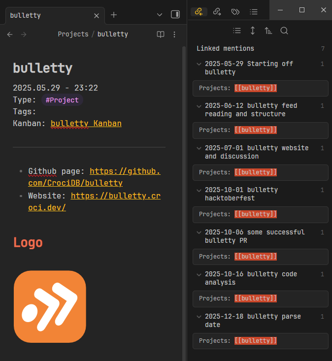
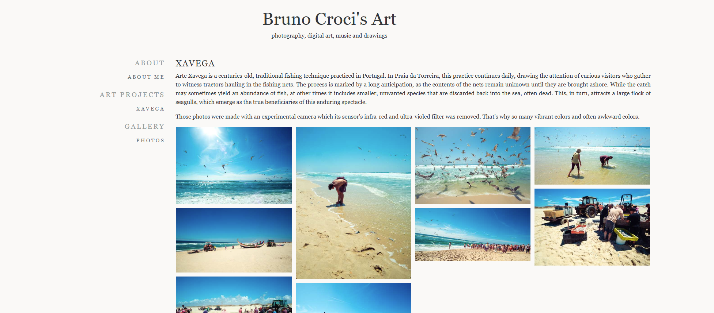
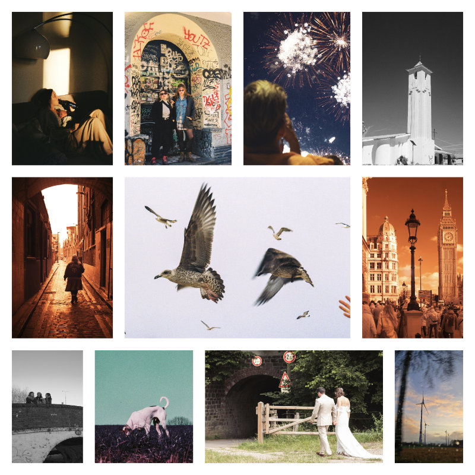
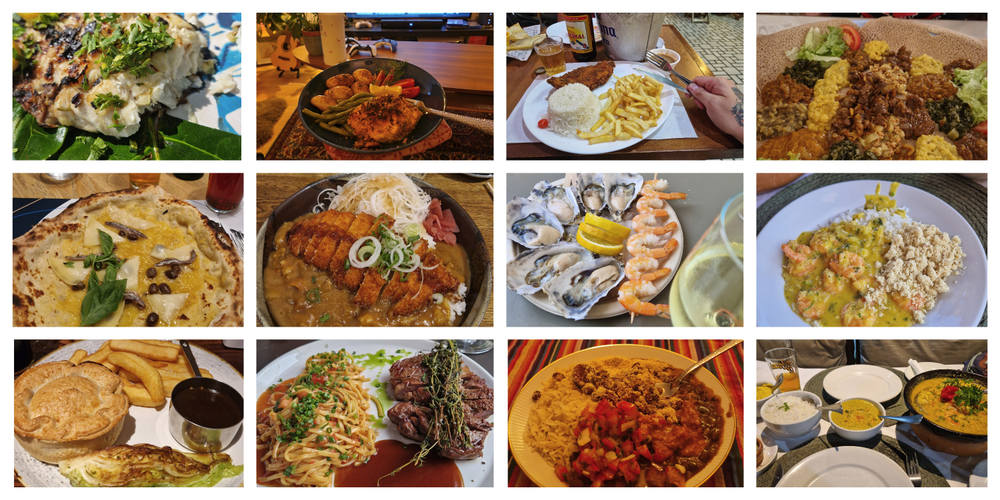

The first quarter of the century is gone, and it's time for recapping this last cycle. With the passing of time feeling quicker and quicker, this is the moment I like to reflect on how my career and hobbies are going.

# Note Taking

Just like in the last years, I like to start this text with my note taking habit. Since 2023, when I started my note-taking habits more seriously, I've been trying to improve it and experiment with different techniques and mediums. This year, I started a notebook. A notebook where I write random notes, journaling, doodling and sketches. I took this notebook to all the trips I did this year and I tried to write as much as I could about anything that came to mind in those moments.

I feel like I can develop my ideas more fully while writing them on the notebook. Also, I created the habit of reading back, which makes me see how interesting those ideas really are. Very commonly I'll cringe out of something I wrote; other times, I'll expand it.

I used it for literally everything. Here are some studies I did when I wanted to create the logo for **bulletty**:

Writing every day is bringing back the muscle resistance I had back in University, where I actually had to write a lot. Along with that, I've been drawing as much as I can, trying to develop a style to maybe in the future be able to write some comics:

## Dev Journal

Probably one of the most important things I started doing this year was journaling my personal projects. I started this habit at work a while back: I'd have a project-wide public directory of articles, usually using Confluence, then I'd simply journal about the current issue I was working on. Either a bug or a feature, I'd just dump all the information I could with a hint of _storytelling_, basically guiding through my thought process on the issue, very well illustrated with screenshots and code snippets. That was very important so I could remember well what I was working on, and be able to return to previous subjects quickly. But it was also very useful to explain what was done when requesting code reviews.

For my personal projects, I don't know how I never did it before, especially considering how many different projects I work at the same time. So I set up an Obsidian vault with a folder `Journal`, where I actually create the articles, a folder `Projects` where I store all the centralized information about a project, and another folder `Kanban` for kanban boards in these projects. _Adieu_ Trello! With a template, I can organize my articles in a way that it's easier to access the projects it's assigned to:

I'm not the best at keeping this board updated, but it's nice to be able to drag tasks here too.

And whenever I need to find all the texts relative to a project, I can go to the main project page and look for the pages that mention it:

It got also pretty easier to write texts for this blog, since I'm already documenting a big part of the tech stuff I'm doing.

# Blogging

There were fewer articles published this year, but I think I probably wrote way more. I also think that this year's articles are better researched and better written than those from previous years.

 - [Treat Your LLM Like a Junior Dev, Not an Oracle](post/on-programming-with-ai-assistants-vibe-coding/)
 - [Demystifying the #! (shebang): Kernel Adventures](post/kernel-adventures/demystifying-the-shebang/)
 - [Rant: Internet is a Scam](post/rant-internet-is-a-scam/)
 - [How I Built bulletty, a TUI Feed Reader in Rust](post/how-i-built-bulletty-tui-feed-reader-written-in-rust/)
 - [Rust after six months: my impressions on language features, tooling and ecosystem](post/rust-after-six-months-my-impressions/)
 - [Generating Fantasy book titles the old way](post/generating-fantasy-book-titles-the-old-way/)
 - [Maintaining an open source software during Hacktoberfest](post/maintaining-an-oss-during-hacktoberfest/)

Most of them are about **bulletty** or Rust, which is because it was probably the personal project I dedicated myself the most this year. The post about the shebang made it to first page of HackerNews with a lot of interesting discussions.

# Projects

A compilation of the status of the projects I worked on in 2025 and I can disclose.

## bulletty

The TUI feed reader that I started working on by May. It was my last attempt to learn Rust and it paid off. I really learned a lot from working on this project, and apparently I'm doing a good job, since I'm seeing it get some traction. With 300 stars on GitHub and many downloads on crates.io, I feel this is genuinely a good tool. I'll keep working on it for the time being, since there's a lot of improvements that need to be done.

## flingern

A static website generator, focused on creating a virtual art gallery. I started this project a few years ago, but I feel it's finally getting to the first release, along with my own art website.

## Guitar Pedal

Another project I spent a considerable amount of time on this year was a custom build of the [FunBox](https://github.com/GuitarML/FunBox/) guitar pedal, by [GuitarML](https://github.com/GuitarML). It uses the [Daisy Seed](https://daisy.audio/hardware/Seed/) chip, and has a bunch of knobs and switches for creating custom effects. It was my first time making a big project like that, with so many different components to solder and the case to assemble. I'll be writing more about it this year, as I'm currently writing a procedural harmony synthesizer for it. 

# Travel & Photography

I was fortunate enough to take many trips this year. I took holidays in _Salvador, Brazil_ and _Torreira, Portugal_, but also took shorter trips to _London_, _Amsterdam_, _São Paulo_, _Milan_, _Berlin_, _Munich_ and more. Always walking around with at least one camera in my hand, I think I did a good job experimenting with film, infra-red camera, and decade old point-and-shoot digicam, while documenting simple day-to-day moments from those places.

For the first time I was also lucky enough to shoot a friend's wedding. A big responsibility that comes with a really good sense of accomplishment. Not to mention how much I had to learn before and during the wedding. Wedding photography is difficult!

# Misc

Other interesting points from this year:

 - I got engaged! :)
 - I got back to play Chess! Back when I was visiting my family in São Paulo, I played a bit with my sister (who totally destroyed me), then when she came to visit me, we played a lot on a real physical board set. The tactile sensation of moving the pieces really gives extra pleasure, and reminds me of the time I used to play some local tournaments in my city.
 - I did therapy for the most part of the year. That's been really interesting and I don't know if I ever learned so much about myself and the world in such a short amount of time. Totally recommend.
 - With some friends recently converting to a new religion, I started listening a lot to their experiences, which made me learn more about religion and spirituality in general. I was raised a Catholic, but became an atheist since I was 17 years old. After that, I just didn't like religion at all. Can't say I like it more now, but I think I'm finally free of the ick, so I can properly learn more about the history and its effects on a person and society.
 - I played _Clair Obscur: Expedition 33_ and it's safely one of the best games I've ever played. Never thought JRPGs were for me, but I'm glad I tried this one.
 - I ate so much good food this year, street food, high-class restaurants, random pubs, homemade food, all-inclusive:

 
