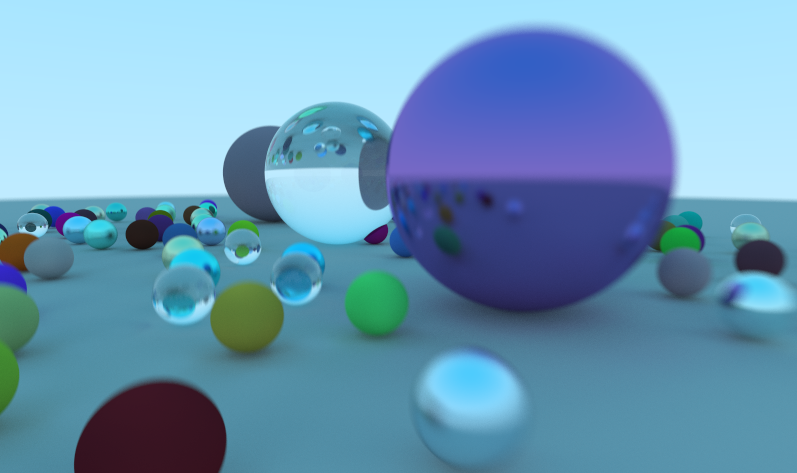
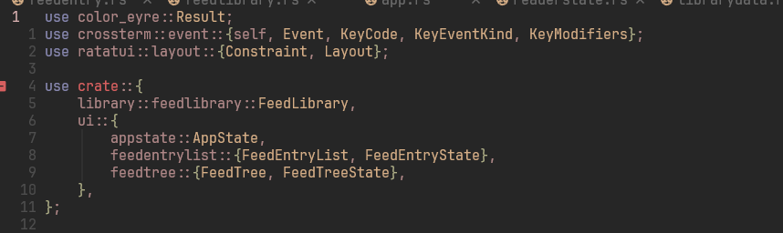

Rust is only around ten years old, but it already made a huge impact in the software community. It went as far as making it into the Linux Kernel! The meme 'written in Rust, btw' is often joked about, but in reality, it's inspiring many people to create interesting innovations in established domains.

Think of tools like [uv](https://github.com/astral-sh/uv) for Python; [deno](https://github.com/denoland/deno) for Javascript; modern terminal emulators like [alacritty](https://github.com/alacritty/alacritty) and [wezterm](https://github.com/wezterm/wezterm); a modern shell, [fish](https://github.com/fish-shell/fish-shell); text/code editors like [zed](https://zed.dev/) and [helix](https://github.com/helix-editor/helix); a new browser engine [servo](https://github.com/servo/servo);  even gamedev with the highly experimental 100% data-driven game engine [bevy](https://github.com/bevyengine/bevy). The new wave of remake of classic unix tools, such as [bat](https://github.com/sharkdp/bat) (for cat), [ripgrep](https://github.com/BurntSushi/ripgrep) (grep), [yazi](https://github.com/sxyazi/yazi) (tui file manager), [eza](https://github.com/eza-community/eza) (ls), [zellij](https://github.com/zellij-org/zellij) (screen/tmux), etc. There are a lot of implications of creating a modern version of these tools, because they're doing one thing very well (as the unix philosophy), but also they've been doing the very same thing for half a century. Rust is bringing more diverse people to the realm of systems programming. People with fresh ideas and different concepts about what it means to _use a computer_. Not necessarily better, but different. 

I also joined the trend of _rewritten in Rust_ and created [bulletty](/post/how-i-built-bulletty-tui-feed-reader-written-in-rust/), a TUI feed reader. And it's been six months since I've been learning this language and this post is a collection of notes on parts of it that I find interesting.

## My first experience with it

Back in 2019, I started doing the [Ray Tracing in One Weekend](https://raytracing.github.io/) series of books in Rust, at the same time I was reading [The Rust Programming Language](https://doc.rust-lang.org/stable/book/) book. I did get [something out of it](https://github.com/CrociDB/pathtracer), I think I finished the first raytracing book entirely. 

It didn't get me really hooked, but I think it has more to do with what was happening in my life at the moment, I was going through some depression, I had just moved countries and it was my first European winter. Coming straight from a place where it's summer every single day of the year.



I moved on, but I wanted to try more at some point.

## Crate ecosystem

I want to start off with the crate ecosystem. If you're not familiar with it, Rust has a very complete build system with a package/dependency manager in it, `cargo`. With it, you can very easily include 3rd party libraries, or `crates`, into your project, something very similar to `npm` in Javascript, or `pip` in Python. But it's the first time I've see a dependency manager work so well in a compiled language. For C++, there's [conan](https://conan.io/), [vcpkg](https://vcpkg.io/en/) and [cpm](https://github.com/cpm-cmake/CPM.cmake), or even pure CMake's _FetchContent_, but honestly it's a pain to get it working seamlessly.

It's really convenient to look for "Perlin Noise" and just include the first crate you find that will provide you with the needed functions. However, there are problems with it, such as dependencies that rely on other dependencies that may not fit your project for a variety of reasons such as license or simply because another of your dependency also require that dependency, but in another version. For example, **bulletty** explicitly declares _27_ dependencies at the moment, but considering all the necessary dependencies to build it, it goes to an outstanding number of _366_!

That means there's just so much code running when you fire up bulletty that I'll never be able to audit. On the other hand, it's thanks to them that bulletty was made possible. I honestly don't think I would have gotten that far if I had to parse HTML into Markdown myself, it's too big of a mountain to climb when you're starting a project. Now I'm customizing parts of the [crate that does that](https://gitlab.com/CrociDB/html2md). :)

## Algebraic Data Types & Pattern Matching

Pattern Matching is one of my favorite language features. It's really expressive and convenient to describe exactly what you're trying to compare, for example:

```rust
match x { 
	1 => println!("one"),
	2 => println!("two"), 
	3 => println!("three"), 
	4 => println!("four"), 
	5 => println!("five"), 
	_ => println!("something else"), 
}
```

That example of course is very similar to a `switch-case`  expression, but what now?

```rust
match ph { 
	0..7 => println!("acid"), 
	7 => println!("neutral"), 
	8..=14 => println!("base"),
	_ => unreachable!()
}
```

Examples were taken from [Rust Reference](https://doc.rust-lang.org/reference/expressions/match-expr.html).

But this gets way more exciting when you combine these with an [Algebraic Data Type](https://en.wikipedia.org/wiki/Algebraic_data_type), such as [Rust Enums](https://doc.rust-lang.org/book/ch06-01-defining-an-enum.html):

```rust
enum IpAddr {
	V4(u8, u8, u8, u8),
	V6(String), 
}
 
let home = IpAddr::V4(127, 0, 0, 1); 
let loopback = IpAddr::V6(String::from("::1"));

//...

match ip {
	V4(ip1, ip2, ip3, ip4) => println("You IP is: {}.{}.{}.{}", ip1, ip2, ip3, ip4),
	V6(ipv6) => println!("Your IP is: {}", ipv6);
}
```

Since `IpAddr` can be either a `V4` or an `V6`, and they hold different information, you can match the type and bind variables for the data needed. If you ever did any Haskell, OCaml or Scala, you'd be smiling now. 

## Error handling

I always hated `try...catch` constructs in C# and Java. First because the way it looks, several blocks of `try` with multiple lines within it, followed by lots of `catch` seemed very hard to read in my opinion. Not to mention that it's not always obvious some function will thrown an exception, completely breaking the flow of the program. In C++, I absolutely never used it.

Rust offers very robust mechanisms to handle errors. Functions can return a `Result<Type, Error>` monad, similar to `Option<Type>`, containing either `Ok(T)` or `Err(E)`, which makes it instantly clear how to deal with the result. Plus, there's a lot of syntactic sugars that help the code get more readable while still safe. For example, the `?` operator:

```rust
fn do_something() -> Result<(), Error> {
	let test = get_some_value()?;
	let another_test = test.get_something_else()?;
	another_test.do_something()
}
```

The `?` operator redirects the result of a function call to the return of the current function, effectively delegating the obligation to check errors to the caller of `do_something()`. That way, you can call several functions that will themselves return a result and not worry for that at that moment.

The good things about the `Result` type don't stop there. It includes functions for quick testing such as `is_error()`, or to transform into another error type with  `map_err`, and since it's just another value, you can pattern match it when you want to treat it. The easiest way to error checking that function above is:

```rust
if let Err(my_error) = do_something() {
	println!("Oops, I got this error: {:?}", my_error);
}
```

## Returning

In Rust, it will automatically return the last value in the block, so you can have a function like:

```rust
fn double(x: i32) -> i32 { x * 2 }
```

No need to add `;` at the end of a return value, which makes it instantly recognizable.

Since any block can return, it's simpler to attribute conditional values to variables with `if` or `match`, for example:

```rust
// almost like a ternary operator
let i: Option<i32> = if b == 2 { 
	let z: i32 = b * 20;
	Some(z)
} else { 
	None 
};

// pattern matching returns values!
let z: i32 = match i {
	None => 0,
	Some(v) => v,
};
```

Or even cooler, just regular blocks:

```rust
let i: i32 = {
    let b = 42 * 3;
    b
};
```

And considering Rust objects only live during their own scope, creating limited blocks like this is more useful to keep your memory in control.

## Compiler messages are fantastic

Rust is a bureaucratic language, purposely. Its memory allocation/deallocation model, binding heap memory to their scopes, creates a lot of friction to programmers used to either languages that deals with garbage, or languages that expects you to do your chores. But it does by shifting all that responsibility to the compiler. It's frustrating, but the messages the compiler and the linter give you are really detailed, often explaining the issue and suggesting fixes. 
## Best LSP

As a professional C++ and C# programmer, I'm very used to Visual Studio, which in general index really well the symbols in the projects and offers several functionalities to help you navigate in a large codebase. So far, I haven't found a single LSP that offered a similar experience to Visual Studio (or other big IDEs), something like detecting types well, finding definitions in other files, suggesting and applying changes in code, reliably renaming fields and functions, etc. But it changes with the Rust LSP. It's very complete and works incredibly well with Neovim, for example.

Of course, it helps that the language has a static type system and a relatively simple build system. For example, C++ has types, but building and linking is a whole nightmare. So many possible ways to build a project in C++, with different compilers, different linkers, different runtimes, that I can understand if no LSPs will ever be really good. On the other hand there's Python or Javascript, where the runtime just need to make dependencies available and run it, but their type system is basically non-existent.

Rust's LSP is aware of the whole project, it finds definitions really quick, it allows for symbols renaming, it resolves `use` directives, it displays API documentations within the editor (and even lets you open the API code directly) and it gives lots of suggestions to improve code. I see some people shitting on LSPs because "you're supposed to know your codebase", as if auto-completions were even the most important thing in it.

But beware the LSP consumes a lot of system resources. I was trying to program rust on a VPS with only 2GB of RAM and it was a bit challenging. Constantly crashing. Good thing I got a much beefier VPS now.

## Compile times are long

It's a [common issue](https://kobzol.github.io/rust/rustc/2025/06/09/why-doesnt-rust-care-more-about-compiler-performance.html), the compiler is slow. Building bulletty from scratch takes around a minute. LSP boot-up time when I open neovim is a bit longer that I would like. But honestly nothing that really annoys me. Just a consideration.
## use directives can get a bit confusing sometimes

You open a Rust source code and first thing you see is this.



Tell me if you don't find it a bit confusing. I'm coming from the C++ realm where you can easily find 75 lines of `#include "../../module/test/foo.h` in the beginning of the file, but at least it's instantly recognizable. All the nesting modules imports in Rust look almost like code, so it's hard to find where code actually starts. I'm glad the LSP usually handles that for me.

## Conclusion

I feel like Rust is a perfect example of a modern language with very good tooling that can build fast, safe natives without a lot of hassle. Easy to start prototyping with 3rd party libraries, beautifully portable, fast and safe. It brought people from the C++-land and the Ruby-land together, it made it to the Linux kernel. Of course, it's not all flowers. The language can be a little complicated to get started with because of the borrow-checker, and it's a rather complicated language with lots of features, but for many domains, it can be almost like coding in python or javascript.
