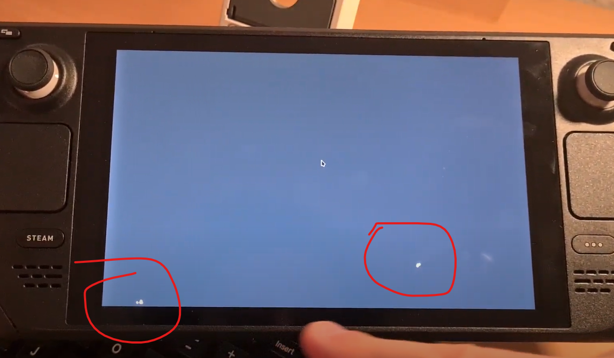

Last year I bought a Steam Deck to play the long list of games in my Steam library, most of which I got from indie bundles. The idea of being able to play even the ones targeting mouse and keyboard in the comfort of my bed with very ergonomic controls sounded amazing. Another reason was to explore a bit the technology behind this _miraculous_ mobile device that can play Elden Ring in solid 30fps, on Linux!

I just didn't imagine I'd have to dive in the tech part so early in, as my device had a screen touch issue. Not long after I set up the system and started downloading games, I noticed that the UI was acting a little weirdly: opening or closing menus out of no apparent reason. After some time trying to analyze the behavior, I recorded this video:



When the keyboard is open you can clearly see how it "touches" some points around the key `.` in the keyboard. It could be an issue with the screen, nonetheless, it was time for some investigations. I turned the Deck into a desktop computer and then decided to start by disabling the touchscreen driver, to see if it would fix the problem.

The SteamOS that runs on the Deck is a distro based on Arch Linux, it comes with a plain KDE environment and can be accessed by holding the power button and select "Switch to Desktop Mode". With the help of a USB-C hub, I connected keyboard, mouse and monitor. 

[image of the desktop setup]

I don't know much about linux device management, but after a bit of research I found out about `xorg-input`, which is capable of displaying the input devices and disable/enable them. It's not installed by default, and it `pacman` didn't seem to work out of the box. According to [this support page](https://help.steampowered.com/en/faqs/view/671a-4453-e8d2-323c), in order to install packages through `pacman`, it's necessary to unlock the system. So first, change the password of the default user `deck`:

```bash
passwd
```

Then disable the readonly mode:

```bash
sudo steamos-readonly disable
```

The package manager still didn't work, but apparently it's necessary to initialize it and populate with Arch Linux packages:

```bash
sudo pacman-key --init
sudo pacman-key --populate archlinux
sudo pacman -Syu
```

Now I could finally install `xorg-input`:

```bash
sudo pacman -S xorg-xinput
```

Now running `xinput` gives me something like this:

```bash
(deck@steamdeck ~)$ xinput
⎡ Virtual core pointer                          id=2    [master pointer  (3)]
⎜   ↳ Virtual core XTEST pointer                id=4    [slave  pointer  (2)]
⎜   ↳ Valve Software Steam Deck Controller      id=10   [slave  pointer  (2)]
⎜   ↳ FTS3528:00 2808:1015                      id=13   [slave  pointer  (2)]
⎜   ↳ Logitech K540/K545                        id=15   [slave  pointer  (2)]
⎜   ↳ Logitech K360                             id=17   [slave  pointer  (2)]
⎜   ↳ Logitech Wireless Mouse                   id=19   [slave  pointer  (2)]
⎣ Virtual core keyboard                         id=3    [master keyboard (2)]
    ↳ Virtual core XTEST keyboard               id=5    [slave  keyboard (3)]
    ↳ Power Button                              id=6    [slave  keyboard (3)]
    ↳ Video Bus                                 id=7    [slave  keyboard (3)]
    ↳ Power Button                              id=8    [slave  keyboard (3)]
    ↳ Valve Software Steam Deck Controller      id=9    [slave  keyboard (3)]
    ↳ acp5x Headset Jack                        id=11   [slave  keyboard (3)]
    ↳ FTS3528:00 2808:1015 UNKNOWN              id=12   [slave  keyboard (3)]
    ↳ AT Translated Set 2 keyboard              id=14   [slave  keyboard (3)]
    ↳ Logitech K540/K545                        id=16   [slave  keyboard (3)]
    ↳ Logitech K360                             id=18   [slave  keyboard (3)]

```

_More information about Xinput can be found here: https://wiki.archlinux.org/title/Xinput_

At first glance, you can point which devices _are not_ the touch screen one, but I had to try around to find out `FTS3528` is the one I was looking for. The command `xinput disable` accepts the id of the device, so `xinput disable 13` would do the job. But since the id seemed to change on every reboot, I came up with this simple one-liner to turn the touchscreen off everytime I needed:

```bash
xinput | grep 'FTS3528' | awk '{print $4}' | sed 's/id=//g' | grep [0-9] | xargs xinput disable
```

And it did the trick. Once I disable it, I could even play some games. But of course it's not the perfect solution, as moving back to the default game mode would enable it back and it's really complicated to navigate in the desktop mode without a mouse and without touch.

At this point I was already in contact with Valve support and they were really open to help. They suggested me some standard procedure of initializing the device in safe mode, but nothing changed the issue. I thought that it would be useful to have a more systematic way to show the touches than just randomly in the UI, so I decided to write a simple Python/Pygame script that displays mouse clicks on the screen.

The system already comes with Python 3.10 and Vim, but not with PIP, so I installed PIP and Pygame:

```bash
python3 -m ensurepip --upgrade
python3 -m pip install -U pygame
```

Then wrote this simple program:

```python
import pygame, sys
from pygame.locals import *

pygame.init()

windowSurface = pygame.display.set_mode((0,0), pygame.FULLSCREEN)
pygame.display.set_caption("Screen Map")

windowSurface.fill((40,40,40))

loop = True
while loop:
    for event in pygame.event.get():
        if event.type == QUIT: loop = False
        if event.type == KEYDOWN and event.key == K_ESCAPE: loop = False
        if event.type == MOUSEBUTTONDOWN:
                pygame.draw.circle(windowSurface, (255,255,255), event.pos, 3)

    pygame.display.update()

pygame.quit()
sys.exit()
```

That was when I was finally able to visualize clearly what was going on and there was no more doubts it was a factory screen problem. I recorded this video:



There was two regions in which the touches would happen:



In the end I sent them both videos, the source code of the Python script and they asked me to sent the device for repair. Not long after, the Deck was back all fixed and I can finally play games on it!
