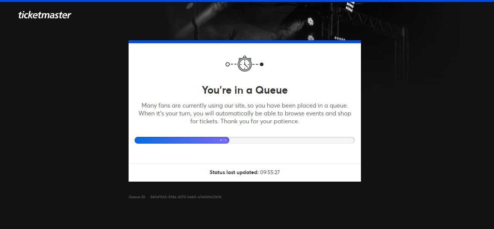
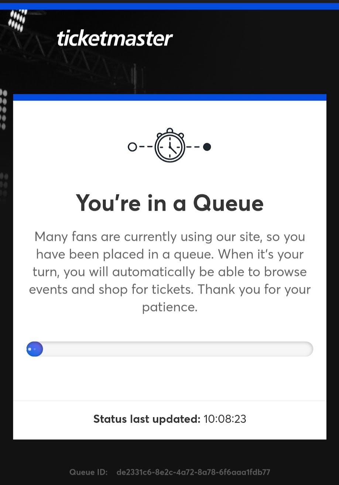
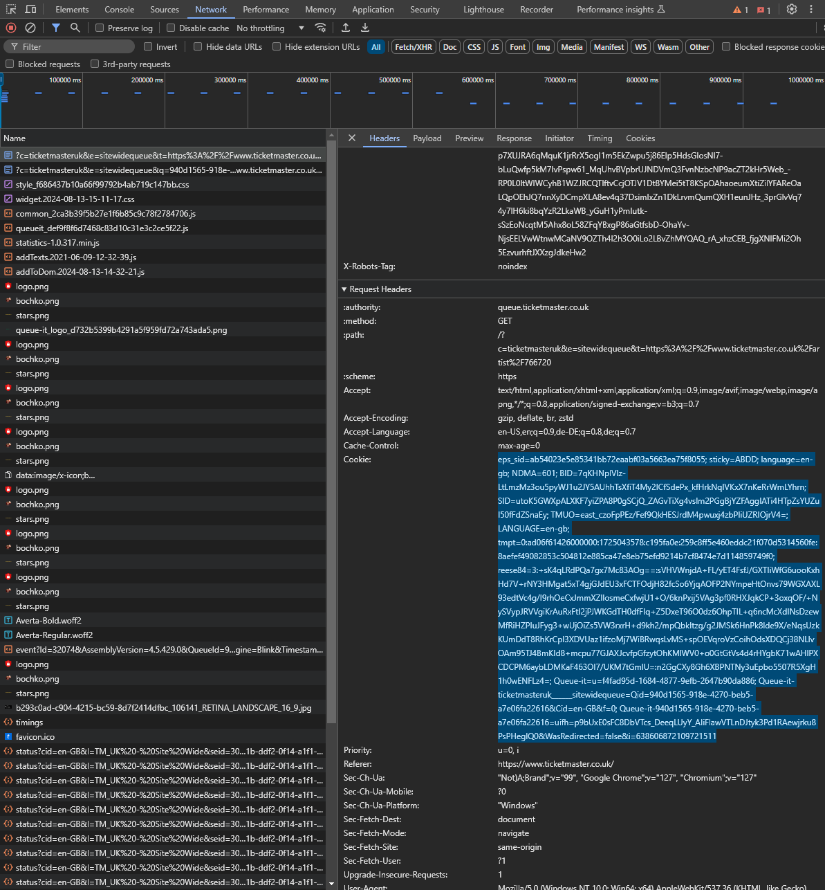
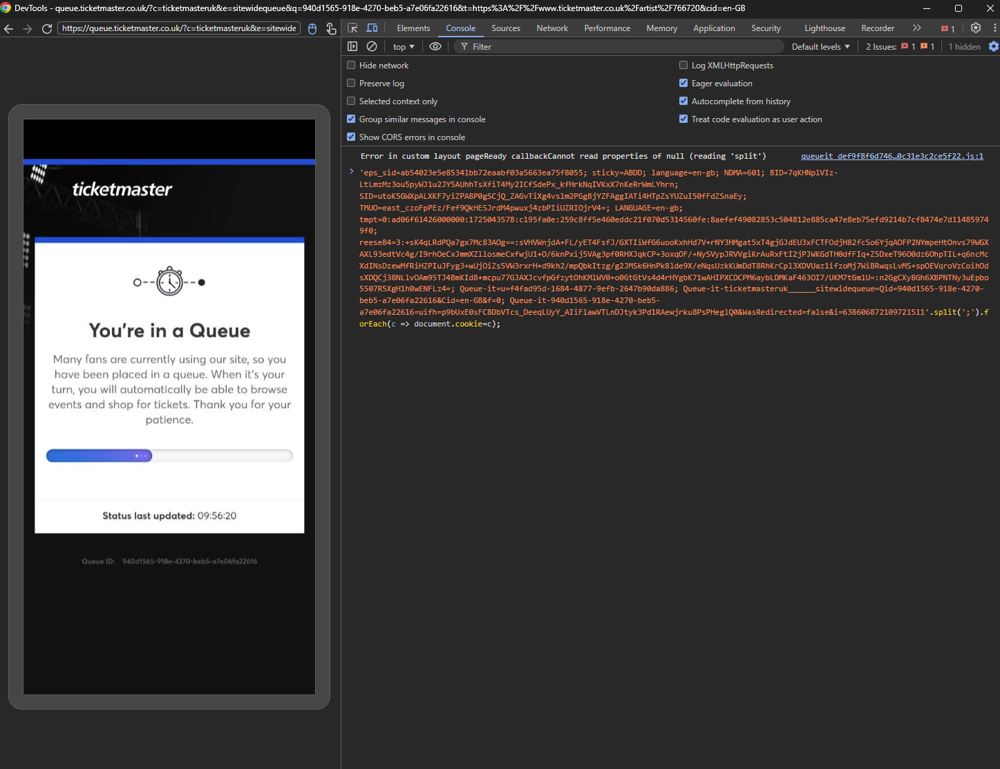
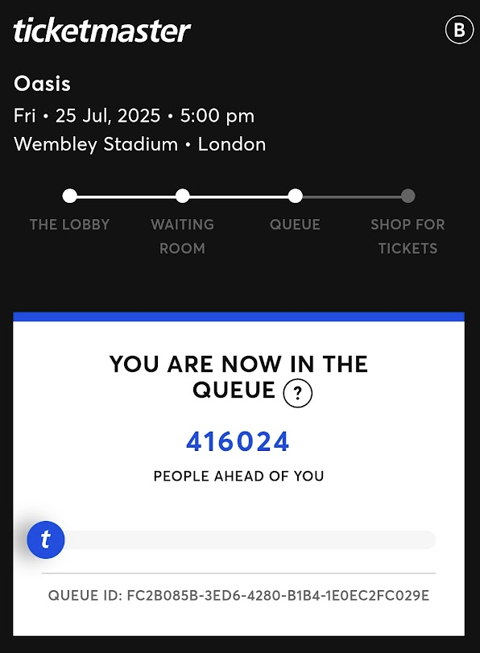
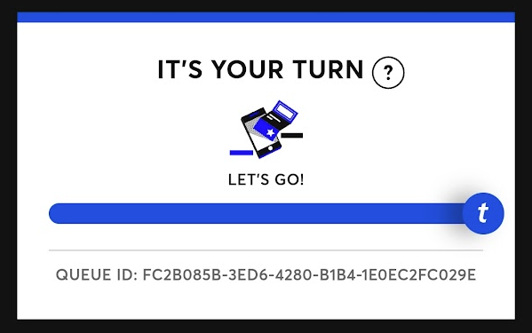
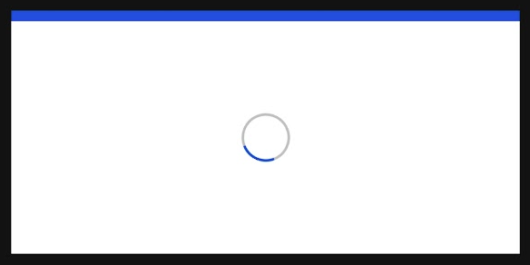

So Oasis got back together for a tour. The tickets were supposed to be out at 31th of August, at 9am London time, 10am my time in Germany. I sit down at the computer half an hour earlier and I get in a queue, that I didn't know at the moment, but would take a long time.

Oasis is very nolstalgic for me, and since my friend [Teo Dutra](https://teodutra.com/), who lives in Vancouver, was also up to watch and eventually meet in London next year, I told him "don't worry, I'll get us the tickets", especially because the timezone in west Canada wouldn't be favorable for him.

Two hours and a half later, it was still like that, less than halfway through:


 
 But I needed to go out help a friend move, so I opened it on my phone and... humm... another place in the queue:



That would take another two and a half hours just to reach the point I was in my computer. So the chance I'll get tickets is even lower.

But they do have a queue ID, what if I could transfer my session to my phone? So I opened the DevTools and found the cookies defined at the request headers for the page:



It does look promising, I can find the queue id somewhere in that crazy amount of characters. Also I assume the session ID is also there somewhere, I don't understand exactly how webservers keep remote user sessions, but there must be with the cookie, right?

Ok, next step, how do I set my phone's cookies manually? I found a few extensions, but they wouldn't work on phone. But hey, I can access the DevTools remotely, I'm familiar with it, been working on a Javascript game for a while now. 

I found this [answer online](https://superuser.com/questions/186609/how-do-i-transfer-copy-cookies-from-one-browser-to-another-or-same-browser-fro) that explains how to do it, and it turns out it's really easy:

```javascript
'[cookies]'.split(';').forEach(c => document.cookie=c);
```

If I just run the code above with all those cookies from my computer in the console, it will set the mobile cookies.



It worked perfectly. But one Victory a day is enough, huh? Many hours later, as I was helping my friend carry her stuff up three stories, I got to the beginning of the queue. Just to be... thrown to **another** queue!



Turns out the first queue was just the queue for queue to shop. Or as the system calls _**a** queue_ and _**the** queue_. Couple more hours and another update:



At this point I had just a tiny bit of hope. I didn't even know what the prices would be like. There was a chance I'd be presented with £500+ and I would just give up in the end. It was over 5pm and I was exhausted. Just to be surprised with this, a never-ending spinning wheel.



Fuck Oasis. At least I got to be rewarded with one of the best Schnitzels in Cologne and lots of cold Kölsch beer. I hardly ever go to big concerts like that and that's one of the reasons.
