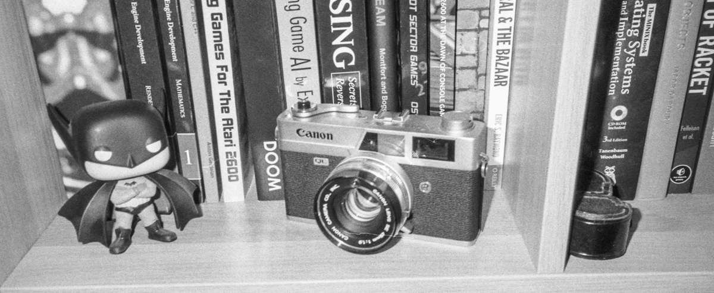

I love physical books. Not gonna say I particularly love the smell of it, because that's not really my fetish, I'm more into the page turning mechanism, and of course the beautiful material object with aesthetically pleasing cover, build, typography and layout. However, I think that digital books are very, very important, and I consume a lot of it.

Originally from Brazil, I've lived in four different cities and three different countries in the last ten years. Consequently, I've had to part with my books several times. And that's okay, I'm not very materialistic in that sense, though I do feel bad when I need to toss out a book that I haven't yet read.  However, the biggest benefit of digital books for me is not only to keep it when I move, but to get access to books released in other countries.

Living in Germany and not speaking German fluently, I purchase many books in English, often published in the US, UK, or Ireland. Not so hard to find them in local bookshops and It's just easy to get them from Amazon. However, when I want to read a Brazilian book (more commonly a graphic novel), it's always a pain. I'm fine with the non-existent import route of Brazilian books in Germany, that wouldn't make sense anyway, but what bugs me is that often those books have no digital version. I'm not gonna ask my family to ship me a book from Brazil because that's the only way for me to read it. Even if I wanted to bring them back every time I go visit my family, that would be a heavy and annoying luggage to carry. I  might still want to do it, but I don't want it to be the only way.

There's a new wave of comics publishers happening in Brazil right now, and they're doing an amazing job in bringing great french/belgian graphic novels; less-mainstream non-japanese mangas; forgotten spanish classic comics; as well as, and most importantly, fomenting more local artists to publish their works. Some are doing incredible archeological-almost work finding lost originals of classics and building single editions of stuff that was never published together. I ask myself why not publish all of them in digital _as well_. What is the effort of making a digital book? Probably zero, as the source material is already at digital form when it's sent to print. That would make more money for the publisher as well as for the authors, since no printing is involved and they can sell that non-stop.

The issues I can think of are three, (1) it's a licensing problem (for licensed products), where the original holder of the rights of that specific book is living in the past and doesn't want to make it broadly available to the public; (2) a rather darker one: restrict the access to that product so they can always re-publish it and sell more and more expensive–making profits from scarcity is basically _Capitalism 101_, after all; (3) there's something wrong with the digital book marketplaces.

Going further on the third hypothesis, I know it's less of a problem with novels, though, all the big ebook marketplaces online are pretty filled with texts from classics to modern literature, released by stablished publishers to self publishing authors. And that's probably because of the big market of eInk eReaders. When you think of more specialized texts and graphic novels (that can't really be presented on most eInk devices), it's really a game of chance. 

I don't want to get into the matter of DRM, it's pretty bad to be attached to one platform, but that's a whole discussion and I'm more interested in just being able to have access to material that I want to read. Maybe the fragmentation is the problem. There are several eBook stores online and most of them are associated with a specific ebook reader, Amazon to Kindle, Barnes&Nobel to Nook, Google Book to Android devices, Apple Books to Apple devices, etc. There's also the option of getting DRM ePub files, which doesn't work for comics. Handling many platform systems may demand too much work. It can be that the fees that those marketplaces charge on the products is too high, that on top of the fact that we have a perception that digital products should be cheaper than the physical ones can make up to a price that's too impeditive for the final client.  

Just a quick word on devices, I agree that eInk readers are usually a terrible idea to read most comics and graphic novels, however reading them in tablets are mostly a good experience. But for some specific materials, I wouldn't have any problem reading that on my computer screen if it comes to it.

In the end, all I wanted was a way to pay the people who made a book (authors, artists, editors, all of them) and get their material. I'm happy a lot of independent artists do that, but why can't that also be a norm for big publishers? Imagine if these big publishers just sold their DRM'd files on their websites? Honestly, that would be enough for me.

